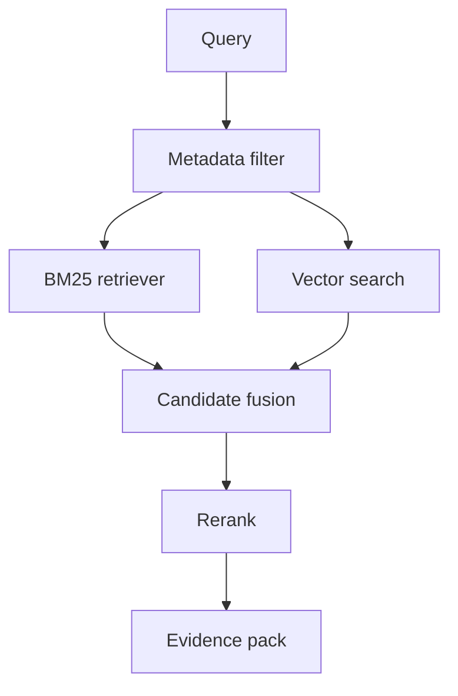

# 为什么 RAG 系统常用混合检索？

## 30 秒回答

因为单一检索方式都有盲区。BM25 擅长 lexical 匹配，能命中错误码、函数名和专有名词。vector search 擅长 semantic 匹配，能理解同义表达和长问句。混合检索用 metadata filter 控制权限，再用 RRF 或加权融合提升 recall 和 precision。

## 面试定位

这道题考的是 RAG 检索层设计。面试官想听到你如何权衡关键词检索、向量检索、融合策略、rerank 和评测。

回答要包含架构、数据流、指标、取舍和追问。不要只说“向量更智能”。

## 标准回答

我会先说向量检索不是银弹。它对语义相似很强，但对精确字符串、版本号、错误码、ID 和短 query 可能不稳定。BM25 对这些精确词更可靠。

混合检索的典型链路是：先做 tenant、权限、时间、文档类型等 metadata filter，再并行跑 BM25 和 vector search。候选通过 RRF 或加权分数融合，去重后交给 rerank，最终生成 evidence pack。

评测上要做消融实验。分别比较 BM25-only、vector-only、hybrid 和 hybrid+rerank，看 recall@k、precision@k、citation_precision、latency 和 cost。

## 架构与运行机制

图 1：RAG 混合检索的双路召回链路。图中 Query 先经过 Metadata filter 做租户、权限、版本和文档类型过滤，再分别进入 BM25 retriever 与 Vector search；Candidate fusion 负责融合和去重；Rerank 判断 answerability；Evidence pack 只保留可引用、可授权、可解释的证据。

这张图的关键是“召回互补，但上下文要收敛”。BM25 负责错误码、函数名、ID、版本号等精确词；向量检索负责同义表达和长问句；RRF 或加权融合只是候选合并，不能替代 rerank、citation check 和 evidence verifier。

数据流的关键是先过滤安全边界，再做双路召回。候选要保留 source、rank、score、retriever_type 和 evidence_id，方便排障。

## 可画图

可以画双路召回图。左边 BM25 处理关键词，右边 vector search 处理语义，中间 fusion 合并，后面接 rerank 和 grounded generation。

## 系统设计案例

企业知识库里，用户问“支付回调 10007 错误怎么处理”。BM25 能命中错误码，向量检索能找到“签名校验失败”的解释。融合后 rerank 会把同时包含错误码和处理步骤的文档排到前面。

如果只用向量检索，可能召回语义相似但没有错误码的通用支付文档。如果只用 BM25，用户换一种说法时又可能漏掉。

## 真实问题与排障

如果答案引用旧文档，检查 metadata filter 是否包含 version 和 updated_at。若召回噪声高，分别看 BM25 和 vector 的候选，判断问题来自分词、embedding、chunk 还是融合权重。

指标包括 recall@k、precision@k、MRR、nDCG、citation_precision、latency_p95 和 cost_per_query。

事故处理要先分影响面：是某类错误码漏召、语义相似但不可回答的 chunk 进入上下文、旧版本文档被引用，还是跨权限证据进入候选。止血可以前置 metadata filter、降低 vector top_k、临时启用 BM25-only、清理旧索引或强制 rerank。根因要查单路候选、retriever_type、raw_score、rank、fusion_score、rerank_score、chunk_hash、updated_at 和 citation verdict。回归要做 BM25-only、vector-only、hybrid、hybrid+rerank 的消融对照。

## 面试官追问

- RRF 为什么适合做融合？
- top_k 应该如何设置？
- hybrid search 什么时候没有收益？
- metadata filter 应在检索前还是后？
- 如何构造离线评测集？

## 多轮追问模拟

**追问 1：为什么向量检索不能替代 BM25？**  
答题要点：向量擅长语义相似，但对错误码、函数名、短 query、版本号和精确实体可能不稳；BM25 能兜住 lexical evidence。考察点是召回盲区。陷阱是说“embedding 更智能所以够了”。

**追问 2：RRF 为什么适合融合？**  
答题要点：RRF 依赖排名而非原始分数，能减少 BM25 分数和向量相似度尺度不可比的问题。考察点是融合机制。陷阱是直接把两路分数相加。

**追问 3：如何判断 hybrid search 真的有收益？**  
答题要点：用标注 query set 做消融，比较 recall@k、precision@context_k、nDCG、citation_precision、latency_p95 和 cost_per_query。考察点是评测设计。陷阱是只看召回数量。

## 项目化回答

我会说项目里没有只依赖 embedding。BM25 兜住精确词，vector search 处理语义泛化，RRF 融合候选，rerank 控制进入上下文的 evidence precision。每一步都有 trace 和消融指标。

## 常见错误

- 认为向量检索可以完全替代关键词检索。
- 权限过滤放到生成后。
- 融合后丢掉来源和 rank。
- 不做消融实验。
- 只看召回率，不看上下文证据质量。

## 深挖技术细节

混合检索的工程细节在候选生成和融合。一次查询通常先经过 query normalization 和 metadata filter，过滤 tenant、权限、文档类型、版本、时间范围。然后并行跑 BM25 与 vector search。每个候选保存 `doc_id`、`chunk_id`、`retriever_type`、`raw_score`、`rank`、`source_uri`、`updated_at`、`permission_scope`、`chunk_hash`。融合层用 RRF 或加权归一化合并，避免不同打分尺度直接相加。

RRF 的好处是利用排名而不是原始分数，对 BM25 和向量分数尺度差异更稳。融合后要去重和做 coverage 控制，避免同一文档的多个相邻 chunk 挤占上下文。随后 rerank 评估 answerability，把真正能回答问题的 span 放进 evidence pack。生成阶段只看到权限允许且被选中的 evidence。

评测要做消融：BM25-only、vector-only、hybrid、hybrid+rerank。指标不只看 `recall@k`，还要看 `precision@context_k`、`nDCG`、`citation_precision`、`no_answer_accuracy`、`p95_search_latency`、`cost_per_query`。排障时分别打印两个召回通道的 top candidates，才能判断是分词、embedding、chunk、filter 还是融合策略的问题。

## 边界条件与反例

反例一：权限过滤放到生成后，虽然答案不展示越权文档，但模型已经看到了敏感内容。反例二：向量召回语义相近但没有错误码，BM25 能命中的关键 ID 被融合权重压低。反例三：融合后不保留 retriever_type 和 rank，导致无法解释为什么选中某段证据。

边界在于：混合检索不是越复杂越好。小语料、结构化查询或精确 ID 查询，BM25 加 metadata filter 可能足够；开放问答、同义表达多、长文档多时 hybrid 收益更明显。每个业务应该用自己的 query log 和标注集做消融，而不是照搬默认 top_k。

## 深问准备

- 问：metadata filter 应放在哪？答：检索前必须做权限和租户过滤，检索后还要复核，避免越权证据进入上下文。
- 问：RRF 为什么稳？答：它融合排名而非原始分数，减少 BM25 和向量分数不可比的问题。
- 问：top_k 怎么定？答：根据 recall 曲线、上下文预算、rerank 延迟和 citation precision 共同选择。
- 问：hybrid 什么时候没收益？答：查询高度结构化、语料很小、关键词覆盖好或向量质量差时。

## 来源与延伸阅读

- [Elasticsearch Reciprocal Rank Fusion](https://www.elastic.co/docs/reference/elasticsearch/rest-apis/reciprocal-rank-fusion)：官方文档用于说明 RRF 如何融合不同检索器返回的排序结果。
- [Elasticsearch kNN Search](https://www.elastic.co/docs/solutions/search/vector/knn)：官方文档用于支撑向量召回在 Elasticsearch 中的参数和执行边界。
- [Elasticsearch Semantic Search](https://www.elastic.co/docs/solutions/search/semantic-search)：官方文档用于补充语义检索与传统搜索在方案中的互补关系。
- [Cohere Rerank 文档](https://docs.cohere.com/docs/reranking)：官方文档用于说明 rerank 如何在候选召回后提升上下文证据精度。
- [OpenAI Cookbook: Elasticsearch RAG](https://cookbook.openai.com/examples/vector_databases/elasticsearch/elasticsearch-retrieval-augmented-generation)：官方示例用于说明 Elasticsearch 与 RAG evidence retrieval 的工程组合。
