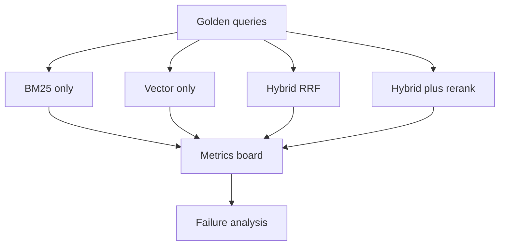

# 如何设计 hybrid search 的消融实验？

## 30 秒回答

我会固定同一批 query、文档版本和标注集，分别跑 BM25-only、vector-only、hybrid、hybrid+rerank。对比 recall@k、precision@k、MRR、nDCG、citation_precision、latency 和 cost。只有 hybrid 在质量收益大于成本时才保留。

## 面试定位

这是检索评测题。面试官想确认你不是凭感觉说 hybrid 更好，而是能设计实验来证明收益。

回答要覆盖架构、数据流、指标、取舍和追问。重点是固定变量、构造标注集和解释失败样本。

## 标准回答

第一步构造 eval set。query 要覆盖精确词、同义表达、长问题、短问题、过期文档、权限过滤和无答案问题。每个 query 标注相关 evidence 或正确文档。

第二步定义实验组。BM25-only、vector-only、hybrid-RRF、hybrid-weighted、hybrid+rerank 分别跑同一套 query。检索参数要记录，例如 top_k、embedding model、分词器、chunk size 和 filter。

第三步看质量和成本。质量指标看 recall@k、precision@k、MRR、nDCG 和 citation_precision。工程指标看 latency_p95、index_size、cost_per_query 和 cache hit。

最后做失败归因。BM25 漏召通常和分词、同义词有关。向量噪声常来自 chunk 太粗或 embedding 不适配。融合失败可能是权重或去重策略问题。

## 架构与运行机制

图 1：Hybrid search 消融实验把同一批 golden queries 同时送进 BM25、向量、融合和融合加精排四个实验组，再统一进入指标看板和失败归因。

这张图的关键边界是 `Golden queries` 和 `Metrics board`。Golden queries 固定了输入、标注和文档快照，避免某个实验组因为语料更新而“看起来更好”；Metrics board 则把质量、延迟、成本和失败样本放在同一个表里，避免只拿 recall 或主观样例做结论。Failure analysis 不是事后描述，而是决定下一轮改 analyzer、embedding、chunk、RRF 参数还是 reranker 的入口。

数据流要保证每个实验组使用相同的文档快照和权限过滤，否则对比不可信。权限过滤也要进入实验配置，因为企业知识库里“命中正确文档但用户无权查看”不能算成功召回。

## 可画图

可以画实验矩阵：行是 query 类型，列是检索方案，单元格记录 recall、precision、延迟和失败原因。

## 系统设计案例

在客服知识库中准备 200 条真实问题。包括“错误码 4039”、 “登录后页面空白”、 “如何配置回调地址”等类型。标注每题应该命中的文档和段落。

实验发现 BM25 在错误码上最好，vector 在自然语言描述上更好，hybrid+rerank 在整体 citation_precision 上最高，但延迟增加 120ms。最终可以只对复杂 query 启用 rerank。

## 真实问题与排障

如果 hybrid 指标不升反降，先看融合是否把两个检索器的噪声都带进来了。再检查去重、filter 和 top_k。也要看 eval set 是否过于偏向某一种 query。

指标包括 per-query-type recall、precision@k、nDCG、latency_p95、cost_per_query 和 no_answer_accuracy。

## 面试官追问

- 标注集怎么构建？
- query 类型如何覆盖真实流量？
- 怎样避免评测数据泄漏？
- hybrid 增加成本怎么权衡？
- 线上 A/B 与离线 eval 如何结合？

## 多轮追问模拟

### 追问 1：标注集怎么构建才不偏？

回答要点：我会把真实 query log、人工边界样本、线上失败样本和无答案样本混合起来，并按 query type 分层抽样。每条样本至少标注期望文档、期望证据 span、是否无答案、权限范围和 freshness 要求。标注结果需要双人复核或抽样仲裁，避免单人偏好把 hybrid 调成只适配某类查询。

考察点：面试官想确认你知道评测集本身会决定实验结论。

容易掉坑：只说“找一些真实 query”但不讲分层、证据粒度、无答案样本和标注一致性。

### 追问 2：如果 hybrid 总体指标升了，但错误码类 query 下降怎么办？

回答要点：不能只看总体平均，要按 query type 拆开。错误码、订单号、接口名这类精确词查询可以保留 BM25 优先或提高 keyword boost；自然语言长问答再启用 hybrid 或 rerank。线上策略可以由 query classifier 决定路径，而不是把一个全局权重套在所有查询上。

考察点：是否能从离线实验走向生产策略。

容易掉坑：为了追求总体 nDCG 把高价值精确查询牺牲掉。

### 追问 3：离线 eval 通过后为什么还要 A/B？

回答要点：离线 eval 只能证明候选策略在标注集上更好，线上还要验证真实用户任务是否完成、答案是否减少人工修改、延迟和成本是否可接受。A/B 应该看 task_success、manual_revision_rate、unsupported_claim_rate、latency_p95 和 cost_per_success，并设置回滚阈值。

考察点：是否理解检索质量和业务成功之间有距离。

容易掉坑：把离线 recall@k 当成上线充分条件。

## 项目化回答

我会说自己用消融证明检索方案，而不是直接上线 hybrid。每个实验组固定语料和 query，输出质量指标、延迟指标和失败归因。最后根据 query 类型决定默认策略。

## 常见错误

- 只拿少量手工样例看效果。
- 不固定文档快照。
- 不区分 query 类型。
- 只比较 recall，不比较 precision 和成本。
- 没有分析失败样本。

## 深挖技术细节

Hybrid search 消融实验要固定四个变量：语料快照、权限过滤、query 集、标注标准。每条 query 保存 `query_id`、`query_type`、`tenant_scope`、`expected_doc_ids`、`expected_spans`、`no_answer`、`freshness_requirement`。每个实验组保存 `bm25_analyzer`、`embedding_model`、`chunk_size`、`top_k`、`rrf_k`、`reranker_version` 和 filter 配置。否则指标差异可能来自语料或权限变化，而不是检索策略。

标注集要覆盖精确词、错误码、同义表达、长问题、短 query、多跳、过期文档、无答案、权限受限、相似实体。评估时分 query type 展示，避免整体平均掩盖问题。例如 BM25 在错误码上明显强，向量在自然语言表达上强，hybrid 在整体上强，但某些短 query 可能引入噪声。

失败分析要落到模块。BM25 漏召可能是 analyzer、分词、同义词、字段 boost；vector 噪声可能是 chunk 太大、embedding 域不匹配、标题缺失；fusion 失败可能是 RRF 参数、去重、coverage；rerank 失败可能是 answerability 标注不足。最终报告应同时给质量、延迟、成本和推荐策略。

## 边界条件与反例

反例一：用 10 条自己写的 query 证明 hybrid 好，这很容易过拟合。反例二：文档更新后才跑某个实验组，导致对比不公平。反例三：只看 recall@50，实际上进入上下文的 top5 证据质量更差。

边界在于：离线 eval 证明候选策略，线上 A/B 还要看真实任务成功、用户修改率、延迟和成本。合规或权限场景不能只评检索命中，还要评越权风险和 citation precision。

## 深问准备

- 问：标注集怎么构建？答：真实 query log 抽样、人工设计边界样本、线上失败样本和无答案样本混合。
- 问：如何避免数据泄漏？答：固定文档快照和训练/评测隔离，标注集不用于调 prompt 或 reranker 训练。
- 问：线上 A/B 看什么？答：task success、manual_revision_rate、latency_p95、cost、unsupported_claim_rate。
- 问：hybrid 成本高怎么办？答：按 query 类型启用、缓存、调 top_k、先轻量融合再选择性 rerank。

## 来源与延伸阅读

- [Elasticsearch Reciprocal Rank Fusion](https://www.elastic.co/guide/en/elasticsearch/reference/current/rrf.html)：用于支持“hybrid 不只是相加分数，还要明确融合算法和参数”的结论。
- [Elasticsearch kNN search](https://www.elastic.co/guide/en/elasticsearch/reference/current/knn-search.html)：用于支持向量检索实验需要固定 embedding、top_k、filter 和索引配置。
- [LangSmith Evaluation](https://docs.smith.langchain.com/evaluation)：用于支持离线 eval、数据集、experiment 和指标对比应该体系化记录。
