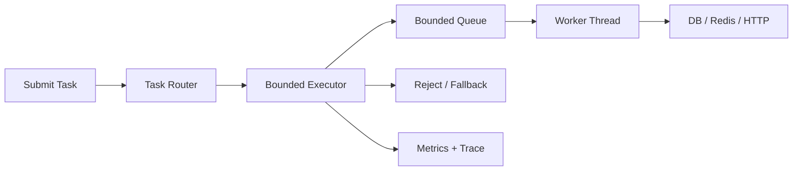

# Java 线程池参数如何配置，线上线程池打满怎么办？

## 面试定位

这道题考的是并发治理和反压能力。好的回答要覆盖任务类型、线程池架构、队列和拒绝策略、上下文传播、指标、止血、根因、回滚和项目经验，而不是背几个构造参数。

## 30 秒回答

线程池配置不能套公式，要先看任务类型、耗时、QPS、SLA、机器资源和下游容量。CPU 密集、IO 密集、MQ 消费、模型 API 调用、导出任务和异步日志应该隔离，避免一个慢下游拖垮所有业务。

关键参数包括 core/max pool size、queue capacity、keepAlive、reject policy、timeout、线程命名、上下文传播和监控。无界队列是常见风险，会把压力藏成延迟和 OOM；拒绝策略是保护机制，不能只打印日志。

线上打满先看 active、queue、reject、task p95、下游 p95、错误率和 consumer lag。止血可以限流、降级、暂停低优任务、隔离慢下游、缩短 timeout 或把失败任务写 retry/DLQ。

## 架构与运行机制

图 1 的主线是：任务先按类型路由，进入有界 executor，执行时带 timeout 和上下文，超出容量时触发拒绝或降级。图中 Metrics 记录 queue size、reject count、task latency、trace_id 和 reject reason。

这张图用于说明 Oracle Java 并发教程里的基础线程工具进入生产后，必须补上反压、隔离和可观测数据流。

## 深挖技术细节

线程数估算只能作为起点。CPU 密集任务接近核心数，IO 密集任务可更多线程，但真正限制来自下游容量和 SLA。比如模型 API 有 rate limit，扩线程只会制造更多超时和重试。线程池不是越大越好，队列也不是越长越安全。

拒绝策略要有业务语义。同步请求可以快速失败或返回降级；异步任务可以写 retry queue 或 DLQ；低优任务可以丢弃并计数。只打印日志等于静默丢任务。MQ 消费场景里，线程池拒绝后不能 ack，否则消息会丢；也不能无限重试，否则形成重试风暴。

跨线程上下文要显式传播。traceId、MDC、tenantId、安全上下文和 locale 要在提交任务时捕获，执行前设置，finally 清理。线程复用会让 ThreadLocal 污染后续任务，造成串租户、日志错乱或内存泄漏。

## 关键数据结构与协议

| 字段 | 用途 | 追问点 |
| --- | --- | --- |
| `executor_name` | 标识线程池 | 隔离边界 |
| `task_type` | 区分任务 | 哪类任务打满 |
| `queue_size` | 队列积压 | 是否超过 SLA |
| `oldest_task_age` | 最老排队时间 | 业务影响 |
| `reject_count` | 拒绝次数 | 保护是否触发 |
| `task_latency_p95` | 任务耗时 | 下游是否变慢 |
| `trace_id` | 链路追踪 | 跨线程定位 |
| `reject_reason` | 拒绝原因 | 降级和审计 |

## 系统设计案例

设计一个异步任务平台，任务包括 MQ 消费、Redis 回源重建、模型 API 调用和报表导出。架构上，Task Router 按任务类型选择线程池，每个线程池有有界队列、timeout、拒绝策略和指标。数据流是 submit -> route -> enqueue -> execute -> downstream -> fallback/retry -> metrics。

取舍是：隔离越细，故障扩散越少，但资源利用更复杂；队列越大，拒绝越少，但尾延迟和内存风险更高；快速失败保护系统，但用户可见错误增加。面试追问通常会问 CPU/IO 线程数、拒绝策略、ThreadLocal 和线程池打满止血。

## 真实问题与排障

线上线程池打满，先看影响面：哪个 executor、哪个 task_type、是否单个下游慢、queue size、oldest task age、reject count、task p95、consumer lag、GC pause。止血可以限流入口、暂停低优任务、隔离慢下游、缩短 timeout、开启降级或把失败任务写 DLQ。

根因定位看下游 p95、锁等待、数据库连接池、Redis latency、模型 API rate limit、thread dump 和 GC。回滚可能是恢复旧线程池配置、关闭新异步任务、降低消费并发或回滚下游调用。回归要模拟下游慢、队列打满、拒绝策略触发和上下文传播。

## 边界条件与反例

反例一：无界队列。它隐藏压力，最终变成延迟和 OOM。

反例二：所有任务共用 common pool。慢任务会拖垮核心任务。

反例三：拒绝策略只打日志。任务已经没执行，必须有业务结果。

反例四：ThreadLocal 不清理。线程复用后会污染后续任务。

## 项目表达

项目里可以说：我把 MQ 消费、模型调用、报表导出和在线请求拆成独立线程池，并为每个线程池配置 queue capacity、timeout、reject policy 和 dashboard。一次短信下游变慢事故中，我们先暂停低优通知止血，再把短信线程池隔离，拒绝任务进入 DLQ，核心发券和 ES 同步不再被拖垮。

为了接住追问，还可以补充上线验证：压测下游慢、队列打满、拒绝策略触发和 ThreadLocal 清理，观察 `queue_size`、`reject_count`、`consumer_lag` 和业务 p95 都在预期范围内。

## 深问准备

1. CPU 密集和 IO 密集线程数怎么估？
2. 为什么无界队列危险？
3. 拒绝策略怎么选？
4. 线程池打满先扩容吗？
5. ThreadLocal 上下文怎么传播和清理？

## 多轮追问模拟

**追问 1：线程池打满第一反应是不是把 maxPoolSize 调大？**

- 回答要点：不应该直接扩。先看 active、queue、oldest_task_age、reject、task p95、下游 p95、DB 连接池、Redis latency、MQ lag 和错误率。若下游已经慢，扩线程只会增加并发压力和超时。止血优先限流、降级、隔离慢任务、缩短 timeout、暂停低优任务或写入 DLQ。
- 考察点：是否能把线程池容量和下游容量、SLA、反压联系起来。
- 常见陷阱：把线程池当成本地资源问题，忽略下游已经成为瓶颈。

**追问 2：为什么无界队列危险？**

- 回答要点：无界队列会让任务提交看起来成功，但真实压力转化为排队延迟、内存增长、Full GC 和超时风暴。使用 `ThreadPoolExecutor` 时，如果队列无界，maxPoolSize 的扩容语义也容易失效，因为任务会不断进入队列而不是触发新线程或拒绝。
- 考察点：是否理解 queue capacity 是反压的一部分。
- 常见陷阱：用无界队列“避免拒绝”，结果把故障推迟到 OOM。

**追问 3：拒绝策略怎么选才算有业务语义？**

- 回答要点：同步请求可快速失败、返回降级或提示稍后重试；异步任务可写 retry queue 或 DLQ；低优统计任务可丢弃并计数；MQ 消费不能在任务未执行时 ack。拒绝策略要配合错误码、告警和审计，而不是只打印日志。
- 考察点：是否能从技术拒绝扩展到业务结果。
- 常见陷阱：使用默认拒绝或只打日志，调用方误以为任务已经处理。

**追问 4：ThreadLocal 在线程池里为什么容易出问题？**

- 回答要点：线程池复用线程，ThreadLocal 中的 traceId、tenantId、MDC、安全上下文如果不在 finally 清理，后续任务可能读到上一个任务的数据，造成日志串链路、串租户或权限污染。提交任务时应捕获必要上下文，执行前设置，执行后清理。
- 考察点：是否理解线程复用带来的隐性状态污染。
- 常见陷阱：只在主线程设置 MDC，异步任务日志没有 trace，或者复用旧 trace。

## 来源与延伸阅读

- [Java ThreadPoolExecutor API](https://docs.oracle.com/en/java/javase/21/docs/api/java.base/java/util/concurrent/ThreadPoolExecutor.html)：用于确认 core/max pool size、work queue、rejected execution handler 和线程池状态语义。
- [Java BlockingQueue API](https://docs.oracle.com/en/java/javase/21/docs/api/java.base/java/util/concurrent/BlockingQueue.html)：用于支持有界/无界队列对反压、容量和任务积压的影响。
- [Java ThreadLocal API](https://docs.oracle.com/en/java/javase/21/docs/api/java.base/java/lang/ThreadLocal.html)：用于说明线程本地变量在线程复用时必须谨慎清理。
- [Prometheus Alerting rules](https://prometheus.io/docs/prometheus/latest/configuration/alerting_rules/)：用于支持 `queue_size`、`reject_count`、`task_latency_p95` 等指标进入告警规则。
- [Apache Kafka Consumer Configs](https://kafka.apache.org/documentation/#consumerconfigs)：用于说明消费并发、poll、lag 和处理线程池容量之间的关系。
