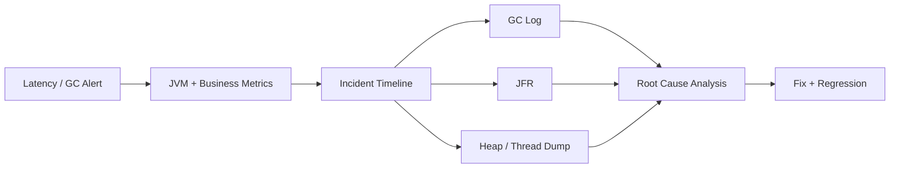

# 线上服务频繁 Full GC 或接口 p99 抖动，你会如何排查？

## 面试定位

这道题考的是线上事故排障能力。合格回答要先讲影响面和证据链，再讲 GC log、JFR、heap dump、thread dump、指标、止血、根因和回归。不能一上来就调大堆，也不能只背收集器名称。

## 30 秒回答

我会先看时间线和影响面：哪些实例、哪些接口、p99、错误率、CPU、GC pause、Full GC、heap used after GC、allocation rate、线程池队列、MQ lag 和下游延迟是否同时变化。

证据采集包括 GC log、JFR、heap dump、thread dump、Prometheus 指标和业务 trace。采集要受控，避免 dump 写满磁盘或同时影响所有实例。

根因可能是对象分配暴涨、无界缓存、ThreadLocal 泄漏、大对象、线程池积压、下游慢、direct memory 或 metaspace 问题。止血可以限流、降级、暂停批量任务、降低 trace 采样、重启单实例或回滚版本。修复后用压测验证 `gc_pause_p95`、`heap_used_after_gc`、`allocation_rate` 和业务 p95。

## 架构与运行机制

图 1 的主线是：告警后先建立时间线，再采集 GC log、JFR 和 dump 证据，最后做根因分析和回归。图中 Timeline 是关键，因为 GC 可能是原因，也可能是线程池积压或下游慢的结果。

这张图用于说明 Oracle GC 调优文档提供机制边界，工程排障还要有安全采集、降级和回归数据流。

## 深挖技术细节

GC 日志要看 pause、GC cause、young/old 区变化、晋升、Full GC 次数和回收后堆占用。`heap_used_after_gc` 持续升高比单次 heap used 更有价值，它说明回收后仍有对象被引用。allocation rate 高说明对象创建太快，即使没有泄漏，也会造成频繁 Young GC 和 CPU 消耗。

JFR 适合看一段时间里的分配热点、锁竞争、线程状态、IO、异常和 GC 事件。heap dump 适合看对象图、dominator tree 和引用链。thread dump 适合看死锁、阻塞、高 CPU 线程和线程池耗尽。三者要结合业务 trace：是哪条接口、哪个租户、哪个任务导致对象膨胀。

区分 GC 是原因还是结果，要看谁先变化。如果下游延迟和线程池 queue 先涨，对象堆积后 GC 才变多，GC 可能是结果。如果 GC pause 先冻结所有请求，然后接口 p99 和 MQ lag 上升，GC 更可能是直接原因。

## 关键数据结构与协议

| 字段 | 用途 | 追问点 |
| --- | --- | --- |
| `gc_pause_p95` | 判断停顿影响 | 是否伤害 SLA |
| `full_gc_count` | Full GC 次数 | 是否严重回收 |
| `heap_used_after_gc` | 回收后堆占用 | 是否泄漏趋势 |
| `allocation_rate` | 分配速率 | 对象 churn |
| `thread_count` | 线程数量 | 线程泄漏 |
| `executor_queue_size` | 队列积压 | GC 原因还是结果 |
| `dump_id` | dump 审计 | 采集风险 |
| `incident_window` | 时间窗口 | 串联证据 |

## 系统设计案例

设计一个 JVM 运行时排障体系：服务输出 GC log 和 JVM metrics，Prometheus 采集指标，告警触发短窗口 JFR，Dump Tool 通过审批采集 heap/thread dump，Dashboard 关联 HTTP p95、MQ lag、Redis latency、线程池 queue 和 GC pause。数据流是 metrics -> alert -> evidence capture -> RCA -> fix -> regression。

取舍是：GC log 开销低但定位有限；JFR 信息丰富但要控制窗口；heap dump 能看引用链但风险高；重启能止血但会丢现场。面试追问如果问“为什么不直接调大堆”，要回答调大堆可能推迟事故并增加停顿。

## 真实问题与排障

线上接口 p99 抖动时，先看影响面：是否所有实例、是否单接口、是否错误率升高、是否 CPU/GC/线程池/下游同时变化。止血可以限流非核心流量、关闭大对象功能、降低 trace 采样、暂停批量任务、重启单个异常实例或回滚新版本。

根因定位看 GC log、JFR 分配热点、heap dump 大对象、thread dump 阻塞、线程池 queue 和业务 trace。回滚可能是恢复旧缓存 schema、缩小批量大小、清理 ThreadLocal、限制队列、关闭新 trace 字段。回归要做压测和线上观察，确认 pause、allocation、heap after GC 和业务 p95 都恢复。

## 边界条件与反例

反例一：没有证据直接调大堆。它可能让停顿更长。

反例二：只看 heap。direct memory、metaspace、线程栈和容器内存也会出问题。

反例三：同时 dump 所有实例。会造成容量下降和磁盘风险。

反例四：把线程池积压误判为 GC 根因。要用时间线判断。

## 项目表达

项目里可以说：一次活动页发布后接口 p99 抖动，我们先看时间线，发现 allocation rate 和 Redis 大 value 先升高，线程池 queue 随后积压，Full GC 最后出现。止血时关闭非核心活动模块并降低 trace 采样；根因通过 JFR 和 heap dump 定位到大 JSON value 和无界 trace buffer；修复后拆分 value、限制 buffer，并用压测验证 `gc_pause_p95` 和 `heap_used_after_gc` 回落。

AI/RAG 项目也类似：长 prompt、全量 trace、embedding 批量结果和工具大响应都会制造对象压力。

## 深问准备

1. GC 是原因还是结果怎么判断？
2. JFR、heap dump、thread dump 分别看什么？
3. 为什么不能直接调大堆？
4. 如何定位内存泄漏？
5. dump 线上实例有什么风险？

## 来源与延伸阅读

- Oracle HotSpot VM Garbage Collection Tuning Guide：用于确认 GC 调优语义和收集器取舍。
- Oracle Java Concurrency 官方教程：用于连接线程池和线程状态。
- Prometheus 官方文档：用于支持 JVM 指标和告警。
