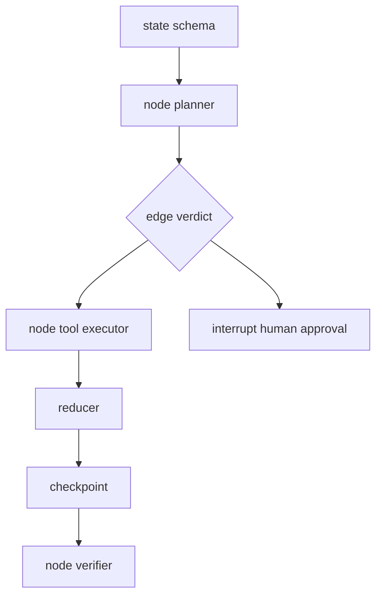

# LangGraph 适合什么类型的 Agent 项目？

## 面试定位

这题考你是否理解 LangGraph 的适用边界。回答要讲 state schema、node、edge、checkpoint、interrupt、reducer 和不适用场景。

## 30 秒回答

LangGraph 适合有明确状态图、条件分支、checkpoint、interrupt、人机协同和恢复需求的 Agent workflow。它把流程拆成 node，把流转放到 edge，把共享事实放到 state schema。简单线性 loop 不一定需要它，高度开放探索任务也可能图膨胀。

## 标准回答

LangGraph 的核心是显式状态。node 读取 state 并返回 update，edge 根据 verdict、error_code、risk_level 或 human decision 决定下一步。reducer 决定多个更新如何合并。checkpoint 保存状态，interrupt 支持人工介入和 resume。

关键取舍是结构化治理和建模成本。显式 graph 便于恢复和测试，但简单任务会显得重。动态探索太多时，图结构也可能膨胀。

适合场景包括旅行规划、客服流程、研究助手、审批流和长任务 coding workflow。它们都有阶段、状态、分支和恢复点。不适合只需要一次工具调用或简单问答的任务。

## 架构与运行机制

数据流是用户输入初始化 state，planner node 生成 plan，tool node 写入 observation，verifier node 输出 verdict，edge 决定 finish、retry、interrupt 或 fail。每次关键更新保存 checkpoint。

## 可画图

## 系统设计案例

Travel Agent 可拆成偏好收集、路线规划、天气查询、预算校验和人工确认节点。预算超限走重规划。付款和预订前触发 interrupt。用户确认后从 checkpoint resume。

## 真实问题与排障

resume 失败时查 checkpoint_id 和 thread_id。状态覆盖时查 reducer。分支错误看 edge condition。图变得难维护时检查是否把开放探索过度图化。指标看 `node_success_rate`、`edge_transition_error_rate`、`checkpoint_resume_rate` 和 `human_intervention_rate`。

## 面试官追问

- state schema 先还是 node 先？先 state，否则节点会失控。
- interrupt 解决什么？高风险步骤暂停，等待外部决策。
- checkpoint 里能放大文件吗？不建议，放 artifact 引用。

## 项目化回答

我会说：我会在多阶段 Agent 中用 LangGraph 建状态图。每个 node 有单一职责，edge 可测试，高风险动作通过 interrupt 进入人工确认，checkpoint 支持恢复。

## 常见错误

- 简单任务过度图化。
- 把复杂逻辑藏进 node。
- reducer 默认覆盖状态。
- 没有 node 级 eval 和 trace。

## 深挖技术细节

LangGraph 类框架适合把 Agent workflow 建模成可恢复状态机。关键不是“画图”，而是 state schema。State 里应区分 `user_goal`、`constraints`、`plan`、`observations`、`tool_results`、`risk_flags`、`human_decisions` 和 `final_answer`。Node 只负责单一阶段，例如 planner、retriever、tool_executor、verifier、human_approval。Edge 根据 verdict、error_code、risk_level 和 user_decision 路由。

Reducer 是容易被忽略的技术点。多个 node 更新同一字段时，要明确 append、merge、overwrite、deduplicate 或 reject。比如 observations 通常 append，constraints 不能被普通 node 覆盖，risk_flags 只能升高不能静默降低。Checkpoint 保存 thread 级状态，interrupt 用于高风险动作和人工输入。恢复时要带 checkpoint_id 和 state version，避免重复执行外部副作用。

适用性可以用指标判断：`checkpoint_resume_rate`、`node_success_rate`、`edge_transition_error_rate`、`state_merge_conflict_rate`、`human_intervention_rate`、`debug_time_to_root_cause`。如果项目主要是一次问答或单次工具调用，这些能力很少用上，图化就是负担。

## 边界条件与反例

反例一：每个按钮点击都拆成 graph node，图迅速膨胀，维护成本超过收益。反例二：node 内部塞进巨型自由文本状态，表面是图，实际不可测试。反例三：恢复后重复执行支付或发送动作，因为 node 没有幂等和副作用记录。

边界在于：Graph 适合稳定的阶段性流程，开放探索可以放在某个 node 内部或子 Agent。高风险外部动作前要 interrupt，外部 artifact 应保存引用而不是塞进 checkpoint。简单任务优先用原生 loop baseline。

## 深问准备

- 问：state schema 先还是 node 先？答：先 state，因为节点职责和 edge 条件都依赖状态字段。
- 问：checkpoint 存什么？答：可恢复的小状态、artifact 引用、版本和决策，不存大文件明文。
- 问：reducer 怎么设计？答：按字段语义决定 append/merge/overwrite，并保护 constraints 和 risk_flags。
- 问：什么时候不用 LangGraph？答：线性、低状态、一次性工具调用或图建模成本大于恢复收益时。

## 来源与延伸阅读

- [LangGraph Overview](https://docs.langchain.com/oss/python/langgraph/overview)
- [LangGraph Persistence](https://docs.langchain.com/oss/python/langgraph/persistence)
- [LangGraph Human-in-the-loop](https://docs.langchain.com/oss/python/langgraph/interrupts)
