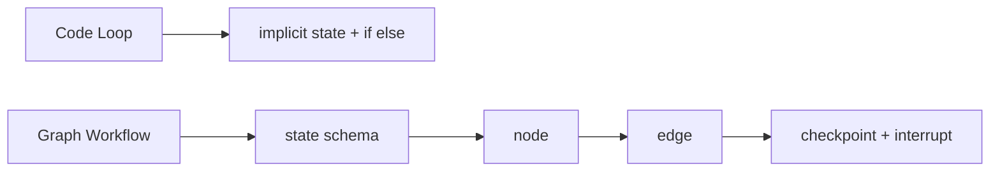

# Graph 化编排相比代码式 loop 的优缺点是什么？

## 面试定位

这是 LangGraph 的深入题。面试官想看你能否比较结构化治理和灵活性，而不是说“图更高级”。

## 30 秒回答

Graph 化编排的优点是 state、node、edge、checkpoint 和 interrupt 显式，便于可视化、测试、恢复和团队协作。缺点是建模成本更高，简单任务显得重，高度动态任务容易图膨胀。代码式 loop 更灵活轻量，但控制流和状态变化容易藏在代码里。

## 标准回答

代码式 loop 适合快速验证和开放探索。它可以用少量代码控制 observe、plan、act、verify。问题是任务变复杂后，重试、人工确认、恢复和状态合并会散落在 if/else 里。

核心取舍是灵活性和可治理性。代码式 loop 更轻，Graph workflow 更可观察。判断标准可以看 `debug_time_to_root_cause`、`checkpoint_resume_rate`、`edge_transition_error_rate` 和 `graph_complexity` 等指标。

Graph 化编排把这些显式化。node 负责单一职责。edge 表达条件流转。reducer 管状态合并。checkpoint 管恢复。interrupt 管人工介入。代价是需要先建模 state schema，并控制图复杂度。

## 架构与运行机制

数据流比较可以这样讲：代码式 loop 在一个循环里处理所有状态。Graph workflow 把状态写入 state schema，把动作拆成 node，把路由放在 edge，把恢复交给 checkpoint。

## 可画图

## 系统设计案例

客服退款 Agent 一开始可以用代码式 loop。后来加入风险分级、人工审批、补偿流程和恢复点后，图化更清晰。每个节点的输出都可测试，审批节点可以 interrupt，失败后从 checkpoint 继续。

## 真实问题与排障

如果代码式 loop 难排障，通常是状态和分支不显式。若 Graph 难维护，通常是节点太碎或边太多。排查时看 `graph_complexity`、`avg_node_count`、`edge_transition_error_rate` 和 `debug_time_to_root_cause`。

## 面试官追问

- Graph 一定更好吗？不，简单线性任务用 loop 更轻。
- 如何防图膨胀？保持 node 粗粒度，开放探索留给子 Agent。
- reducer 为什么关键？它定义状态更新语义，避免污染和覆盖。

## 项目化回答

我会说：我先用代码式 loop 建 baseline。只要出现复杂 state、checkpoint、interrupt 和多分支恢复，我就迁移到 Graph。迁移后保留 Adapter Layer 和同一批 eval case。

## 常见错误

- 认为 Graph 化天然更先进。
- 没有 state schema 就画节点。
- 每个小动作都拆成 node。
- 图结构和真实业务流程不一致。

## 深挖技术细节

Graph 化编排的技术核心是显式 state transition。一个 LangGraph 类系统通常要定义 `State` schema、node 输入输出、edge 条件、reducer、checkpoint namespace 和 interrupt 点。node 不应该随意修改全局状态，而应返回增量 update，由 reducer 决定 append、merge、overwrite 还是 reject。否则图看起来结构化，实际仍然是隐藏副作用。

与代码式 loop 相比，Graph 的优势在恢复和审计。每个 node 执行前后都能形成 checkpoint，失败后可以从某个状态继续；人工审批可以在 interrupt 点暂停；trace 能显示从哪个 edge 进入了错误分支。缺点是图建模需要稳定业务边界。高度探索式任务如果把每个微动作都建成 node，会出现 edge 爆炸、状态 schema 膨胀和调试成本上升。

指标上可以比较 `checkpoint_resume_success_rate`、`edge_transition_error_rate`、`state_merge_conflict_rate`、`avg_node_count_per_run`、`debug_time_to_root_cause`、`p95_graph_overhead_latency`。如果 Graph 让 resume 和排障明显变好，代价可接受；如果只是把简单 loop 包成图，指标不会有收益。

## 边界条件与反例

反例一：没有先定义 state schema 就画流程图，最后每个 node 都传一大段自由文本。反例二：把 LLM 的每次思考都拆成 node，图复杂但不可治理。反例三：Graph 的状态和业务真实状态不一致，恢复后用户看到旧数据或重复执行外部动作。

边界在于：Graph 适合稳定的高层控制流，开放探索可以留给某个 node 内部的子 Agent 或代码式 loop。涉及外部副作用的 node 要做幂等、确认和 checkpoint，否则恢复可能重复发送、重复支付或重复写入。

## 深问准备

- 问：reducer 为什么重要？答：它定义并发或多节点状态合并语义，避免旧 state 覆盖新证据。
- 问：interrupt 放哪里？答：放在高风险动作、人工审批、信息不足追问和不可逆写入前。
- 问：如何防图膨胀？答：node 按业务阶段而不是微动作划分，开放决策放进子运行时。
- 问：如何从 loop 迁到 graph？答：先抽 state schema 和工具边界，再把稳定分支变成 node/edge，保留同一批 eval。

## 来源与延伸阅读

- [LangGraph Overview](https://docs.langchain.com/oss/python/langgraph/overview)
- [LangGraph Persistence](https://docs.langchain.com/oss/python/langgraph/persistence)
- [LangGraph Human-in-the-loop](https://docs.langchain.com/oss/python/langgraph/interrupts)
