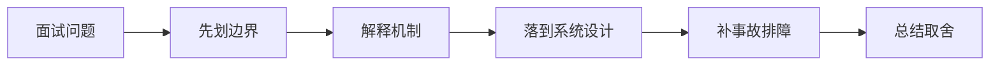

# LLM 推理链路与 KV Cache 的核心机制是什么？

## 面试定位

这道题关联 LLM 推理链路与 KV Cache，难度 4/5，出现频率 high。面试官真正想看的是：你能否把概念回答升级成架构、数据流、指标、取舍和真实故障处理。
回答主轴可以从「LLM 推理链路与 KV Cache」切入：LLM 在线推理通常分为 prefill 和 decode 两阶段，KV cache 复用已有上下文的注意力中间状态，直接影响首 token 延迟、吞吐和显存占用。

**第一句话建议**
我会先划清边界，再解释运行机制，最后用一个系统设计案例说明数据流、失败模式、指标和取舍。

**不要只答**
- 只看总延迟不拆 TTFT 和生成速度
- 忽略 KV cache 显存占用
- 认为 streaming 会降低模型真实计算量

## 30 秒回答

先给定义和边界：推理是模型在给定上下文下生成输出 token 的在线过程。；Prefill 处理输入，decode 逐 token 生成输出。；KV cache 是为了复用 attention 计算中间结果，提升生成效率。；LLM 在线推理通常分为 prefill 和 decode 两阶段，KV cache 复用已有上下文的注意力中间状态，直接影响首 token 延迟、吞吐和显存占用。；prefill 处理输入上下文。

回答时必须主动补数据流、关键字段、失败模式、指标和取舍，否则很容易停留在背概念。

## 架构与运行机制

### 标准回答骨架

- 先给定义和边界：推理是模型在给定上下文下生成输出 token 的在线过程。；Prefill 处理输入，decode 逐 token 生成输出。；KV cache 是为了复用 attention 计算中间结果，提升生成效率。；LLM 在线推理通常分为 prefill 和 decode 两阶段，KV cache 复用已有上下文的注意力中间状态，直接影响首 token 延迟、吞吐和显存占用。；prefill 处理输入上下文。
- 再讲机制：首 token 延迟主要受排队、上下文长度、prefill 和安全检查影响。；后续生成速度受 decode、batching、模型大小和硬件影响。；KV cache 节省计算但占用显存，并随上下文长度和并发增长。；流式输出改善体感延迟，但不消除总生成成本。；Prefill 阶段把输入上下文一次性送入模型，建立后续生成需要的中间状态。。
- 工程落地要说清楚：Model Gateway。；Streaming response。；Dynamic batching。；Context length routing。；Local/cloud fallback。；请求链路要记录 model、context_tokens、output_tokens、ttft_ms、decode_tokens_per_second、queue_ms、timeout 和 fallback_reason。。
- 最后补指标、失败模式和取舍：time_to_first_token；tokens_per_second；queue_time；gpu_memory_usage；fallback_rate；只看总延迟不拆 TTFT 和生成速度；忽略 KV cache 显存占用；认为 streaming 会降低模型真实计算量。
- LLM 在线推理通常分为 prefill 和 decode 两阶段，KV cache 复用已有上下文的注意力中间状态，直接影响首 token 延迟、吞吐和显存占用。
- 推理是模型在给定上下文下生成输出 token 的在线过程。
- Prefill 处理输入，decode 逐 token 生成输出。
- KV cache 是为了复用 attention 计算中间结果，提升生成效率。
- 首 token 延迟主要受排队、上下文长度、prefill 和安全检查影响。
- 后续生成速度受 decode、batching、模型大小和硬件影响。
- KV cache 节省计算但占用显存，并随上下文长度和并发增长。
- 流式输出改善体感延迟，但不消除总生成成本。
- Prefill 阶段把输入上下文一次性送入模型，建立后续生成需要的中间状态。
- Decode 阶段每次基于已有上下文生成下一个 token。
- KV cache 缓存 attention 的 key/value，避免每生成一个 token 都重复计算全部历史上下文。
- 把核心对象、状态变化、执行顺序和异常路径讲出来，避免只说结论。

### 数据流怎么讲

可以按用户目标、模型、上下文、状态、工具、执行循环、评测、安全和可观测性来讲。数据流是用户任务进入编排层，Context Builder 汇总系统指令、用户约束、RAG 证据、短期状态和工具结果，模型输出结构化动作，宿主程序执行工具并把 observation 写回 State 和 Trace。

### 落地实现细节

- Model Gateway。
- Streaming response。
- Dynamic batching。
- Context length routing。
- Local/cloud fallback。
- 请求链路要记录 model、context_tokens、output_tokens、ttft_ms、decode_tokens_per_second、queue_ms、timeout 和 fallback_reason。
- 对高并发场景按任务类型和风险等级路由模型，避免所有请求走最大模型。
- 长上下文任务要结合 RAG、摘要和缓存策略，防止 KV cache 压垮推理服务。
- 线上指标要区分 time_to_first_token、tokens_per_second、queue_time、prefill_time、decode_time 和 cache hit。
- 长上下文和并发会放大 KV cache 显存压力，需要限流、批处理、上下文裁剪和模型路由。
- 明确输入、上下文、模型、参数、工具、安全策略和输出校验。
- 为关键能力建立离线评测和线上观测。
- 按业务风险设计缓存、降级、审计和人工确认。
- 关键接口要有 schema、version、timeout、retry、幂等键和审计字段。
- 关键状态要能恢复，关键动作要能回放，关键结果要有验证器或指标证明。

## 可画图

图 1：这类题不要直接背结论，先划清边界，再沿机制、设计、事故和取舍回答。

## 系统设计案例

### 面试可展开的系统设计

典型设计题是企业内部 Agent、Coding Agent、Paper Agent 或 Web Agent：外层 deterministic workflow 管理权限、预算、审批和最终提交，内层 Agent loop 处理开放探索，Eval Gate 根据 golden case、轨迹评分、工具结果和人工反馈决定是否继续。

**答题时建议画出的模块**
- 入口层：生成 request_id，识别用户、租户、任务类型、风险等级和预算。
- Context Builder：组装 system policy、用户目标、历史摘要、RAG evidence、工具结果和输出约束。
- Model Gateway：选择模型、解码参数、timeout、retry、fallback 和成本记录。
- Tool/Verifier 层：执行受控工具，校验 schema、citation、权限、业务规则和安全策略。
- Trace/Eval 层：保存上下文 manifest、模型输出、工具 observation、verdict 和失败样本。

**数据流**
- 用户请求进入后生成 request_id，并绑定 tenant、user_scope、task_type 和 risk_level。
- Context Builder 按 token budget 和可信级别选择证据、历史、状态和工具说明。
- 模型生成结构化输出或工具调用意图，宿主程序负责执行、权限、错误和审计。
- Verifier 检查引用、格式、安全和业务规则；失败样本进入 eval/regression。

## 真实问题与排障

真实线上问题一般从任务成功率、工具调用成功率、invalid args、上下文漂移、幻觉率、引用准确率、token 成本、延迟、guardrail block rate 和 human handoff rate 看起。回答时要把模型问题、检索问题、工具问题、状态问题和权限问题分开归因。

**现场排障回答法**
- 先确认是事实错误、格式错误、工具错误、权限错误、成本异常还是延迟异常。
- 查看 context manifest：模型看到哪些证据、哪些内容被裁剪、是否有权限污染。
- 查看 model/tool/verifier trace，定位是检索、上下文、模型、工具还是校验层失败。
- 先止血：降级到检索摘要、关闭高风险工具、回滚 prompt/model/config 或转人工。
- 把失败样本加入 golden set，并补 citation、schema、权限或工具回归。

**重点指标**
- time_to_first_token
- tokens_per_second
- queue_time
- gpu_memory_usage
- fallback_rate

## 多轮追问模拟

### 追问 1：如果面试官深挖 LLM 推理链路与 KV Cache 的生产落地和排障，你怎么回答？

**回答要点**：我会先划清边界：推理是模型在给定上下文下生成输出 token 的在线过程。；Prefill 处理输入，decode 逐 token 生成输出。；KV cache 是为了复用 attention 计算中间结果，提升生成效率。；LLM 在线推理通常分为 prefill 和 decode 两阶段，KV cache 复用已有上下文的注意力中间状态，直接影响首 token 延迟、吞吐和显存占用。。然后再解释机制、生产约束和指标，避免只背名词。

**考察点**：边界、机制

### 追问 2：如果把这个点落到真实项目，你会怎么设计？

**回答要点**：我会按输入、配置、运行、失败处理和观测展开：请求链路要记录 model、context_tokens、output_tokens、ttft_ms、decode_tokens_per_second、queue_ms、timeout 和 fallback_reason。；对高并发场景按任务类型和风险等级路由模型，避免所有请求走最大模型。；长上下文任务要结合 RAG、摘要和缓存策略，防止 KV cache 压垮推理服务。；线上指标要区分 time_to_first_token、tokens_per_second、queue_time、prefill_time、decode_time 和 cache hit。；长上下文和并发会放大 KV cache 显存压力，需要限流、批处理、上下文裁剪和模型路由。。项目表达里要说明数据流、配置来源、回滚方式和指标。

**考察点**：项目设计、数据流

### 追问 3：线上出问题时先看什么？

**回答要点**：先确认影响面和最近变更，再看关键指标：time_to_first_token；tokens_per_second；queue_time；gpu_memory_usage；fallback_rate。排查时按入口、运行态、依赖、配置、资源和发布逐层收敛。

**考察点**：排障、指标

### 延伸追问 1：如果面试官深挖 LLM 推理链路与 KV Cache 的生产落地和排障，你怎么回答？

回答时继续沿着边界、架构、数据流、指标、失败模式和取舍展开。可以落到这些项目证据：可以关联项目证据：pe-coding-agent；线上指标要区分 time_to_first_token、tokens_per_second、queue_time、prefill_time、decode_time 和 cache hit。；长上下文和并发会放大 KV cache 显存压力，需要限流、批处理、上下文裁剪和模型路由。

### 延伸追问 2：这个点最容易和哪个概念混淆？

回答时继续沿着边界、架构、数据流、指标、失败模式和取舍展开。可以落到这些项目证据：可以关联项目证据：pe-coding-agent；线上指标要区分 time_to_first_token、tokens_per_second、queue_time、prefill_time、decode_time 和 cache hit。；长上下文和并发会放大 KV cache 显存压力，需要限流、批处理、上下文裁剪和模型路由。

### 延伸追问 3：线上失败时你会看哪些指标？

回答时继续沿着边界、架构、数据流、指标、失败模式和取舍展开。可以落到这些项目证据：可以关联项目证据：pe-coding-agent；线上指标要区分 time_to_first_token、tokens_per_second、queue_time、prefill_time、decode_time 和 cache hit。；长上下文和并发会放大 KV cache 显存压力，需要限流、批处理、上下文裁剪和模型路由。

## 项目化回答与取舍

**项目证据怎么挂钩**
- 可以关联项目证据：pe-coding-agent
- 线上指标要区分 time_to_first_token、tokens_per_second、queue_time、prefill_time、decode_time 和 cache hit。
- 长上下文和并发会放大 KV cache 显存压力，需要限流、批处理、上下文裁剪和模型路由。

**取舍总结**
AI Agent 的取舍是开放任务能力换来了不确定性、成本、延迟和治理复杂度。面试追问通常会围绕 workflow 与 agent 边界、memory 与 RAG 区别、function calling 是否等于 agent、eval 怎么证明不是 demo、如何做安全边界展开。

**收尾句**
这类问题最后要回到可验证结果：设计上有什么边界，线上看什么指标，失败后怎么恢复，哪些场景不该用这个方案。这样回答才经得起连续追问。

## 深挖技术细节

- Model Gateway。
- Streaming response。
- Dynamic batching。
- Context length routing。
- Local/cloud fallback。
- 请求链路要记录 model、context_tokens、output_tokens、ttft_ms、decode_tokens_per_second、queue_ms、timeout 和 fallback_reason。
- 对高并发场景按任务类型和风险等级路由模型，避免所有请求走最大模型。
- 长上下文任务要结合 RAG、摘要和缓存策略，防止 KV cache 压垮推理服务。
- 线上指标要区分 time_to_first_token、tokens_per_second、queue_time、prefill_time、decode_time 和 cache hit。
- 长上下文和并发会放大 KV cache 显存压力，需要限流、批处理、上下文裁剪和模型路由。
- 明确输入、上下文、模型、参数、工具、安全策略和输出校验。
- 为关键能力建立离线评测和线上观测。
- 按业务风险设计缓存、降级、审计和人工确认。
- LLM 在线推理通常分为 prefill 和 decode 两阶段，KV cache 复用已有上下文的注意力中间状态，直接影响首 token 延迟、吞吐和显存占用。
- 推理是模型在给定上下文下生成输出 token 的在线过程。
- Prefill 处理输入，decode 逐 token 生成输出。
- KV cache 是为了复用 attention 计算中间结果，提升生成效率。
- 首 token 延迟主要受排队、上下文长度、prefill 和安全检查影响。
- 后续生成速度受 decode、batching、模型大小和硬件影响。
- KV cache 节省计算但占用显存，并随上下文长度和并发增长。
- 流式输出改善体感延迟，但不消除总生成成本。
- Prefill 阶段把输入上下文一次性送入模型，建立后续生成需要的中间状态。
- Decode 阶段每次基于已有上下文生成下一个 token。
- KV cache 缓存 attention 的 key/value，避免每生成一个 token 都重复计算全部历史上下文。

## 边界条件与反例

反例一：如果业务需要强事务一致性，不能只靠缓存、搜索索引或异步读模型承载最终正确性。

反例二：如果没有指标、trace 和回归样例，方案在线上出问题时只能靠猜，不能证明稳定性。

反例三：为了追求低延迟而省略权限、幂等、超时或降级，会把局部性能优化变成系统性风险。

## 深问准备

被追问时优先沿四条线展开：为什么需要这个方案、关键数据结构是什么、失败后如何止血和定位、最终用什么指标证明修复有效。

- 准备一个线上事故：影响面、止血、根因、修复、回归。
- 准备一个系统设计：入口、状态、执行、存储、观测。
- 准备一个取舍：一致性、延迟、吞吐、成本和可维护性。

## 来源与延伸阅读

- [OpenAI Documentation: Text generation](https://platform.openai.com/docs/guides/text)：用于确认官方语义边界、命令行为和工程约束。
- [OpenAI Help: How ChatGPT and foundation models are developed](https://help.openai.com/en/articles/7842364-how-chatgpt-and-our-language-models-are-developed)：用于确认官方语义边界、命令行为和工程约束。
