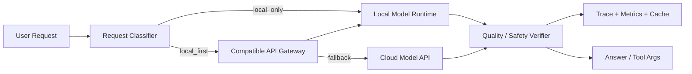

# 什么场景适合 Local-first AI？

## 面试定位

这道题考的不是“本地模型是不是更便宜”，而是你能否判断任务边界：哪些请求应该留在本地，哪些请求可以本地优先但允许云端 fallback，哪些请求一开始就应该走云模型或托管服务。成熟回答要同时覆盖隐私、延迟、成本、质量、硬件水位、模型能力、观测和回退策略。

## 30 秒回答

Local-first AI 适合三类场景：第一，数据敏感或离线环境，例如本地代码、企业文档、桌面自动化、语音转写和个人知识库；第二，低延迟和高频调用场景，例如补全、摘要、轻量分类、本地检索和工具参数生成；第三，成本可控但质量要求中等的批处理任务。它不是默认更优，复杂推理、强事实准确、长上下文、多模态高质量生成和需要统一审计的企业流程，通常要保留云端或专用服务 fallback。

## 标准回答

我会先把请求分级，而不是直接说“本地跑”。可以分成三档：

- `local_only`：敏感数据不能离开设备或内网，典型是代码仓库、客户资料、会议音频、内部文档、终端命令上下文。
- `local_first`：优先本地执行，失败、质量不足、上下文过长或硬件水位过高时转云端。
- `cloud_required`：需要更强模型、更长上下文、托管合规审计、团队协作记录或外部工具生态。

这个分级背后的工程判断是：本地优先降低了网络延迟、API 成本和数据外发风险，但会引入模型能力波动、硬件占用、版本碎片、冷启动、量化质量下降和运维可观测不足。回答时要把这些代价一起讲出来，才不像是在追热点。

## 架构与运行机制

图 1：Local-first AI 的关键不是把云模型替换掉，而是在网关层做请求分级、能力探测、质量验证和 fallback。`local_only` 保护敏感数据，`local_first` 追求成本与延迟收益，`cloud_required` 承认本地模型能力边界。

运行机制可以拆成四步。第一步，Classifier 根据数据敏感性、任务类型、上下文长度、目标质量和用户策略给请求打路由标签。第二步，Gateway 选择本地运行时，例如 MLX、llama.cpp、Ollama、Rapid-MLX 这类 OpenAI-compatible server，尽量保持上层调用协议稳定。第三步，Verifier 检查输出是否满足 schema、引用、测试或业务规则。第四步，把 `model_id`、`backend`、`latency_ms`、`tokens`、`memory_peak_mb`、`fallback_reason`、`quality_verdict` 写进 trace。

## 系统设计案例

以本地 Coding Agent 为例，读代码、生成小 patch、解释错误日志和检索项目文档可以走本地模型，因为数据敏感、上下文来自本机、调用频率高。涉及复杂重构、跨仓库推理、需要最新外部资料、需要更强代码模型或多轮失败后，就走云端 fallback。

核心数据流是：IDE 或桌面应用提交任务，入口层识别 workspace 和 data scope，网关选择 local_only、local_first 或 cloud_required，模型运行时产出回答或工具参数，Verifier 检查 schema、测试、引用和安全策略，最后把结果、route decision 和 fallback_reason 写入 Trace。这样回答既讲清楚请求怎么流动，也讲清楚每个环节失败后在哪里被发现。

落地模块可以这样设计：

- 入口层：识别 workspace、用户策略、数据敏感等级、任务类型和最大预算。
- 网关层：暴露 OpenAI-compatible API，让上层 Agent 不感知具体后端。
- 本地运行时：负责模型加载、量化版本、上下文窗口、并发队列和健康检查。
- 质量门禁：对代码任务跑测试或静态检查；对 RAG 回答检查引用；对工具参数做 schema validation。
- 回退策略：本地超时、OOM、质量 verdict 失败、上下文过长、连续两轮无改进时转云端或转人工。
- 观测层：记录本地命中率、fallback 率、延迟、成本节省、质量差异和硬件水位。

这个设计的重点是“兼容 API + 路由策略 + verifier”，而不是只把模型下载到本机。

## 真实问题与排障

Local-first 常见事故有四类。第一类是质量退化：本地模型能答但答案不准，排查要看 eval case、量化版本、prompt 模板、上下文截断和 verifier 失败原因。第二类是资源问题：内存、显存、CPU 或 Apple Silicon unified memory 被打满，表现为延迟上升、并发排队、系统卡顿。第三类是 fallback 失效：云端备用模型没有相同 schema 或工具能力，导致切换后结果格式不兼容。第四类是隐私边界破损：本应 local_only 的请求被错误路由到云端。

排障顺序是先看影响面，再按链路定位。指标包括 `local_hit_rate`、`fallback_rate`、`quality_delta`、`latency_p95`、`oom_count`、`queue_wait_ms`、`tokens_per_second`、`privacy_policy_denied_count`。止血动作可以是限制并发、降低上下文长度、禁用某个本地模型版本、强制高风险请求走云端或把敏感任务锁定在 local_only。

## 多轮追问模拟

### 追问 1：哪些任务不适合 Local-first？

**回答要点**：强事实准确、复杂推理、超长上下文、高质量多模态生成、需要统一审计和团队协作记录的任务，不应只靠本地模型。可以本地做预处理、检索或草稿，但最终要有云端模型、规则 verifier 或人工审核。

**考察点**：是否能主动承认本地模型能力边界。

**陷阱**：只用隐私和成本论证，把质量、审计和可维护性忽略掉。

### 追问 2：如何防止敏感请求错误 fallback 到云端？

**回答要点**：请求进入网关时先打 `data_scope` 和 `routing_policy`，`local_only` 请求在策略层禁止云端 fallback；trace 记录 policy verdict；高风险字段做脱敏或摘要；配置变更要有审计和回归测试。

**考察点**：是否把隐私边界做成硬策略，而不是提示词约定。

**陷阱**：说“提示模型不要上传敏感数据”，这不是可靠的工程控制。

### 追问 3：怎么证明本地优先真的值得？

**回答要点**：用同一批 golden cases 比较本地和云端的质量、延迟、成本、失败率和人工接管率。上线后看 `cost_per_task` 是否下降、`latency_p95` 是否改善、`quality_delta` 是否在可接受范围内、fallback 是否集中在少数任务类型。

**考察点**：是否能用评测和线上指标证明取舍，而不是只讲体验。

**陷阱**：只看 token 成本下降，不看质量下降和排障成本。

### 追问 4：本地模型服务卡住时怎么处理？

**回答要点**：先隔离影响面，降低并发或暂停该 backend；健康检查失败时从本地模型路由池摘除；local_first 请求转云端，local_only 请求进入队列或提示不可用；同时记录模型版本、内存峰值、上下文长度、队列等待和失败样本。

**考察点**：是否有运行时治理和降级策略。

**陷阱**：把本地模型当成单用户脚本，没有健康检查、队列、超时和熔断。

## 项目化回答

我会把 Local-first 落成一个“模型路由网关”，而不是在业务代码里散落 `if local then ...`。上层 Agent 调同一套 OpenAI-compatible API；网关根据任务策略选择 MLX、Ollama、llama.cpp、Rapid-MLX 或云模型；Verifier 决定结果是否可用；Trace 记录每次路由和 fallback。这样项目里既能保护本地数据，也能在本地模型能力不足时有清晰恢复路径。

## 深挖技术细节

本地优先要落到几个具体技术点。模型运行时要记录模型格式、量化版本、context window、tokens/s、内存峰值和加载时间；兼容 API 要覆盖 streaming、tool call、JSON schema、usage、错误码和 timeout；向量索引要记录 embedding 模型、维度、索引版本和召回阈值；语音或文档解析链路要记录输入格式、切片策略和质量校验结果。

请求路由可以用规则和评测结果共同驱动。规则负责硬边界，例如 `local_only` 禁止外发；评测结果负责软优化，例如某个本地模型在代码解释任务上通过率高，就优先给它；如果 RAG 引用校验失败或工具参数 schema 不通过，就触发 fallback 或转人工。这样本地优先不是静态配置，而是可观测、可回归、可调整的策略。

## 边界条件与反例

反例一：需要强事实准确和最新外部知识的问答，只靠本地模型容易过期或幻觉，应该接检索、云模型或人工审核。

反例二：企业审计要求统一留痕时，个人电脑上的本地模型虽然保护了数据外发，但可能缺少集中审计、权限和留存策略。

反例三：低配设备上强行跑大模型，会把延迟和系统资源占用转嫁给用户，体验不一定比云端好。

反例四：本地模型只兼容 chat 接口，不兼容工具调用和结构化输出时，不适合直接承载需要可靠 tool args 的 Agent。

## 深问准备

- 准备一个分级策略：local_only、local_first、cloud_required 各自对应哪些业务。
- 准备一个 fallback 事故：本地模型质量不足、OOM 或 schema 不兼容时如何止血。
- 准备一组指标：local_hit_rate、fallback_rate、quality_delta、latency_p95、cost_per_task。
- 准备一个隐私边界：哪些字段可以脱敏外发，哪些请求必须停在本地。
- 准备一个 eval 方案：用同一批 golden cases 比较本地和云端结果。

## 常见错误

- 只讲省钱，不讲质量回归和模型能力边界。
- 本地模型服务没有健康检查、并发限制和超时。
- OpenAI-compatible 只兼容接口路径，不兼容工具调用、streaming、错误码和 usage 字段。
- local_only 和 local_first 混在一起，导致敏感请求被错误外发。
- 没有 golden cases，无法证明本地模型在目标任务上够用。

## 来源与延伸阅读

- [MLX](https://github.com/ml-explore/mlx)：用于确认 Apple Silicon 本地机器学习运行时的工程定位。
- [llama.cpp](https://github.com/ggml-org/llama.cpp)：用于确认本地 LLM 推理、量化和服务器化能力。
- [Ollama OpenAI compatibility](https://docs.ollama.com/openai)：用于确认本地模型服务通过兼容 API 降低上层集成成本。
- [Rapid-MLX](https://github.com/raullenchai/Rapid-MLX)：用于确认 Apple Silicon 本地推理服务和 OpenAI-compatible server 的实战形态。
