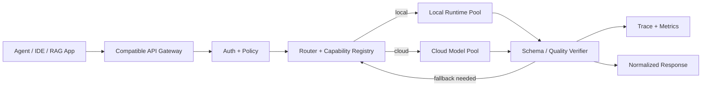

# 如何设计本地模型和云模型混合的兼容 API 网关？

## 面试定位

这道题比“什么场景适合 Local-first AI”更偏系统设计。面试官想看你是否能设计一个真正可上线的模型路由层：上层应用使用统一 API，下层可以接本地 MLX、Ollama、llama.cpp、Rapid-MLX，也可以接云端模型；中间要处理能力发现、路由策略、fallback、配额、观测、安全和质量验证。

## 30 秒回答

我会把它设计成一个 OpenAI-compatible model gateway。入口统一接收 chat/completions、responses 或 embeddings 类请求，先做租户、数据敏感等级、任务类型、上下文长度和工具能力判断；再根据 policy 路由到本地模型或云端模型。网关必须记录 `request_id`、`routing_policy`、`backend`、`model_id`、`latency_ms`、`tokens`、`memory_peak_mb`、`fallback_reason` 和 `quality_verdict`。本地优先不是目的，目标是让隐私、成本、延迟和质量都可治理。

## 架构与运行机制

图 1：混合模型网关的核心是 Router、Capability Registry 和 Verifier。Router 决定走本地还是云端，Capability Registry 描述每个 backend 支持的上下文长度、工具调用、streaming、embedding、JSON schema 和并发限制，Verifier 决定结果能否返回或需要 fallback。

关键对象可以这样建模：

| 对象 | 关键字段 | 作用 |
| --- | --- | --- |
| RequestPolicy | `data_scope`、`task_type`、`routing_mode`、`max_cost`、`quality_bar` | 决定 local_only、local_first、cloud_allowed 或 cloud_required |
| ModelCapability | `model_id`、`backend`、`context_window`、`tool_calling`、`json_schema`、`embedding_dim` | 避免把不支持的请求路由给错误模型 |
| RouteDecision | `selected_backend`、`reason`、`fallback_chain`、`policy_version` | 让每次路由可解释、可审计 |
| QualityVerdict | `schema_pass`、`grounding_pass`、`test_pass`、`confidence`、`failure_reason` | 决定返回、重试、fallback 或转人工 |

## 路由策略

我会把路由拆成硬约束和软优化。硬约束先执行：local_only 不能出本机或内网；需要工具调用但本地模型不支持工具 schema 的请求不能路由到该模型；上下文长度超过本地窗口不能硬塞；云端不可用或合规策略禁止时不能 fallback。软优化再比较延迟、成本、历史质量、当前队列长度和硬件水位。

一个典型路由顺序是：

1. 解析请求类型：chat、tool call、embedding、rerank、ASR 或 summarization。
2. 读取策略：用户、workspace、数据敏感等级、预算、最大延迟。
3. 做能力匹配：context window、JSON schema、streaming、tool calling、embedding dim。
4. 做资源判断：本地内存、队列长度、模型是否已加载、并发水位。
5. 执行模型调用，并用 verifier 验证 schema、引用、测试或安全规则。
6. 如果失败且策略允许，带着 `fallback_reason` 进入下一 backend。

## 系统设计案例

假设是一个企业内部 Coding Agent。用户在 IDE 里让 Agent 解释报错、改一段代码、查本地文档。网关先识别请求含有源代码和本地路径，默认 `local_first`；解释日志和小范围摘要走本地模型；涉及跨仓库大重构、连续两次测试失败或需要外部资料时，转云端模型。代码写入动作必须经过工具权限和测试 verifier，不允许仅凭模型自信度放行。

数据流是：IDE 调兼容 API -> 网关生成 request_id -> 策略层识别 workspace 和 data_scope -> Router 选择本地 backend -> 本地模型生成 patch 或解释 -> Verifier 跑 schema/test/citation -> 通过则返回标准响应，不通过则 fallback 或转人工 -> trace 记录完整决策链。

核心取舍是：本地路径提升隐私、延迟和成本可控性，但牺牲了模型上限、统一审计和集中运维；云端路径提升能力和治理一致性，但增加数据外发、网络延迟和 API 成本。网关的价值就是把这些取舍显式化，而不是让业务代码在每个调用点临时判断。

## 真实问题与排障

线上最容易出的问题不是“模型调不通”，而是兼容层假兼容。比如本地 backend 返回的 streaming chunk、tool call JSON、usage 字段或错误码和云端不一致，导致上层 Agent 在某些路径崩掉。因此网关必须做 response normalization，把不同 backend 的返回统一成内部标准结构。

第二类问题是 fallback 污染隐私边界。`local_only` 请求如果因为本地 OOM 自动转云端，就是严重策略事故。解决方式是策略层先于资源层执行，trace 里记录 policy verdict，并用回归用例覆盖敏感请求。

第三类问题是质量不可比。本地模型速度快但在特定任务上错误率高，如果没有 golden cases，只看人工体感会很危险。上线前应准备代码解释、工具参数、RAG 问答、摘要、分类等任务集，分别比较质量、延迟、成本和失败率。

## 多轮追问模拟

### 追问 1：OpenAI-compatible API 只要路径一样就够吗？

**回答要点**：不够。要看 message 格式、tool call、streaming chunk、JSON schema、错误码、usage、finish_reason、embedding 维度和超时语义是否一致。网关最好把外部响应先转成内部 canonical response，再返回给上层。

**考察点**：是否理解兼容层不仅是 URL 和字段名，更是行为语义。

**陷阱**：只做简单代理，上线后在工具调用、流式响应或错误恢复路径爆雷。

### 追问 2：什么时候 fallback，什么时候不 fallback？

**回答要点**：schema 失败、质量 verifier 失败、上下文过长、本地模型超时、OOM、连续无改进时可以 fallback；但 `local_only`、合规禁止外发、用户明确关闭云端、请求含高敏数据时不能 fallback。fallback 必须带 `fallback_reason`，否则后续无法评估策略是否合理。

**考察点**：是否能把可用性和隐私合规同时考虑。

**陷阱**：把 fallback 当作兜底万能键，忽略数据外发边界。

### 追问 3：如何做能力发现？

**回答要点**：为每个 backend 维护 capability registry，包括模型上下文长度、工具调用支持、JSON schema 支持、embedding 维度、streaming 支持、量化版本、最大并发、平均 tokens/s 和最近健康状态。启动时探测，运行时用健康检查和失败样本更新。

**考察点**：是否能避免把请求路由到不支持的 backend。

**陷阱**：只按模型名字路由，不知道这个本地模型是否支持工具调用和结构化输出。

### 追问 4：怎么证明这个网关带来了收益？

**回答要点**：离线用 golden cases 比较质量、延迟和成本；线上看 `local_hit_rate`、`fallback_rate`、`quality_delta`、`cost_per_task`、`privacy_policy_denied_count`、`p95_latency`、`oom_count`。收益要按任务类型拆，不要用全局平均掩盖某类任务质量下降。

**考察点**：是否能把架构收益量化。

**陷阱**：只说 API 成本下降，但没有证明质量和故障率没有恶化。

## 项目化回答

我会在项目里把它做成独立 gateway，而不是把本地/云端选择散落在业务代码里。上层 Agent 只依赖统一 SDK；网关负责 policy、capability、routing、normalization、verifier 和 trace。这样未来替换本地模型、接新云模型、调整隐私策略或做 A/B test，都不会重写业务逻辑。

上线步骤也要谨慎：先 shadow mode 记录本地模型建议但不返回；再对低风险任务放量；再引入 local_first；最后才考虑更敏感的 local_only 工作流。每一步都用 regression cases 和 trace 证明。

## 深挖技术细节

兼容 API 网关最好有内部 canonical schema。外部可以接近 OpenAI-compatible，但内部要把不同 backend 的 streaming、tool_calls、usage、error、finish_reason、embedding 和 metadata 归一化。否则上层 Agent 会被某个本地服务的字段差异绑死。

Capability Registry 是路由质量的核心。它不是静态文档，而是运行时表：模型上下文窗口、量化版本、JSON schema 支持、工具调用支持、embedding 维度、tokens/s、最大并发、最近健康检查、近七天任务通过率都要在里面。Router 先做能力匹配，再做成本和延迟优化。

Verifier 要按任务类型拆。代码类请求看 patch schema、测试结果和 diff 风险；RAG 请求看 citation grounding；工具调用看参数 schema、权限 verdict 和副作用等级；摘要和分类看 golden case accuracy。只有 verifier 明确失败且策略允许时，fallback 才是合理的。

## 边界条件与反例

反例一：`local_only` 请求因为本地模型超时就自动转云端，这是策略事故，不是可用性优化。

反例二：某个本地 backend 声称兼容 OpenAI API，但不支持工具调用或 streaming chunk 格式不同，上层 Agent 仍可能失败。

反例三：只按成本路由，把复杂推理任务送给低能力本地模型，会导致质量下降和人工返工。

反例四：没有 `policy_version` 和 `route_decision`，事故后无法解释为什么某个请求走了本地或云端。

## 深问准备

- 准备一张模块图：API Gateway、Policy、Router、Capability Registry、Runtime Pool、Verifier、Trace。
- 准备一个路由例子：同一请求在 local_only、local_first、cloud_required 三种策略下怎么走。
- 准备一个兼容性清单：tool call、streaming、JSON schema、usage、error code、embedding dim。
- 准备一个上线计划：shadow mode、低风险放量、A/B、回滚。
- 准备一个收益证明：质量、延迟、成本、fallback、隐私拦截五类指标。

## 常见错误

- 把兼容 API 当反向代理，没有 response normalization。
- 不维护 capability registry，导致工具调用、JSON schema 或 embedding 请求路由错误。
- fallback 策略绕过隐私边界。
- 没有 golden cases，只用主观体验判断本地模型可用。
- 不记录 policy_version 和 route decision，事故后无法解释为什么走了某个 backend。

## 来源与延伸阅读

- [MLX](https://github.com/ml-explore/mlx)：用于确认 Apple Silicon 本地模型运行时和生态边界。
- [llama.cpp server](https://github.com/ggml-org/llama.cpp/tree/master/tools/server)：用于确认本地推理服务化、OpenAI-compatible endpoint 和量化部署形态。
- [Ollama OpenAI compatibility](https://docs.ollama.com/openai)：用于确认本地模型服务通过兼容接口接入现有应用的方式。
- [Rapid-MLX](https://github.com/raullenchai/Rapid-MLX)：用于确认 Apple Silicon 本地推理网关与 OpenAI-compatible server 的实战参考。
