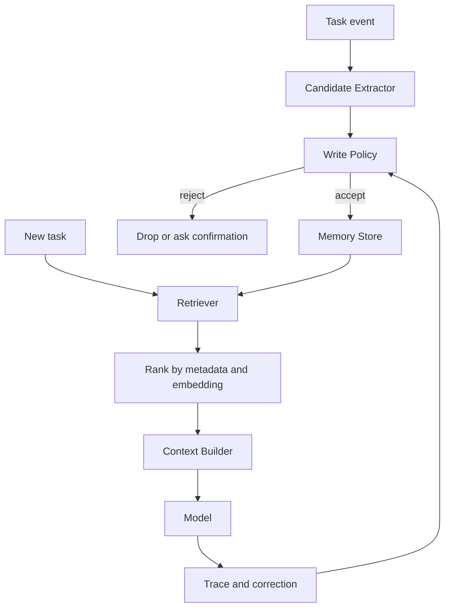

# 如何为 Agent 设计长期记忆系统？

## 30 秒回答

我会把长期记忆设计成一个受控的 Memory Store，而不是简单保存聊天记录。写入前用 policy 判断稳定性、敏感性、scope 和未来复用价值，读取时结合 metadata、embedding、TTL、confidence 和当前任务做 retrieval。最后必须有用户纠错、删除、审计和 eval，否则旧记忆会污染后续任务。

## 面试定位

这题考的是你能否把“记住用户”落到工程架构。重点不是接一个向量库，而是说明哪些信息能写、怎样隔离、如何读回上下文、失败时怎么恢复。

回答时要主动提到架构、数据流、指标、取舍和追问方向。这样面试官继续问隐私、冲突和大规模检索时，你不会只停留在概念层。

## 标准回答

长期记忆一般分三类。Profile memory 保存稳定偏好，例如语言、格式和工作习惯。Episodic memory 保存任务事件、项目决策和失败经验。Semantic memory 保存可检索知识片段，通常会有 embedding 和 citation。

写入路径要严格。Candidate Extractor 从会话或任务 trace 中抽取候选，Write Policy 判断是否稳定、是否敏感、是否需要用户确认，并写入 scope、source、confidence、TTL 和 version。

读取路径要保守。Retriever 先按 user、workspace、project 等 metadata 过滤，再用 embedding 召回，最后按 relevance、recency、importance 和 confidence 排序。Context Builder 只取少量高价值记忆，并明确标注它只是参考上下文，不能覆盖当前用户指令或外部事实证据。

## 架构与运行机制

图 1：长期记忆系统的写入、读取、上下文注入和纠错闭环。

这张图把长期记忆拆成两个方向。写入方向从 Task event 到 Candidate Extractor，再由 Write Policy 决定 accept、reject 或 ask confirmation，防止临时信息、敏感数据和模型猜测被永久保存。读取方向从 New task 开始，Retriever 先按 user、workspace、project、memory_type 做 metadata filter，再结合 embedding、recency、importance 和 confidence 排序。Context Builder 只注入少量高价值记忆，Trace and correction 则把错误命中、用户纠错和删除请求反馈给写入策略。

运行时要把写入、读取和纠错分开治理。写入决定系统未来会相信什么，读取决定当前任务会看见什么，纠错决定错误记忆能否被及时降权或删除。

## 可画图

图里建议画五层：输入事件、写入策略、Memory Store、检索排序、上下文构建。旁边标出关键字段：scope、metadata、embedding、TTL、confidence、sourceEventId 和 version。这样面试官能看到你关心的是完整生命周期。

## 系统设计案例

如果是 coding agent，我会保存 workspace 级偏好、常用测试命令、历史失败原因和用户审查风格。比如“这个仓库发布前要跑 pnpm verify:ci”可以写入 workspace scope，过期策略较长。某次临时调试命令则只留在短期状态中，不进入长期记忆。

数据流是：任务结束后抽取候选，policy 拒绝临时信息和敏感内容，通过的记录写入 Memory Store。下一次任务开始时，Retriever 只从当前 repo scope 取回相关记忆，模型执行后把 read_hit 和任务结果写入 trace。

## 真实问题与排障

如果 Agent 总按旧项目规则回答，先查 trace 中读取了哪些 memory_id。再看它们的 scope、source、confidence、TTL 和 lastUsedAt。止血可以禁用相关 memory type 或降低可疑记录权重。

关键指标包括 memory_precision、stale_memory_rate、correction_rate、privacy_block_rate 和 task_success_lift。只看命中率不够，因为错误命中比没有命中更危险。

## 面试官追问

- Memory 和 RAG 的区别是什么？
- 用户删除记忆后，向量索引和缓存怎么同步？
- 历史记录很大时，retrieval 怎么分层？
- 旧记忆与当前指令冲突时优先级怎么定？
- 如何证明长期记忆确实提升了任务成功率？

## 多轮追问模拟

第一轮追问：长期记忆和普通 RAG 最大区别是什么？  
回答要点：RAG 主要服务外部事实证据，长期记忆服务用户、工作区和任务连续性；二者来源、权限、更新和验证方式不同。考察点是语义边界。陷阱是把用户偏好、历史决策和事实知识都塞进同一个向量库。

第二轮追问：什么信息不应该写入长期记忆？  
回答要点：临时授权、敏感凭据、一次性调试状态、未经验证的模型推断、跨租户内容和过期项目规则。考察点是 Write Policy。陷阱是“多记总比少记好”，导致旧记忆污染后续任务。

第三轮追问：旧记忆和当前用户指令冲突怎么办？  
回答要点：当前明确指令优先，系统策略优先，外部事实证据优先；旧记忆只能作为参考，必要时降权、追问或标记 superseded。考察点是优先级和冲突处理。陷阱是让历史偏好覆盖当前任务。

第四轮追问：用户删除一条记忆后，系统要做哪些同步？  
回答要点：写 tombstone，更新结构化 store、向量索引、缓存和审计日志，并确保未来 retrieval 不再返回该 memory_id。考察点是删除语义。陷阱是 UI 删除了，向量索引仍可召回。

## 项目化回答

我会说自己不是“把对话塞进向量库”，而是做了 Memory Store、Write Policy、Retriever 和 Review UI。每条记忆带 source、scope、confidence、TTL 和 version，读取结果进入 trace，用户纠错会生成回归样本。

## 常见错误

- 把所有聊天都永久保存。
- 只用 embedding 检索，忘记租户和项目隔离。
- 让旧记忆覆盖当前用户明确指令。
- 没有删除和纠错机制。
- 只讲功能，不讲指标和安全取舍。

## 深挖技术细节

长期记忆系统要分写入、存储、读取、纠错四条链路。写入链路从 trace 中抽取候选，Write Policy 判断 `stability`、`future_value`、`sensitivity`、`scope`、`requires_confirmation`。存储链路把 profile、episodic、semantic 分开，记录 `memory_id`、`user_id`、`workspace_id`、`project_id`、`memory_type`、`source_event_id`、`confidence`、`ttl`、`version`、`embedding_ref`、`deleted_at`。

读取链路必须先 scope filter，再 semantic retrieval。Context Builder 只注入 top few memories，并且标记为 memory context，不能覆盖当前用户指令、系统策略和外部事实证据。纠错链路要支持用户删除、编辑、降权、supersede，并同步结构化 store、向量索引和缓存。高风险记忆写入或读取要进审计。

评估长期记忆不能只看命中率。关键指标包括 `memory_precision`、`task_success_lift`、`stale_memory_rate`、`correction_rate`、`privacy_block_rate`、`cross_scope_leak_count`、`memory_query_p95`。如果旧记忆导致错误，trace 要能看到具体 memory_id 和 rank。

## 边界条件与反例

反例一：把所有对话永久向量化，后续检索出过期路径、临时口令或另一个项目的规则。反例二：用户当前明确说“这次用英文”，旧中文偏好仍覆盖当前任务。反例三：删除记忆只删 UI，向量索引和缓存仍能召回。

边界在于：长期记忆适合稳定偏好、长期目标、项目经验和用户确认的事实；不适合保存临时授权、敏感凭据、一次性调试状态和未经证实的模型推断。事实类问题优先 RAG 或业务系统，Memory 只提供个性化上下文。

## 深问准备

- 问：Memory 和 RAG 区别？答：RAG 是外部事实证据，Memory 是用户/任务连续性，二者的来源、权限和验证方式不同。
- 问：用户删除后怎么同步？答：写 tombstone，更新结构化 store、向量索引、缓存和审计日志。
- 问：旧记忆冲突怎么办？答：当前指令优先，强证据优先，高风险冲突追问用户。
- 问：如何证明有收益？答：A/B 或离线 replay 比较任务成功率、返工率，同时监控 stale 和 leak 指标。

## 来源与延伸阅读

- [LangChain Memory overview](https://docs.langchain.com/oss/python/concepts/memory)：用于支持短期、长期与语义记忆的概念边界。
- [LangGraph Persistence](https://docs.langchain.com/oss/python/langgraph/persistence)：用于说明状态持久化、checkpoint 和可恢复执行如何支撑记忆读取。
- [LangSmith Evaluation](https://docs.smith.langchain.com/evaluation)：用于支持长期记忆收益、错误命中和回归样本的评测闭环。
