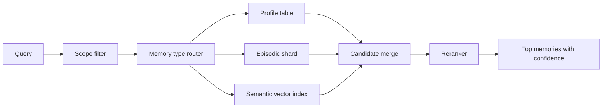

# 历史记录非常大时，如何优化长期记忆查询效率？

## 30 秒回答

我不会直接在全部历史上做向量搜索。长期记忆查询要先做 scope 和 metadata 过滤，再分层索引，最后用 embedding、recency、importance、confidence 和 TTL 排序。对高频偏好用结构化表，对长文本经验用向量索引，对旧记录做压缩、归档和衰退。

## 面试定位

这道题考大规模 retrieval 的工程感。面试官想确认你知道长期记忆不是“记录越多越好”，而是要控制召回范围、延迟、成本和污染率。

回答要覆盖架构、数据流、指标、取舍和追问。尤其要讲清楚如何避免跨用户、跨项目和旧事实被召回。

## 标准回答

第一步是分区。按 tenant、user、workspace、project、memory type 和时间范围建立 metadata，查询前先过滤掉不可能相关的记录。

第二步是分层。Profile memory 放结构化表，适合精确读取。Episodic memory 可按任务和时间分片。Semantic memory 才进入向量索引，并保留 source、citation 和摘要。

第三步是重排。初始召回后，用当前任务、最近使用时间、重要性、confidence、staleness 和权限做 rerank。只有通过阈值的少量记忆进入 Context Builder。

第四步是治理。旧记录要有 TTL、压缩摘要、version 和 correction history。长期不用且低置信的记录可以归档，不应继续占用热索引。

## 架构与运行机制

图 1：长期记忆查询的分层召回漏斗。图中 `Scope filter` 先切掉跨租户、跨用户、跨 workspace 和权限不足的记录；`Memory type router` 再把 profile、episodic、semantic 记忆送往不同索引；`Reranker` 最后把相似度、时效性、重要性、置信度和纠错状态合成排序。

这张图的核心边界是：向量检索只适合语义经验和知识片段，不适合权限、当前项目状态、用户确认和精确配置。那些内容应该走结构化读取或业务系统复核。否则系统可能“语义上很像”但 scope 错误，把另一个项目或旧事实放进当前上下文。

这里的核心不是单一索引，而是“先缩小集合，再语义召回，最后可信排序”。这样能减少延迟，也能降低错误记忆进入上下文的概率。

## 可画图

建议画成漏斗：全量 Memory Store 先按 scope 过滤，再按 type 路由，接着做向量召回和 rerank，最后只输出 top-k。每层旁边标出会丢弃什么记录，例如跨租户、过期、低置信、无来源和权限不足。

## 系统设计案例

对一个拥有多年对话历史的学习 Agent，可以把“用户长期目标”放 profile 表，把“每周学习反馈”放 episodic 分片，把“知识卡片和错题总结”放 semantic index。用户问 Java 并发时，系统先过滤 user 和学习计划，再取相关错题和已掌握状态。

数据流是：Query Planner 判断任务主题，Memory Router 选择索引，Retriever 召回候选，Reranker 加入 TTL 和 confidence，Context Builder 生成受限记忆块。结果进入 trace，用于后续 eval。

## 真实问题与排障

如果查询慢，先看过滤是否失效、索引分片是否倾斜、top-k 是否过大。若答案受旧记忆影响，检查 staleness penalty、归档策略和 correction 是否进入 rerank。

指标包括 memory_query_p95、candidate_count、memory_precision、stale_hit_rate、index_freshness 和 cost_per_retrieval。性能指标和质量指标要一起看，否则会把错误内容更快地召回。

事故处理先分影响面：是慢查询、错召回、跨 scope 泄漏，还是旧记忆污染回答；止血可以降低 top-k、关闭低置信 semantic memory、强制 tenant/workspace filter，或让高风险任务只读结构化状态；根因要查 query intent、filter 条件、候选集合、memory_id、rank、version、last_verified_at 和缓存 key；回归则建立跨项目旧路径、用户纠错、过期偏好和权限不足四类样本，验证不会再被召回。

## 面试官追问

- 什么时候用结构化查询，什么时候用向量检索？
- 记忆压缩会不会损失关键约束？
- 热索引和冷归档怎么划分？
- 用户纠错后如何更新索引？
- 如何评估 top-k 设置是否合理？

## 多轮追问模拟

**追问 1：为什么不能直接在全量历史上向量搜索？**  
答题要点：会带来跨用户、跨项目、旧事实和低置信记录污染；必须先按 scope 和 type 缩小集合，再做语义召回。考察点是安全边界和检索质量。陷阱是只谈性能，不谈污染率。

**追问 2：profile memory 和 semantic memory 的查询有什么区别？**  
答题要点：profile 偏好、权限、配置等精确字段适合结构化查询；semantic memory 适合经验、知识卡片和长文本摘要；episodic memory 则按任务和时间分片。考察点是索引建模。陷阱是所有记忆都进向量库。

**追问 3：如何判断 top-k 设置合理？**  
答题要点：看 memory_precision、stale_hit_rate、answer lift、token cost、latency 和用户纠错率；不同任务可以动态 top-k。考察点是效果评估。陷阱是只调大 top-k 追求召回。

## 项目化回答

可以说我会把长期记忆做成分层检索系统。先用 metadata 和 scope 控制安全边界，再用 embedding 解决语义召回，最后用 confidence、TTL 和用户纠错做重排。项目里会把慢查询和错召回都沉淀成 regression case。

## 常见错误

- 在全量聊天历史上直接做相似度搜索。
- 只优化延迟，不看 stale memory 命中。
- 把摘要压缩后丢掉 source 和 version。
- 缓存 key 缺少 workspace 或 user。
- 不给低置信记忆降权。

## 深挖技术细节

长期记忆检索要先缩小安全和语义范围。查询进入 Memory Router 后，先根据 `tenant_id`、`user_id`、`workspace_id`、`project_id`、`memory_type`、`time_range` 和 `sensitivity` 做 metadata filter。然后按类型路由：profile memory 走结构化表，episodic memory 走时间/任务分片，semantic memory 才走向量索引。这样避免跨用户、跨项目和旧事实直接进入候选。

候选合并后要做可信排序。Reranker 可以综合 `similarity_score`、`recency`、`importance`、`confidence`、`last_verified_at`、`ttl`、`correction_status`、`source_reliability` 和 `access_scope`。进入 Context Builder 前还要做 top-k 限制和冲突检查。缓存 key 必须包含 user、workspace、scope、query intent、memory version，否则会把别的项目或旧版本召回。

治理侧要有冷热分层。高频偏好和近期项目状态在热索引，过期低置信记录归档；旧长文本可以压缩成带 source/version 的 summary，原始记录进入冷存储。用户纠错时同时更新结构化 store、向量索引和缓存。指标包括 `memory_query_p95`、`candidate_count`、`memory_precision`、`stale_hit_rate`、`cross_scope_leak_count`、`index_freshness`、`cost_per_retrieval`。

## 边界条件与反例

反例一：全量聊天历史向量搜索，最相似的是另一个项目的旧路径。反例二：为了提速只用缓存，但缓存 key 没有 workspace，导致跨项目串记忆。反例三：旧记录压缩后丢 source，后续无法判断是否可信。

边界在于：向量检索适合语义化经验和知识卡片，不适合权限、当前状态、用户确认和精确配置。这些应走结构化查询。大规模系统既要优化延迟，也要优化污染率；召回错误记忆比慢一点更危险。

## 深问准备

- 问：什么时候用结构化查询？答：用户偏好、权限、项目配置、时间、状态和精确字段。
- 问：热索引和冷归档怎么分？答：按使用频率、最近验证、置信度、TTL 和当前任务相关性。
- 问：用户纠错后怎么更新？答：写 correction event，更新结构化记录、向量索引、缓存和 superseded 标记。
- 问：top-k 如何评估？答：看 memory precision、stale_hit_rate、answer lift、token cost 和用户纠错率。

## 来源与延伸阅读

- [LangChain Memory overview](https://docs.langchain.com/oss/python/concepts/memory)：官方文档用于说明长期记忆、短期记忆和不同 memory 类型的语义边界。
- [LangGraph Persistence](https://docs.langchain.com/oss/python/langgraph/persistence)：官方文档用于支持 thread state、checkpoint 和跨步骤状态恢复的工程实践。
- [LangSmith Evaluation](https://docs.smith.langchain.com/evaluation)：官方文档用于说明用数据集和评估器衡量 memory precision、stale hit 与回答质量。
