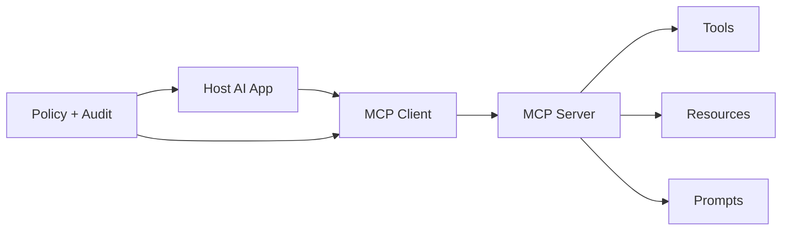

# MCP 解决了 Agent 系统里的什么问题？

## 面试定位

这题考协议抽象。不能只说“统一工具调用”，要讲 Host、Client、Server、Tools、Resources、Prompts，以及 MCP 和 Function Calling 的边界与取舍。

## 30 秒回答

MCP 解决的是 AI 应用连接外部能力的标准化问题。Host 通过 MCP Client 连接 MCP Server，发现和使用 Server 暴露的 Tools、Resources 和 Prompts。

它让工具和上下文接入不再是每个应用私有实现，但不自动解决权限、安全和审计。Host 仍要决定哪些能力对模型可见。

## 标准回答

先讲角色。Host 是 AI 应用，Client 是连接某个 Server 的协议层，Server 是能力提供方。Server 可以暴露 Tools、Resources 和 Prompts。

再讲价值。没有 MCP 时，每个工具都要写私有插件适配。MCP 提供统一 discovery、schema、调用和资源读取方式，让 Agent 更容易接 Git、文件、数据库、SaaS 和知识库。

最后讲边界。MCP 是应用到外部能力的协议。Function Calling 是模型输出工具调用的方式。真实系统里二者可以配合：模型产生 tool call，Host 通过 MCP Client 调 Server。

## 架构与运行机制

数据流是：Host 初始化 MCP Client，Client 连接 Server，发现 capabilities，Host 根据用户权限过滤可见 Tools/Resources/Prompts，模型提出动作，Host 通过 Client 调 Server，结果返回给模型上下文和 trace。

## 可画图

图 1 里要把三层边界说清楚：Host 决定用户体验和能力裁剪，Client 负责协议连接，Server 提供 Tools、Resources、Prompts。Policy 不应该只在提示词里声明，而要在 Host 和 Server 两侧都能执行和审计。

## 系统设计案例

Coding Agent 可以通过 MCP 接 Git Server、Docs Server 和 Issue Server。Git Server 暴露 diff 和 branch，Docs Server 暴露文档 Resources，Issue Server 暴露创建评论或读取工单的 Tools。

## 真实问题与排障

MCP 故障要看连接、capability discovery、权限过滤、tool schema、Server 错误和 Host trace。指标包括 `server_connect_success_rate`、`tool_call_success_rate`、`schema_error_rate` 和 `permission_denial_rate`。

## 面试官追问

### 追问 1：Tools 和 Resources 区别是什么？

Tools 是动作，Resources 是可读上下文。不要把只读文档硬包装成有副作用工具。

### 追问 2：MCP 和 Function Calling 区别是什么？

MCP 规范外部能力接入，Function Calling 规范模型如何表达调用意图。

### 追问 3：MCP 安全边界怎么做？

Host 过滤能力，Server 做权限和审计，高风险 Tool 要确认和幂等。

## 项目化回答

我会把本地文件、Git、文档和工单分别做成 Server，Host 根据任务只暴露少量能力。这样比把所有工具硬编码到 Agent 里更可维护。

## 常见错误

- 把 MCP 当成模型能力。
- 把 Tools、Resources、Prompts 混在一起。
- 忽略 Host 的能力过滤。
- 远程 Server 不做 OAuth 和租户隔离。

## 深挖技术细节

MCP 的工程价值在于把“能力发现”和“能力调用”从某个 Agent 应用里抽离出来。Host 不直接硬编码所有第三方 API，而是通过 Client 和 Server 建立会话，读取 Server 暴露的 capabilities。Tools 描述可执行动作，Resources 描述可读取上下文，Prompts 描述可复用提示模板；这三者有不同风险等级和生命周期，不能放进同一个列表让模型自由选择。

生产系统里还要补三层控制：Host 根据用户、任务和会话过滤可见能力；Client 记录连接、调用、超时和 structured error；Server 做 OAuth、租户隔离、输入校验、限流和审计。trace 里至少要有 `server_id`、`capability_name`、`schema_version`、`user_scope`、`args_hash`、`result_status` 和 `latency_ms`，否则 MCP 只解决了接入，却没有解决可观测和追责。

## 边界条件与反例

MCP 不会自动保证安全。一个本地文件 Server 暴露 `read_file` 和 `write_file`，如果 Host 不做路径白名单，Server 不校验 workspace root，模型提示词再严格也可能读到敏感文件。远程 Server 同理，如果只信任模型选择 tool，而不校验 token scope 和对象归属，就会变成越权通道。

MCP 也不是 Function Calling 的替代品。Function Calling 描述模型如何表达“我要调用某个函数”；MCP 描述应用如何连接外部能力。真实链路通常是模型输出 tool call，Host 判断允许后，通过 MCP Client 调 Server。把这两个层次混淆，会导致把协议接入问题误以为模型能力问题。

## 深问准备

如果被问“怎么设计一个 MCP Server”，我会先定义资源边界和风险等级：只读 Resource 默认低风险，写操作 Tool 必须声明 side effect、幂等键、超时、错误码和审计字段。再设计 discovery 输出，让 Host 能按 scope 和 task type 做 capability filtering。

如果追问“怎么排障 MCP 调用失败”，顺序是连接、capability discovery、schema mismatch、Host policy deny、Server auth deny、业务执行失败、timeout/retry。指标看 `connect_success_rate`、`tool_call_success_rate`、`schema_error_rate`、`permission_denial_rate` 和 `p95_latency`，用这些指标区分协议层、权限层和业务层问题。

## 来源与延伸阅读

- [MCP Architecture](https://modelcontextprotocol.io/docs/learn/architecture)
- [Model Context Protocol](https://modelcontextprotocol.io/)
