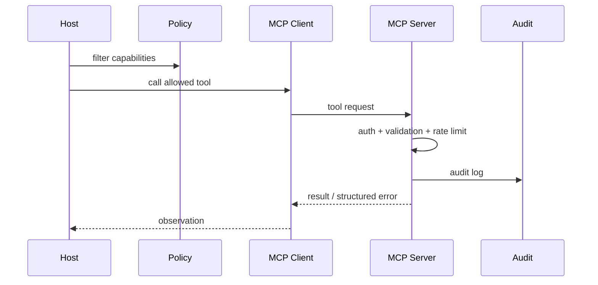

# MCP server 暴露工具时如何设计权限和安全边界？

## 面试定位

这道题考生产安全。MCP Server 暴露工具不代表模型可以随便调用。回答要覆盖 Host 过滤、Server 鉴权、Tool schema、最小权限、审计、限流、human confirmation 和安全取舍。

## 30 秒回答

我会分两层设计。Host 层决定哪些 Server 和 Tools 对当前用户、当前任务可见。Server 层负责鉴权、scope、参数校验、租户隔离、限流、审计和 structured error。

高风险写操作要有 preview、用户确认、idempotency key 和可追溯日志。不能把 MCP 当成绕过后端权限的通道。

## 标准回答

先做 capability 最小暴露。Host 不应该把所有 Server 的所有 Tools 都给模型，而是根据任务、用户权限和风险等级选择候选能力。

再做 Server 侧安全。每个 Tool 要声明 side effect、risk level、input schema、output schema、timeout、owner 和 audit fields。Server 执行前要检查 OAuth token、租户、对象归属和速率。

最后做可恢复。工具返回 structured error，Host 把错误写入 trace。写操作必须幂等，长期失败要能补偿或人工处理。

## 架构与运行机制

数据流是：用户请求进入 Host，Host 读取用户身份和任务上下文，过滤 MCP capabilities。模型生成 tool call 后，Host 通过 Client 发送请求。Server 再做二次鉴权和业务校验，执行后返回结果和审计字段。

## 可画图

图 1：MCP 工具调用从 Host 能力过滤到 Server 二次鉴权的双重门禁。

图中 Host 先把用户身份、任务上下文和风险等级交给 Policy，决定当前模型可见哪些 MCP capabilities。模型生成 tool call 后，MCP Client 只是传输请求，不替代权限判断；MCP Server 在执行前仍要做 auth、validation、rate limit、租户隔离和对象归属校验。Audit 记录 tool、args hash、policy decision、result status 和 latency。这个双门禁能避免“Host 暴露过宽”或“Server 只信 schema”导致的越权调用。

## 系统设计案例

假设 MCP Server 暴露 `create_github_issue`。Host 只在用户明确要创建 issue 时暴露它。Server 校验 repo 权限、title/body 长度、label 是否允许、rate limit 和 idempotency key。执行后返回 issue id 和 URL。

## 真实问题与排障

如果出现越权或误调用，先看 Host 是否暴露了不该暴露的 Tool，再看 Server 是否缺少 scope 校验，然后看 audit 是否能追到 user、tool、args hash 和 result。

指标包括 `permission_denial_rate`、`unsafe_action_block_rate`、`tool_error_rate`、`audit_coverage` 和 `rate_limit_hit_rate`。

## 面试官追问

### 追问 1：本地 MCP Server 有什么风险？

文件系统、shell、Git 凭证和本机敏感文件。要做路径白名单、只读默认、写操作确认和日志。

### 追问 2：远程 MCP Server 有什么风险？

OAuth、租户隔离、token 泄漏、网络访问和数据脱敏。

### 追问 3：模型提示词能不能承担安全？

不能。提示词只能辅助，真正安全要靠 deterministic policy 和后端权限。

## 多轮追问模拟

第一轮追问：Host 层和 Server 层为什么都要做权限控制？  
回答要点：Host 负责最小能力暴露，降低模型误选工具概率；Server 负责最终鉴权和业务校验，防止 Host 配错或请求被重放。考察点是 defense in depth。陷阱是只在 Host 过滤，Server 变成无权限后门。

第二轮追问：Tool schema 除了参数类型还应包含什么？  
回答要点：risk_level、side_effect、requires_confirmation、allowed_scopes、idempotency_key_required、timeout、audit_fields 和 error_codes。考察点是 schema 的生产语义。陷阱是只写 JSON 参数，不表达副作用和审计要求。

第三轮追问：高风险写工具如何上线？  
回答要点：preview-first，先生成变更计划或 diff，用户确认后带 confirmation token 和 idempotency key 执行，执行结果写 audit，并提供 rollback 或 compensating action。考察点是可控副作用。陷阱是模型一生成 tool_call 就直接写生产系统。

第四轮追问：本地 MCP Server 和远程 MCP Server 的风险差异是什么？  
回答要点：本地侧重文件系统、shell、环境变量、Git 凭证和路径白名单；远程侧重 OAuth scope、租户隔离、token 泄漏、SSRF、限流和数据脱敏。考察点是部署形态差异。陷阱是把所有 MCP Server 当成同一种威胁模型。

## 项目化回答

在 Coding Agent 里，我会把 read-only tools 和 write tools 分开。读文档可以低风险自动执行，写文件、创建 PR、执行 shell 必须有确认和审计。

## 常见错误

- Server 只做 schema，不做权限。
- Host 暴露所有工具。
- 高风险动作没有 preview。
- 审计日志缺 user 和 args hash。

## 深挖技术细节

MCP Server 的安全边界要做“双重门禁”。第一道在 Host：根据用户身份、会话任务、数据域和风险等级过滤 capabilities，只把本次任务需要的 Tools/Resources 暴露给模型。第二道在 Server：即使 Host 放行，Server 仍要校验 OAuth scope、租户、对象归属、参数范围、速率限制和 side effect policy。

Tool schema 也要带安全语义，而不只是 JSON 参数。生产字段可以包括 `risk_level`、`side_effect`、`requires_confirmation`、`idempotency_key_required`、`timeout_ms`、`allowed_scopes`、`audit_fields` 和 `error_codes`。Host 可以用这些元数据决定是否需要 preview，Server 可以用它们生成结构化审计。trace 至少记录 `user_id`、`tenant_id`、`tool_name`、`args_hash`、`policy_decision`、`result_status` 和 `latency_ms`。

## 边界条件与反例

本地 MCP Server 最大风险通常是文件系统、shell、Git 凭证和环境变量。只靠“请不要访问敏感文件”的提示词不够，必须限制 workspace root、默认只读、写操作确认、命令白名单和输出脱敏。远程 MCP Server 的风险则集中在 token 泄漏、跨租户访问、SSRF、过宽 OAuth scope 和审计缺失。

另一个反例是把所有错误都返回自然语言。自然语言错误很难让 Host 决定重试、降级还是询问用户。更好的返回是 structured error，例如 `AUTH_DENIED`、`VALIDATION_FAILED`、`RATE_LIMITED`、`CONFLICT`、`TRANSIENT_UPSTREAM_ERROR`，并带 retryable、retry_after 和 user_action 字段。

## 深问准备

如果面试官问“高风险 Tool 怎么上线”，我会回答 preview-first：模型只能生成变更计划，Tool Runtime 返回 diff/preview，用户确认后带 confirmation token 执行；执行时要求 idempotency key，结果写 audit log，并提供 rollback 或 compensating action。这个链路比“模型决定后直接写”慢，但符合生产可控性。

如果追问“如何发现 Host 暴露过多能力”，可以看 trace 和指标：某任务类型下可见 tool 数量、unused exposed tools、permission denial rate、unsafe action block rate、tool selection entropy。能力面越大，模型误选风险越高，所以 capability filtering 本身就是安全和质量优化。

## 来源与延伸阅读

- [MCP Architecture](https://modelcontextprotocol.io/docs/learn/architecture)：用于支持 Host、Client、Server 与 tools/resources 的基础边界。
- [OpenAI A practical guide to building agents](https://cdn.openai.com/business-guides-and-resources/a-practical-guide-to-building-agents.pdf)：用于支持工具权限、确认、人类审核和可控执行的 agent 工程实践。
