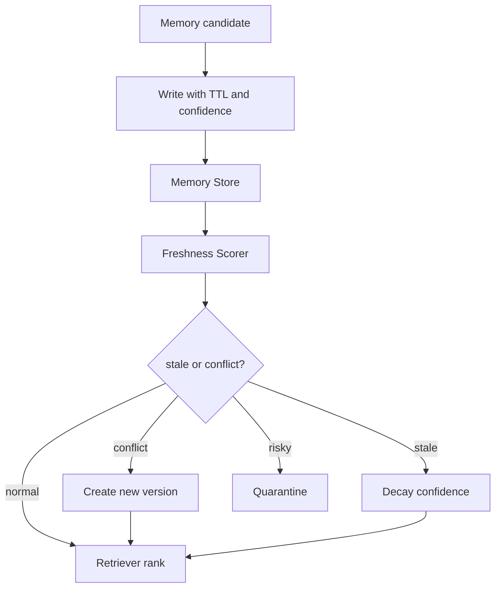

# 有没有做过记忆衰退，避免旧数据干扰新任务？

## 30 秒回答

会做。记忆衰退不是定时删除，而是给每条 memory 加 TTL、confidence、staleness、version 和 correction 机制。读取时把 freshness 纳入排序，冲突或可疑记录进入 quarantine，用户纠错会生成新版本并降低旧版本权重。

## 面试定位

这题是在追问长期记忆的生产治理。面试官想听到你怎样防止 Memory Store 变成污染源，而不是只说“旧数据会清理”。

回答要体现架构、数据流、指标、取舍和追问准备。尤其要说明不同 memory type 的生命周期不同，不能一刀切。

## 标准回答

我会先在数据模型中记录 createdAt、lastUsedAt、lastVerifiedAt、TTL、confidence、version、source 和 correction history。写入时按 profile、episodic、semantic 设置不同策略。

读取时不只看语义相似度。Retriever 会计算 freshness score，把过期、低置信、被纠错或跨 scope 的记录降权。事实类记忆需要能回到 citation 或业务对象复核，偏好类记忆则允许用户确认更新。

冲突处理要谨慎。新旧记忆矛盾时，不应该自动拼接成一条摘要，而是保留 version，必要时追问用户。高风险或疑似注入污染的记录进入 quarantine。

## 架构与运行机制

图 1：记忆衰退的读写治理链路。图中写入阶段先给 memory 标注 TTL、confidence、source 和 version；读取阶段由 `Freshness Scorer` 判断是否 stale、conflict 或 risky；正常记录进入排序，过期记录降权，冲突记录生成新版本，高风险记录进入 quarantine。

这张图强调衰退不是“到期删除”。很多稳定偏好可以长期保留，但默认不应压过当前指令；很多短期项目状态即使很新，也可能因为用户纠错而被 superseded。真正的控制点是读取排序和冲突策略，而不是后台清理任务本身。

衰退逻辑最好放在读取和后台治理两处。读取时做实时降权，后台任务负责归档、复核和索引清理。

## 可画图

可以画一条 memory 生命周期：write、use、verify、decay、correct、archive。每个节点标出控制字段，例如 TTL、confidence、staleness、correction 和 version。

## 系统设计案例

Paper Agent 曾记住用户关注 LLM eval。几个月后用户转向多 Agent 安全，如果旧偏好仍高权重，就会持续推荐无关论文。系统应在新任务与旧偏好冲突时降低 confidence，并询问“这次是否仍按 eval 方向筛选？”

数据流是：Retriever 召回旧偏好，Freshness Scorer 发现主题偏移，Context Builder 降低其优先级。用户确认新方向后，Write Policy 写入新 version，旧记录被标记为 superseded。

## 真实问题与排障

线上如果出现“总按旧偏好推荐”，先查 memory read trace。重点看记录年龄、最近验证时间、用户纠错是否被处理、向量索引是否同步降权。

指标包括 stale_memory_rate、correction_rate、conflict_resolution_rate、quarantine_rate 和 repeated_error_rate。衰退效果要看错误命中是否下降，而不是看清理了多少记录。

事故处理时先看影响面：是某个用户旧偏好污染，还是同一类 memory type 的 TTL 策略失效；止血可以临时降低低置信和过期记忆权重，或让当前任务强制以用户最新指令为准；根因要检查 correction event 是否写入、superseded 标记是否同步到向量索引、缓存是否仍命中旧 version；回归需要覆盖用户纠错、项目切换、权限过期、事实源更新和 quarantine 恢复五类样本。

## 面试官追问

- 哪些记忆适合长 TTL，哪些应该短 TTL？
- 自动衰退和用户确认怎么平衡？
- 旧版本是否要保留审计？
- quarantine 里的记忆什么时候能恢复？
- 如何发现某条记忆造成任务失败？

## 多轮追问模拟

**追问 1：记忆衰退和简单删除有什么区别？**  
答题要点：衰退是读取时降权、冲突时版本化、风险时隔离、长期低价值时归档；删除只是其中一种治理动作。考察点是生命周期设计。陷阱是只回答定时清理。

**追问 2：用户纠错后为什么还要更新向量索引和缓存？**  
答题要点：如果只改结构化记录，旧 embedding 和缓存仍可能召回旧事实；需要写 correction event、标记 superseded、重建或删除旧向量、失效缓存。考察点是一致性。陷阱是把 UI 上改掉当成真正修复。

**追问 3：旧版本是否应该保留？**  
答题要点：审计上通常保留 version 和 superseded_by，但默认不进入上下文；高风险数据按合规策略缩短 TTL 或脱敏归档。考察点是可追溯与污染控制。陷阱是为了省事直接覆盖，导致无法复盘。

## 项目化回答

我会说自己把记忆当成有生命周期的数据资产。每条记录有 TTL、confidence 和 version，读取时做 freshness rerank，纠错时写新版本，安全风险进入 quarantine，最终用 stale hit 和 repeated error 指标验收。

## 常见错误

- 只做定时删除，不处理冲突。
- 低置信记忆仍能进入上下文。
- 用户纠错只改 UI，不更新索引。
- 事实类记忆没有 source 可复核。
- 只看 memory_hit_rate，不看污染指标。

## 深挖技术细节

记忆衰退的核心是让每条 memory 都有生命周期元数据。推荐字段包括 `memory_id`、`namespace`、`memory_type`、`subject`、`value`、`source_event`、`created_at`、`last_used_at`、`last_verified_at`、`ttl`、`confidence`、`version`、`superseded_by`、`correction_history`、`sensitivity` 和 `scope`。不同类型的记忆策略不同：profile 偏好可长 TTL，项目状态短 TTL，安全授权极短 TTL，事实类记忆必须能回到 source 或业务对象复核。

读取时不能只做向量相似度。Retriever 先按 tenant、user、workspace、project、type 过滤，再用 similarity 召回，最后用 freshness、confidence、importance、source reliability、correction status 做 rerank。旧记录不是立刻删除，而是降权、归档或标记 superseded。用户纠错必须同时更新结构化 store、向量索引和缓存，否则旧版本仍可能被召回。

冲突处理要有 policy。当前用户指令优先于历史记忆；当前业务系统或 citation 优先于旧事实；高风险冲突进入 clarification。指标包括 `stale_memory_rate`、`superseded_hit_rate`、`correction_success_rate`、`repeated_error_rate`、`quarantine_rate`、`memory_precision` 和 `memory_query_p95`。

## 边界条件与反例

反例一：定时删除 90 天前的所有记录，可能删掉稳定偏好，却保留 10 天前的错误事实。反例二：用户说“以后不要按旧项目路径处理”，系统只改 UI，不改向量索引，旧路径继续召回。反例三：旧偏好和当前任务冲突时，模型把两者合并成一个奇怪摘要。

边界在于：衰退不是遗忘一切，而是让旧信息在当前上下文中降低影响。对隐私、安全、授权、财务和跨租户数据，宁可短 TTL 和当前确认；对语言偏好、学习目标这类稳定偏好，可以长 TTL 但允许用户覆盖。

## 深问准备

- 问：哪些记忆长 TTL？答：稳定偏好、长期目标、用户确认的非敏感设置；短 TTL 用于权限、临时状态、项目路径和事实快照。
- 问：旧版本是否保留？答：通常保留审计和 superseded 关系，但默认不进上下文。
- 问：quarantine 什么时候恢复？答：人工复核或强证据确认后恢复，并记录 reviewer、理由和版本。
- 问：如何发现记忆造成失败？答：trace 记录 memory_id、rank、confidence 和最终使用位置，失败样本按 memory pollution 分桶。

## 来源与延伸阅读

- [LangChain Memory overview](https://docs.langchain.com/oss/python/concepts/memory)：官方文档用于说明 memory 类型差异，支撑“不同记忆生命周期不同”的判断。
- [LangGraph Persistence](https://docs.langchain.com/oss/python/langgraph/persistence)：官方文档用于说明持久化状态、checkpoint 和 thread 级状态如何支持版本化与恢复。
- [LangSmith Evaluation](https://docs.smith.langchain.com/evaluation)：官方文档用于支持把 stale hit、纠错率和 repeated error 做成可回归评估。
