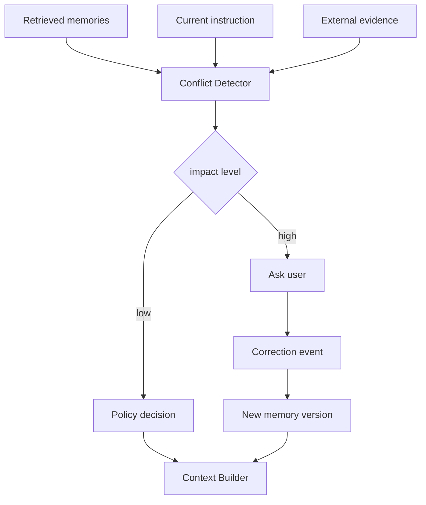

# 如果新旧记忆冲突，Agent 应该如何决策和追问？

## 30 秒回答

新旧记忆冲突时，Agent 不应直接合并或盲目相信最新记录。系统要比较 scope、source、confidence、TTL、version 和当前用户指令。低风险场景可按规则选择，高影响场景应向用户追问，并把裁决写回 correction history。

## 面试定位

这题考的是记忆治理中的冲突处理。面试官想看你有没有优先级模型，而不是让模型凭语感决定。

回答要把架构、数据流、指标、取舍和追问讲完整。尤其要说明当前用户明确指令通常高于历史记忆。

## 标准回答

我会把冲突分成三类。第一类是时间冲突，例如旧项目路径和新项目路径不同。第二类是事实冲突，例如记忆说使用 npm，但仓库文件证明使用 pnpm。第三类是偏好冲突，例如用户以前要中文，现在要求英文。

决策顺序是：当前用户指令优先，其次可信业务状态或 citation，再看高 confidence 且未过期的记忆。若冲突影响安全、数据写入、对外发送或长期偏好，就要追问用户。

追问不能模糊。应该展示冲突来源，例如“我记得这个项目以前使用 npm，但 packageManager 显示 pnpm，你希望以后按哪个规则记住？”用户选择后写入新 version，并将旧记录标记为 superseded 或降低 confidence。

## 架构与运行机制

图 1：新旧记忆冲突时的决策链路。图中 `Retrieved memories` 只是候选事实，必须和 `Current instruction`、`External evidence` 一起进入 `Conflict Detector`；低影响冲突可以由 policy 自动裁决，高影响冲突要进入 `Ask user`；用户裁决会写成 `Correction event` 和新版本，再进入 Context Builder。

这张图的关键边界是：记忆不是事实源本身。当前用户明确指令、当前仓库文件、业务系统状态和可追溯 citation 往往比旧记忆更可信。只有把 impact level、source reliability 和 scope 一起算进去，才能避免“语义相似但上下文错误”的记忆污染当前任务。

冲突检测可以基于字段级规则、source 类型和模型辅助判断。真正的裁决应由 policy 和用户确认完成，不能完全交给自然语言推理。

## 可画图

建议画成优先级栈：system policy、current user instruction、trusted external evidence、fresh memory、stale memory。再画一个冲突处理分支，低影响自动选择，高影响进入追问。

## 系统设计案例

Coding Agent 记得某仓库测试命令是 npm test，但当前 package.json 写的是 pnpm test。系统应优先相信仓库文件，因为它是当前 workspace 的强证据。Agent 可以回答：“我检测到历史记忆与当前文件不一致，本次按 pnpm test 处理，是否把长期记忆也更新为 pnpm？”

数据流是：Retriever 取回旧命令，Evidence Reader 读取 package.json，Conflict Detector 发现差异，Policy Engine 选择当前事实，并生成 correction candidate。用户确认后更新 Memory Store。

## 真实问题与排障

如果冲突反复出现，检查 correction event 是否写入成功，旧版本是否仍在向量索引中被召回，缓存是否没有失效。还要看 scope 是否过宽，把另一个 repo 的记忆带了进来。

指标包括 conflict_detect_rate、clarification_accept_rate、superseded_hit_rate、correction_latency 和 post_correction_error_rate。最重要的是用户纠错后同类错误是否下降。

事故处理可以按四步展开：影响面先区分是单个 subject 冲突、某类 memory type 策略失效，还是跨 workspace 召回泄漏；止血先降低 superseded 和低置信记忆权重，必要时关闭长期记忆注入；根因重点查 memory_id、scope、source、version、embedding index、cache key 和 correction event；回归要覆盖用户纠错、外部事实覆盖旧记忆、恶意写入、跨项目路径和高风险写操作五类样本。

## 面试官追问

- 什么冲突可以自动处理？
- 用户不回答追问时怎么办？
- 新记忆是否一定覆盖旧记忆？
- 如何防止恶意用户污染共享记忆？
- 当前证据和用户偏好冲突时怎么处理？

## 多轮追问模拟

**追问 1：什么冲突可以自动处理，什么必须追问？**  
答题要点：低风险且有强外部证据的冲突可自动处理，例如当前 `package.json` 覆盖旧测试命令；涉及对外发送、删除、支付、长期偏好、安全授权或跨租户数据时必须追问。考察点是影响面分级。陷阱是把所有冲突都交给模型自由判断。

**追问 2：用户不回答追问时怎么办？**  
答题要点：保守执行，只使用当前明确证据，不更新长期记忆；高风险动作停止或转人工；低风险问答可以说明不确定性并选择可回滚路径。考察点是失败降级。陷阱是为了推进任务而擅自覆盖记忆。

**追问 3：如何防止 memory poisoning？**  
答题要点：写入前做来源校验、scope 限制、敏感字段过滤、高影响记忆确认；读取时检查 source reliability、confidence、superseded 状态和 privacy risk；所有裁决写入 audit trace。考察点是安全治理。陷阱是只靠 TTL 或“最新记录优先”。

## 项目化回答

我会把冲突处理做成 Memory Governance 的一部分。冲突不是让模型猜，而是生成 conflict event，按优先级和影响面处理。高影响场景追问用户，决策写入 correction history，并通过 eval 观察纠错后是否复发。

## 常见错误

- 直接把两条冲突记忆合并成摘要。
- 无条件相信最新记录。
- 忽略当前用户明确指令。
- 追问没有展示冲突来源。
- 更新结构化记录却忘了更新向量索引。

## 深挖技术细节

记忆衰减和冲突治理要靠结构化元数据。每条长期记忆至少要有 `memory_id`、`namespace`、`subject`、`predicate`、`value`、`source`、`created_at`、`updated_at`、`ttl`、`confidence`、`scope`、`supersedes`、`evidence_uri` 和 `sensitivity`。检索出来后不要直接塞进上下文，而是经过 Memory Policy Engine 计算 freshness、source reliability、task relevance、privacy risk 和 conflict score。

冲突处理可以分三条路径。低风险、强证据场景自动决策，例如当前仓库 `package.json` 覆盖旧记忆里的测试命令。中风险场景降权，例如用户偏好可能变化但不影响写操作。高风险场景追问，例如发送邮件、更新长期偏好、使用密钥、跨租户数据访问。裁决后写入 correction event，把旧记忆标记为 superseded，而不是物理删除；向量索引也要更新，否则旧内容还会被召回。

衰减不是简单按时间删除。偏好类记忆可能长期有效，但要允许用户覆盖；事实类记忆和项目路径更容易过期；安全和权限类记忆应短 TTL 并依赖当前会话确认。指标包括 `superseded_hit_rate`、`stale_memory_usage_rate`、`conflict_detect_rate`、`clarification_accept_rate`、`post_correction_error_rate`、`p95_memory_retrieval_latency`。这些指标能证明记忆系统是否越用越准，而不是越用越污染。

## 边界条件与反例

反例一：无条件相信最新记忆。恶意或误触发的输入会覆盖稳定偏好，造成 memory poisoning。反例二：无条件相信高置信旧记忆。用户当前明确说“这次用英文”时，旧的中文偏好不应覆盖当前指令。反例三：只更新 SQL 里的结构化记录，却忘了同步向量索引和缓存，导致旧记忆继续被召回。

边界在于：长期记忆适合保存跨任务复用的偏好、事实和经验，不适合保存一次性权限确认、临时 token、当前页面状态和未经证实的推断。涉及隐私、安全、财务和对外发送时，历史记忆只能提供参考，不能替代当前授权。

## 深问准备

- 问：记忆过期和用户纠错有什么不同？答：过期是 policy 根据 TTL 和 freshness 降权，纠错是用户或强证据产生 supersede 事件。
- 问：如何防 memory poisoning？答：写入前做来源校验、scope 限制、敏感字段过滤、高影响记忆确认和审计 trace。
- 问：向量索引里的旧记忆怎么办？答：索引项要带 version 和 superseded 标记，检索后再用结构化 store 复核最新状态。
- 问：什么时候必须追问？答：冲突影响外部副作用、长期偏好、安全权限、隐私数据或不可逆写操作时。

## 来源与延伸阅读

- [LangChain Memory overview](https://docs.langchain.com/oss/python/concepts/memory)：官方文档用于说明 short-term memory、long-term memory 与语义/情节/程序类记忆的边界。
- [LangGraph Persistence](https://docs.langchain.com/oss/python/langgraph/persistence)：官方文档用于支持 checkpoint、thread state 和持久化状态在恢复与冲突处理中的作用。
- [PersistBench: When Should Long-Term Memories Be Forgotten by LLMs?](https://arxiv.org/abs/2602.01146)：论文用于补充“何时遗忘长期记忆”这一研究问题，支撑本文对衰退、纠错和过期评估的讨论。
