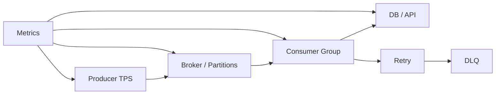

# 线上 MQ 消费积压突然升高，你会如何定位和处理？

## 面试定位

这是现场排障题。回答要体现先止血、再定位、后治理，并说明扩容、限流、隔离和降级之间的取舍。不能只说“加消费者”。

## 30 秒回答

我会先确认影响面：consumer lag、消息年龄、业务延迟、错误率和下游压力。止血上可以限流上游、暂停毒丸消息、扩容消费者或降级非核心任务。

定位时沿数据流看：producer 是否突增，broker 是否异常，consumer 是否处理慢，下游是否限流，是否有毒丸消息、rebalance 或线程池耗尽。最后把失败样本进入 DLQ、补偿和回归。

## 标准回答

第一步看指标。消费积压可能是生产变多，也可能是消费变慢。要同时看 produce_tps、consume_tps、consumer_lag、oldest_message_age、processing_p95、error_rate、retry_rate 和 DLQ_count。

第二步分段排查。broker 磁盘、网络、分区热点会影响投递。consumer 线程池、数据库慢查询、外部 API 限流、代码异常都会拖慢处理。毒丸消息会造成反复重试。

第三步恢复。短期可以隔离异常消息、提高并发、限流下游调用、暂停非核心消费者。长期要优化批处理、幂等、重试退避、DLQ 治理和容量规划。

## 架构与运行机制

数据流是 producer 写入 topic，broker 按分区或队列保存，consumer group 拉取并处理，业务成功后 ack/commit offset。任何一段慢下来都会形成 lag。

## 可画图

图 1：MQ 积压排障要同时观察 Producer、Broker、Consumer、Downstream、Retry 和 DLQ，不能只盯 consumer 实例数量。

图中 `Producer TPS` 是生产侧边界，判断是不是上游流量突增；`Broker / Partitions` 是队列水位和分区热点边界；`Consumer Group` 是执行能力边界；`DB / API` 是下游瓶颈边界；`Retry` 和 `DLQ` 则决定失败消息会被退避、隔离还是反复打回主链路。Metrics 必须覆盖每一段，才能判断该扩容、限流、隔离还是回滚。

## 系统设计案例

RAG embedding 队列突然积压，可能是文档同步突增，也可能是 embedding API 限流。先看生产速率和消费耗时。如果下游限流，盲目扩容 consumer 会加剧失败，应该限流、退避和分批处理。

## 真实问题与排障

常见根因包括流量突增、消费者发布 bug、数据库慢查询、外部服务限流、单分区热点、rebalance 频繁、毒丸消息和 retry 风暴。

关键指标是 `consumer_lag`、`oldest_message_age`、`consume_tps`、`processing_p95`、`retry_rate`、`DLQ_count`、`rebalance_count` 和 `downstream_error_rate`。

## 面试官追问

### 追问 1：能直接加消费者吗？

要看瓶颈。如果瓶颈在下游 DB 或外部 API，加消费者会放大压力。如果分区数不足，加消费者也不一定有效。

### 追问 2：毒丸消息怎么办？

识别失败次数和错误类型，超过阈值进 DLQ，不能让它阻塞正常消息。

### 追问 3：如何防止复发？

容量水位告警、重试退避、DLQ 治理、限流、批处理优化和压测。

## 多轮追问模拟

**追问 1：你怎么判断是生产突增还是消费变慢？**
回答要点：把 produce_tps、consume_tps、oldest_message_age、consumer_lag 和 processing_p95 放到同一时间线看。生产突增时 produce_tps 先升，消费能力可能不变；消费变慢时 processing_p95、downstream_latency 或 error_rate 先升。考察点是分段定位能力。陷阱是只看 lag 数值，不看消息年龄和生产速率。

**追问 2：什么时候可以扩容 consumer？**
回答要点：分区数足够、瓶颈在 consumer CPU 或本地计算、下游仍有余量时可以扩容；如果瓶颈是 DB 锁等待、外部 API 429、单分区热点或顺序消息，扩容可能无效甚至放大故障。考察点是吞吐模型和下游保护。陷阱是把扩容当万能止血。

**追问 3：毒丸消息如何不影响正常消息？**
回答要点：按 error_code、attempt、schema_version 和 message_id 识别反复失败样本，超过阈值进入 DLQ，并保留 payload、trace_id、handler_version 和重放原因。临时错误走指数退避，永久错误隔离。考察点是错误分类和 DLQ 治理。陷阱是无限 retry 或直接丢弃。

**追问 4：如何确认恢复是真的？**
回答要点：看 lag 下降斜率、oldest_message_age 回到 SLA、processing_p95 和业务 error_rate 回到基线，同时确认没有错误 ack、消息丢弃或暂停生产制造的假恢复。考察点是验证闭环。陷阱是只看 lag 清零。

## 项目化回答

这题可以连接到 Agent 异步执行队列、ES 同步队列和 embedding 任务队列。项目里要讲 lag、retry、DLQ 和下游保护。

## 常见错误

- 只说扩容消费者。
- 不区分生产突增和消费变慢。
- 忽略下游限流。
- 毒丸消息反复重试。

## 深挖技术细节

我会把 lag 排查拆成“队列水位、消费执行、下游依赖、重试链路”四层。队列层看 `partition_lag`、`oldest_message_age`、broker 磁盘和 ISR/副本状态；执行层看 consumer poll 间隔、批大小、线程池队列、单条 `processing_latency_p95`；依赖层看 DB 慢查询、外部 API 429、连接池耗尽；重试层看 retry topic 是否把失败消息重新打回主链路形成风暴。

关键不是单点指标，而是对齐时间线：生产 TPS 从 10:00 突增、consumer p95 从 10:03 变慢、downstream error 从 10:05 升高，三者代表不同根因。定位时 trace 要带 `topic`、`partition`、`offset`、`message_id`、`attempt`、`handler_version`、`downstream_status` 和 `ack_result`，否则只能看到 lag 变高，却不知道哪类消息或哪版代码制造了积压。

## 边界条件与反例

“加消费者”只有在分区足够、瓶颈在 consumer CPU 或本地处理、下游还能承压时才有效。如果 Kafka topic 只有 4 个分区，consumer group 加到 20 个也只有 4 个实例真正消费；如果瓶颈是数据库锁等待，扩容 consumer 会把锁竞争和 retry 放大。遇到顺序消息时还要保护同一 key 的顺序，不能简单并发打散。

另一个反例是毒丸消息。某条消息因为 schema 变更或空字段一直失败，如果 retry 没有退避和最大次数，它会反复占用消费线程，让正常消息被拖慢。正确做法是按错误类型区分 transient 和 permanent：临时错误指数退避，永久错误进入 DLQ，并保留原始 payload、错误栈、handler 版本和重放策略。

## 深问准备

面试官如果追问“怎么判断恢复成功”，我会回答三个水位：lag 下降斜率大于生产速率、`oldest_message_age` 回到 SLA 内、业务 `error_rate` 和 `processing_p95` 回归基线。只看 lag 清零不够，因为可能是丢弃、错误 ack 或暂停生产造成的假恢复。

如果继续问“怎么做长期治理”，可以讲容量模型：`required_consumers = peak_produce_tps * avg_processing_time / target_utilization`，再用压测验证分区数、批处理大小、连接池、限流和 DLQ 重放能力。告警要按年龄和业务延迟触发，不能只按消息数量，因为低 TPS 但消息很老同样影响 SLA。

## 来源与延伸阅读

- [Apache Kafka Documentation](https://kafka.apache.org/documentation/)：用于确认 consumer group、partition、offset 和 broker 语义，是分析 Kafka 积压的官方基础。
- [Kafka Consumer configs 官方文档](https://kafka.apache.org/documentation/#consumerconfigs)：用于说明 poll、fetch、commit 和 consumer 配置如何影响消费进度与恢复策略。
- [RabbitMQ Dead Letter Exchanges 官方文档](https://www.rabbitmq.com/docs/dlx)：用于支持 DLQ 隔离毒丸消息和永久失败消息的排障方案。
- [RabbitMQ Consumer acknowledgements 官方文档](https://www.rabbitmq.com/docs/confirms)：用于说明 ack 时机、重投递和消费可靠性，支撑“不能错误 ack 制造假恢复”的结论。
