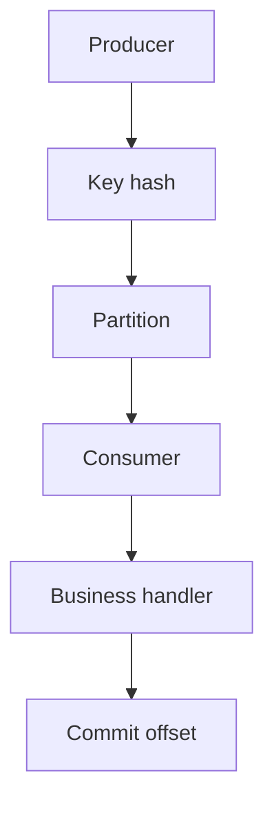

# MQ 如何保证顺序消息？全局顺序和局部顺序有什么取舍？

## 30 秒回答

MQ 通常保证分区或消息组内顺序，而不是全局顺序。做法是用 message key 把同一业务对象路由到同一 partition，同一 consumer group 内由一个消费者按 offset 处理。全局顺序会牺牲吞吐，生产系统通常选择订单、账户或 run_id 级别的局部顺序。

## 面试定位

这题考顺序语义和吞吐取舍。面试官想确认你知道顺序依赖分区、key、消费者组和失败处理。

## 标准回答

要先定义顺序范围。如果是订单状态，只需要同一 order_id 内有序。如果要求全局有序，基本意味着单分区或单消费者，吞吐和可用性都会变差。

Producer 用稳定 message key 路由消息。Broker 保证 partition 内日志顺序。Consumer group 中一个 partition 同时只被一个 consumer 消费。业务处理成功后再提交 offset 或 ack。

失败时不能随意跳过消息，否则后续状态可能先执行。需要 retry、DLQ、版本号或补偿策略。

## 架构与运行机制

图 1：局部顺序消息的生产、路由和消费链路。Producer 使用稳定 message key，例如 `order_id` 或 `workflow_run_id`，Key hash 把同一业务对象路由到同一 Partition；Consumer 按 partition 内 offset 顺序调用 Business handler，业务成功后再 Commit offset。图中最关键的数据流边界是 message key：它定义顺序范围；offset 只表示消费进度，不能替代业务版本和幂等判断。

## 可画图

可以画三个 order_id 分别进入不同 partition 的图。强调每个 partition 内有序，但不同 partition 并行。

## 系统设计案例

订单事件用 order_id 做 key。创建、支付、发货、取消都进入同一 partition。消费者按订单版本号做幂等，防止重复消息覆盖新状态。

## 真实问题与排障

如果状态乱序，先查 key 是否一致，再查同一 key 是否被并发处理。若 lag 集中在一个 partition，可能是热点 key 或 poison message。

指标要覆盖 ordering_violation_count、partition_lag、consumer_lag、rebalance_count、retry_count、DLQ_count、offset_commit_latency 和 idempotency_conflict_count。工程取舍是顺序范围越大，并行度越低。全局顺序实现最简单但吞吐最低，局部顺序需要业务 key 和幂等版本控制，却能保留分区并行能力。热点 key 可以拆业务维度或做补偿队列，但不能破坏同一状态机的先后语义。

排障同样按影响面、止血、根因、回归来讲。影响面先看乱序涉及哪些 key、partition、consumer group 和业务状态机；止血可以暂停对应 key 或 partition 的消费、关闭并发处理、把 poison message 隔离到审计队列；根因从 key 选择、partition 扩容、rebalance、offset 提交时机、业务并发和 retry 策略里找；回归要构造同一 key 的事件序列，验证 create/pay/ship/cancel 不会乱序覆盖。

## 面试官追问

- 为什么不做全局顺序？
- rebalance 会影响顺序吗？
- 热点 key 怎么办？
- 失败消息能不能跳过？
- Kafka 和 RocketMQ 的顺序语义有什么差异？

## 多轮追问模拟

### 追问 1：全局顺序为什么通常不可取？

回答要点：全局顺序会把并行度压到很低，通常需要单分区、单队列或单消费者；多数业务只要求同一订单、账户或 workflow run 内有序，局部顺序能保留吞吐和可用性。  
考察点：是否先定义顺序范围，而不是默认追求最强语义。  
常见陷阱：把“有序”理解成全系统总顺序，导致系统不可扩展。

### 追问 2：失败消息能不能跳过？

回答要点：默认不能直接跳过，因为后续事件可能依赖它；可以有限重试、暂停该 key、进入 DLQ/审计队列、人工修复后重放，业务层还要用 version/idempotency 防止旧状态覆盖。  
考察点：是否理解顺序和失败处理是一体的。  
常见陷阱：为了降低 lag 直接提交 offset，造成状态机缺步骤。

### 追问 3：partition 扩容会不会破坏顺序？

回答要点：如果 key 到 partition 的映射算法变化，同一业务对象可能进入不同 partition；扩容前要评估路由一致性，必要时用固定队列映射、迁移窗口、双写校验或按业务分组单独迁移。  
考察点：是否具备容量变更和顺序语义联动意识。  
常见陷阱：只看吞吐扩容，不验证历史 key 的路由稳定性。

## 项目化回答

我会说系统只承诺业务局部顺序。用 order_id 或 run_id 做 key，消费者成功后再提交 offset，业务层用 version 和 idempotency 防重复和状态回退。

## 常见错误

- 以为 MQ 默认全局有序。
- key 选择不稳定。
- 失败后跳过消息。
- offset 提交过早。
- 不监控 partition lag。

## 深挖技术细节

顺序消息要先定义顺序粒度。全局顺序通常意味着单分区、单消费者或严格串行处理，吞吐和可用性都差。生产上更常见的是按 order_id、account_id、workflow_run_id 做局部顺序。Producer 用稳定 message key 路由，同一 key 进入同一 partition 或 FIFO group，Consumer group 在同一时间只让一个消费者处理该 partition。

失败处理是顺序语义的关键。业务成功后再 commit offset 或 ack，避免丢消息。失败时不能随意跳过，因为后续状态可能依赖前一条。可以有限重试、隔离 poison message、人工处理、补偿任务，也可以用业务 version 拒绝旧状态覆盖。rebalance 时要处理好正在执行的消息，否则可能出现重复处理或并发处理同一 key。

## 边界条件与反例

如果业务只要求最终状态正确，不要求每个事件严格顺序，可以用幂等 upsert 和版本号替代强顺序。反例是为所有订单追求全局顺序，结果一个慢订单拖垮全系统。另一个反例是扩 partition 后没有评估 key 分布，导致同一业务对象被路由到不同分区，顺序承诺被破坏。

## 深问准备

- 追问 rebalance：回答停止拉取、处理或中断当前任务、提交安全 offset、恢复后靠幂等兜底。
- 追问热点 key：限流、拆业务维度、单独队列、补偿处理，但不能破坏同一状态机。
- 追问跳过失败消息：默认不能直接跳过，除非 DLQ 有审计、补偿和重放策略。
- 追问 Kafka/RocketMQ 差异：Kafka 强调 partition 内顺序，RocketMQ FIFO 按 message group 提供顺序语义。

## 公开阅读校验

这道题的高分答案要先限定承诺：“我保证业务 key 内的局部顺序，不承诺全局顺序。”然后把实现拆成四层：Producer 使用稳定 key；Broker 保证 partition 或 message group 内顺序；Consumer group 同一时刻只让一个消费者处理该顺序域；业务层用 version、状态机约束和幂等抵御重复、重试和旧消息。这样能避免把“同 key 路由”误说成完整方案。

如果面试官追问项目细节，可以补充上线验证：监控 `partition_lag`、`rebalance_count`、`hot_key_count`、`ordering_violation_count`、`offset_commit_latency` 和 `idempotency_conflict_count`；发布前用同一 `order_id` 的 create、pay、ship、cancel 事件做回放，验证失败重试、rebalance 和消费者重启不会让后续状态提前提交。这个回答比“Kafka 分区内有序”更能体现工程经验。

还要明确一个边界：失败消息是否能跳过取决于业务语义。状态机强依赖前序事件时不能直接跳过，只能暂停该 key、有限重试、进入 DLQ 后人工修复并重放；如果事件是最终值覆盖，且带 version 或时间戳，可以通过拒绝旧版本来降低顺序要求。高分答案要把“严格顺序”和“版本幂等替代顺序”的取舍说出来。

## 来源与延伸阅读

- [RocketMQ Ordered Message](https://rocketmq.apache.org/docs/featureBehavior/03fifomessage/)：用于说明 RocketMQ 的顺序语义围绕 message group/FIFO 组织，并区分顺序范围和并发能力。
- [Apache Kafka Consumer configs](https://kafka.apache.org/documentation/#consumerconfigs)：用于支持 consumer group、partition 分配、offset 提交和消费并发相关讨论。
- [Apache Kafka Design: The Log](https://kafka.apache.org/documentation/#design_log)：用于延伸理解 partition 内追加日志、offset 和顺序消费之间的关系。
