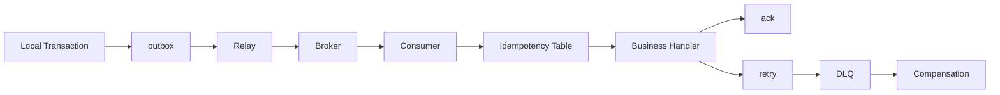

# MQ 如何设计可靠投递？如何避免重复消费造成业务副作用？

## 面试定位

这题是后端可靠性高频题。不能只说 producer confirm 和 consumer ack，要端到端讲本地事务、broker、consumer、幂等、retry、DLQ、补偿、指标和取舍。

## 30 秒回答

我会把可靠投递拆成四段：生产端用 outbox 或事务消息解决本地事务和发消息一致性；broker 做持久化和副本；consumer 处理成功后 ack，失败 retry；业务侧用幂等键、唯一约束或状态机版本防止重复副作用。

多数 MQ 是 at-least-once 语义，重复消息是正常情况。目标是最终可靠处理，而不是假设绝对不重复。

## 标准回答

生产端不能简单“写库后发消息”。服务宕机可能导致消息丢。outbox 方案把业务数据和事件写入同一个数据库事务，再由 relay 异步发送 MQ。

消费端要先幂等再执行业务。比如用 `orderId + eventType + version` 做 idempotency key。插入幂等表成功才处理，重复消息直接跳过或返回上次结果。

失败要有 retry 和 DLQ。DLQ 不是垃圾桶，要有告警、失败原因分类、修复、重放和审计。

## 架构与运行机制

数据流是：业务事务写 outbox，relay 发送消息，broker 持久化，consumer 拉取，幂等表去重，业务处理，成功 ack，失败 retry，长期失败进入 DLQ 和补偿。

## 可画图

图 1 里要强调可靠投递不是一个 ack 能解决的点，而是从本地事务、outbox、broker 持久化、consumer 幂等、retry、DLQ 到补偿的闭环。面试时沿图讲每一段的失败分支，答案会比只背 producer confirm 更稳。

## 系统设计案例

订单创建后加积分。订单服务写 `orders` 和 `outbox_events` 同一事务。Relay 发送 `OrderCreated`。积分消费者用 `order_id + event_type + version` 写幂等表，成功插入后加积分，业务成功再 ack。

## 真实问题与排障

producer 超时但 broker 已收到，会导致重试重复。consumer 处理成功但 ack 失败，也会再次投递。排查看 producer ack、broker log、consumer lag、retry_count、DLQ_count、duplicate_rate 和 idempotency_conflict_rate。

指标包括 `produce_tps`、`consume_tps`、`consumer_lag`、`retry_rate`、`DLQ_count`、`processing_p95` 和 `duplicate_message_rate`。

一个典型事故是：积分消费者已经给用户加分，但 ack 超时，消息被 broker 重新投递。影响面是同一订单可能重复加分，止血动作是暂停该 consumer group 或临时拒绝重复 `event_id`，根因通常是业务成功和 ack 提交之间缺少幂等结果记录。修复要把 `event_id`、业务版本和处理状态写入幂等表，并在回归用例里模拟“业务成功后 ack 失败”的重投场景。

## 面试官追问

### 追问 1：ack 能保证不丢吗？

只能保证某一段确认。端到端还要本地事务、broker 持久化、consumer 处理和补偿。

### 追问 2：重复消息怎么办？

按 at-least-once 设计，用业务幂等键、唯一约束、状态机版本和外部接口 idempotency key。

### 追问 3：DLQ 怎么治理？

监控告警、失败分类、修复工具、重放次数、人工审核和审计。

## 项目化回答

这套能力可以迁移到 Agent tool execution queue、RAG embedding job 和 ES 索引同步。只要有异步任务，就要讲可靠投递、幂等、retry、DLQ 和补偿。

## 常见错误

- 只讲 ack。
- 忽略 outbox 或事务消息。
- 认为 exactly-once 等于业务绝对一次。
- DLQ 没有重放和告警。

## 深挖技术细节

可靠投递要拆成两个一致性问题：生产端“业务事务和消息是否一起成功”，消费端“消息重复到达是否只产生一次业务副作用”。生产端常用 outbox，把业务表和 `outbox_events` 放在同一个本地事务里，事件字段包含 `event_id`、`aggregate_id`、`event_type`、`version`、`payload`、`status`、`next_retry_at` 和 `trace_id`。Relay 发送成功后标记 sent，失败按退避重试。

消费端默认按 at-least-once 设计。handler 开始前先写幂等记录，key 可以是 `event_id` 或 `business_id + event_type + version`；如果插入冲突，说明已处理或处理中，再按状态返回。业务成功后提交 offset/ack，失败则根据错误类型 retry、延迟投递或进入 DLQ。trace 要串起 producer confirm、broker offset、consumer attempt、idempotency result 和 ack result。

## 边界条件与反例

exactly-once 不能被简单理解成“业务绝对只发生一次”。某些 MQ 可以在 broker 和 stream processing 语义上减少重复，但外部数据库、支付接口、短信接口仍可能因为超时重试产生副作用。因此面试里要强调端到端幂等，而不是把希望押在 MQ 的单个特性上。

另一个反例是“先执行业务再写幂等表”。如果业务成功后进程崩溃，幂等表没记录，消息重投会再次执行业务。更稳妥的方式是先占用幂等键，记录处理中状态，业务成功后更新结果；如果处理中超时，需要恢复任务判断上次是否真的成功，而不是盲目重跑。

## 深问准备

追问“outbox 会不会延迟”时，可以承认会增加异步延迟，并给出取舍：核心是换取事务一致性和可恢复。延迟可以通过 relay 批量扫描、CDC、分片轮询、`next_retry_at` 索引和 backpressure 控制。监控看 `outbox_pending_count`、`oldest_outbox_age`、`relay_error_rate` 和 `publish_latency_p95`。

追问“DLQ 怎么重放”时，不能只说人工点一下。要先分类错误、修复 payload 或代码、限制重放速率、保留原始 event_id、复用幂等逻辑，并把重放操作写审计。否则 DLQ 重放可能造成第二次事故，尤其是订单、支付、库存这类有强业务副作用的场景。

## 来源与延伸阅读

- [RabbitMQ Confirms](https://www.rabbitmq.com/docs/confirms)：用于说明 producer confirm 和 consumer ack 的语义边界。
- [RabbitMQ DLX](https://www.rabbitmq.com/docs/dlx)：用于说明 DLQ 的路由和治理机制。
- [Apache Kafka Documentation](https://kafka.apache.org/documentation/)：用于支持 consumer group、offset 和分区消费语义。
