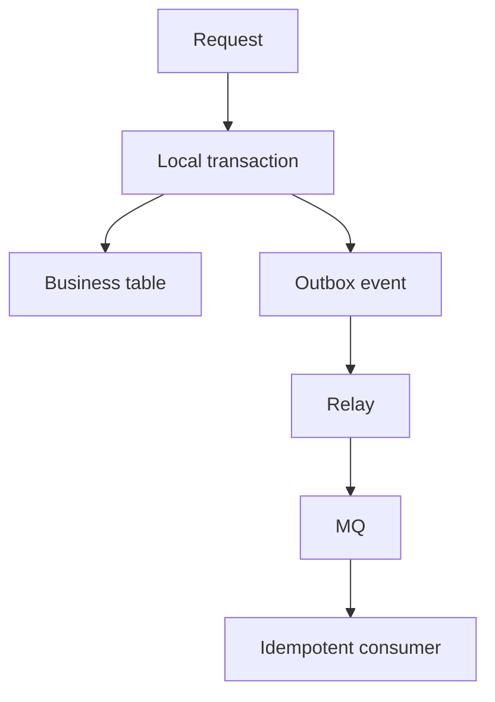

# 本地事务成功但消息发送失败怎么办？事务消息和 Outbox 怎么取舍？

## 30 秒回答

这是一致性缝隙问题。常用方案是 Transactional Outbox 或事务消息。Outbox 把业务表和 outbox 表放在同一个 local transaction，再由 relay 发布消息。事务消息如 RocketMQ 先发 half message，再执行业务事务，最后 commit 或 rollback，并支持回查。消费者仍要 idempotency。

## 面试定位

这题考最终一致性。面试官想听你如何处理数据库事务和 MQ 发布之间的不一致，而不是只说重试。

## 标准回答

如果本地事务提交后直接发消息，发送失败会导致下游长期不知道变更。Outbox 的做法是在本地事务里同时写业务数据和 outbox event，确保“状态变更”和“待发布事件”一起提交。Relay 扫描 outbox 发布，失败可重试。

事务消息则由中间件支持。先发送 half message，业务事务成功后提交消息，失败则回滚。状态未知时 broker 回查 producer。

两种方案都只能保证最终一致。消费者必须幂等，因为消息可能重复投递。

## 架构与运行机制

图 1：Transactional Outbox 的最终一致性链路。数据流从 Request 进入 Local transaction，同时写业务表和 outbox event，Relay 负责把 pending event 发布到 MQ，消费者按 `event_id` 或业务键幂等处理。图中要强调的是：Outbox 没有让数据库和 MQ 变成强一致，而是把“不可恢复的双写窗口”改造成“可扫描、可重试、可告警、可回放”的事件状态机。

## 可画图

可以画 Outbox 流程和事务消息流程对比。标出 half message、commit/rollback、relay 和回查。

## 系统设计案例

支付成功发券时，支付服务在同一事务里更新支付状态和 outbox。Relay 发布 CouponIssueRequested。发券消费者按 payment_id 幂等，避免重复发券。

## 真实问题与排障

下游没收到时，查 `outbox_pending_count`、`oldest_pending_age`、relay 错误、broker 投递和 consumer lag。重复消费时，查 consumer 幂等表。指标包括 `event_publish_lag`、`duplicate_consume_count`、`transaction_check_count`、`DLQ_count` 和 `relay_error_rate`。

事故处理要把 producer、relay、broker、consumer 分开。影响面先看是单个 event type 积压、单个分区积压还是全局 broker 不可用；止血可以暂停高风险消费、扩 relay worker、提高重试间隔、把超龄事件转人工补偿或临时降级下游功能；根因常见于 outbox 事务未提交、relay 卡在不可重试错误、broker ACL/网络变更、消费者幂等锁冲突或回查逻辑只读缓存；回归时要固定一组 pending、published、failed、dead-letter 状态，验证重启后 relay 能从数据库恢复发布进度。

## 面试官追问

- Outbox 的缺点是什么？
- half message 是什么？
- broker 回查时如何判断本地事务状态？
- 为什么消费者还要幂等？
- relay 积压怎么办？

## 多轮追问模拟

### 追问 1：Outbox 和事务消息怎么选？

回答要点：Outbox 更通用，依赖数据库本地事务和 relay，可跨不同 MQ；事务消息依赖 broker 原生能力，链路更短，但平台绑定更强。考察点是方案边界。容易踩坑的是把事务消息说成强一致，或者忽略消费者仍然要幂等。

### 追问 2：half message 回查怎么做？

回答要点：broker 回查 producer 时，producer 必须查业务主库的事务结果，例如订单状态、支付流水或唯一业务键；查不到就返回 unknown 或按平台语义等待下一次回查，不能靠缓存、日志或内存标记判断。考察点是事务状态来源。容易踩坑的是把回查写成“看日志有没有成功”，重启后就不可恢复。

### 追问 3：relay 积压如何处理？

回答要点：先看 oldest pending age、pending count、发布错误码和 broker 端限流；再区分可重试错误和不可重试错误；可水平扩 relay，但要用乐观锁、分片或 `SKIP LOCKED` 防止重复抢任务。考察点是恢复能力。容易踩坑的是只加线程，不处理幂等、退避、死信和归档。

## 项目化回答

我会优先用 Outbox 讲通用方案。它用 local transaction 保证业务状态和事件同生共死，再通过 relay 发布，配合 idempotent consumer 和补偿任务实现最终一致。

## 常见错误

- 本地事务提交后直接发消息。
- 只重试 producer，不保存待发布事件。
- 消费者不幂等。
- outbox 没有告警。
- 事务回查逻辑不可判断。

## 深挖技术细节

这题本质是双写一致性。业务表和 MQ 不在同一个本地事务里，先写库再发消息会遇到库成功消息失败，先发消息再写库会遇到下游看到不存在的业务状态。Outbox 把业务状态和待发布事件写入同一个 local transaction，relay 再异步发布。事务消息则由 broker 先保存 half message，本地事务成功后 commit，失败后 rollback，未知状态时回查业务服务。

Outbox 的细节在 relay 和幂等。outbox 表要有 status、retry_count、next_retry_at、last_error_code、payload_hash。relay 发布成功后更新状态，失败按退避重试。消费者仍然用 event_id 或 business_key 做幂等，因为 relay 重试、broker 重投和网络超时都会造成重复消息。

## 边界条件与反例

Outbox 的代价是发布延迟、表膨胀、relay 单点和清理归档复杂。事务消息依赖中间件能力，平台绑定更明显。反例是只给 producer 加重试但没有保存事件，进程崩溃后消息仍然丢。另一个反例是事务回查逻辑只查缓存，缓存失效时无法判断真实本地事务状态。

## 深问准备

- 追问 half message：broker 暂存不可消费消息，等待本地事务提交或回滚。
- 追问回查未知状态：查业务主库事务结果，不能靠模型、缓存或日志猜。
- 追问消费者幂等：即使发送端保证最终发送，投递和处理仍可能重复。
- 追问 relay 积压：看 outbox_pending_count、oldest_pending_age、publish_lag，扩 relay 或修 broker/downstream。

还可以补一句项目经验：Outbox 的关键不是表结构本身，而是 relay 的可恢复性、发布状态机和重放审计。只要能从 pending 状态恢复发布，并且消费者按 event_id 幂等，就能把不可控的双写窗口变成可观测的最终一致链路。

## 公开阅读校验

这道题对外发布时要先纠正一个误区：事务消息和 Outbox 解决的是本地事务与消息发布之间的一致性缝隙，不是把数据库、MQ 和下游副作用变成全局强一致事务。它们提供的是可恢复的最终一致，所以消费者幂等、补偿和监控仍然是答案的一部分。

Outbox 的项目化回答可以更具体：“业务事务内同时写订单表和 outbox event，relay 按 `next_retry_at` 扫描 pending 事件并发布 MQ，发布成功后标记 published，失败按退避重试或转 dead-letter；消费者用 `event_id` 唯一约束处理重复消息。”这里要强调 relay 崩溃恢复、重复发布和表归档，否则面试官会继续追问单点和数据膨胀。

事务消息的项目化回答要讲回查依据：“half message 发送后执行本地事务，commit 或 rollback 由业务主库状态决定；broker 回查时不能依赖缓存或日志，而要查支付流水、订单状态或唯一业务键。”如果状态未知，要有最大回查次数、巡检和人工补偿。这样答案才不会停留在“发送半消息再提交”的流程图层面。

最后可以用指标收口：`outbox_pending_count`、`oldest_pending_age`、`relay_error_rate`、`transaction_check_count`、`unknown_transaction_count`、`duplicate_consume_count`、`dlq_count`。能把这些指标说出来，说明候选人知道这套方案如何运行和排障。

## 来源与延伸阅读

- [RocketMQ Transaction Message](https://rocketmq.apache.org/docs/featureBehavior/04transactionmessage/)：用于说明 half message、提交/回滚和事务状态回查的 broker 语义。
- [Transactional Outbox pattern](https://microservices.io/patterns/data/transactional-outbox.html)：用于支持业务表与 outbox event 同事务提交、relay 异步发布的通用模式。
- [Debezium Outbox Event Router](https://debezium.io/documentation/reference/stable/transformations/outbox-event-router.html)：用于延伸说明基于 CDC 的 outbox 发布方式，以及事件路由字段如何进入消息系统。
