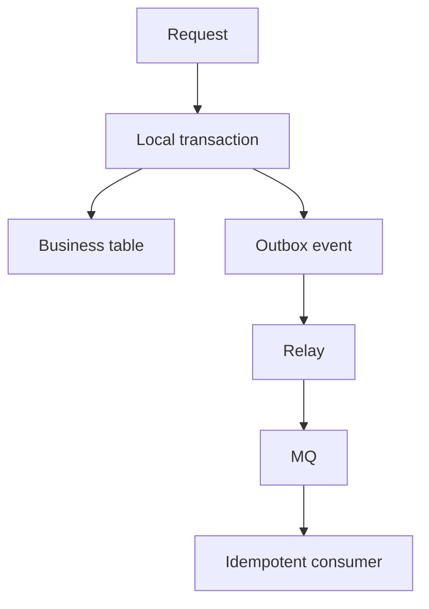

# 本地事务成功但消息发送失败怎么办？事务消息和 Outbox 怎么取舍？

## 30 秒回答

这是一致性缝隙问题。常用方案是 Transactional Outbox 或事务消息。Outbox 把业务表和 outbox 表放在同一个 local transaction，再由 relay 发布消息。事务消息如 RocketMQ 先发 half message，再执行业务事务，最后 commit 或 rollback，并支持回查。消费者仍要 idempotency。

## 面试定位

这题考最终一致性。面试官想听你如何处理数据库事务和 MQ 发布之间的不一致，而不是只说重试。

## 标准回答

如果本地事务提交后直接发消息，发送失败会导致下游永远不知道变更。Outbox 的做法是在本地事务里同时写业务数据和 outbox event，确保“状态变更”和“待发布事件”一起提交。Relay 扫描 outbox 发布，失败可重试。

事务消息则由中间件支持。先发送 half message，业务事务成功后提交消息，失败则回滚。状态未知时 broker 回查 producer。

两种方案都只能保证最终一致。消费者必须幂等，因为消息可能重复投递。

## 架构与运行机制

数据流核心是用本地事务消除业务表和待发布事件之间的缝隙。

## 可画图

可以画 Outbox 流程和事务消息流程对比。标出 half message、commit/rollback、relay 和回查。

## 系统设计案例

支付成功发券时，支付服务在同一事务里更新支付状态和 outbox。Relay 发布 CouponIssueRequested。发券消费者按 payment_id 幂等，避免重复发券。

## 真实问题与排障

下游没收到时，查 outbox_pending_count、relay 错误、broker 投递和 consumer lag。重复消费时，查 consumer 幂等表。指标包括 event_publish_lag、duplicate_consume_count、transaction_check_count 和 DLQ_count。

## 面试官追问

- Outbox 的缺点是什么？
- half message 是什么？
- broker 回查时如何判断本地事务状态？
- 为什么消费者还要幂等？
- relay 积压怎么办？

## 项目化回答

我会优先用 Outbox 讲通用方案。它用 local transaction 保证业务状态和事件同生共死，再通过 relay 发布，配合 idempotent consumer 和补偿任务实现最终一致。

## 常见错误

- 本地事务提交后直接发消息。
- 只重试 producer，不保存待发布事件。
- 消费者不幂等。
- outbox 没有告警。
- 事务回查逻辑不可判断。

## 深挖技术细节

这题本质是双写一致性。业务表和 MQ 不在同一个本地事务里，先写库再发消息会遇到库成功消息失败，先发消息再写库会遇到下游看到不存在的业务状态。Outbox 把业务状态和待发布事件写入同一个 local transaction，relay 再异步发布。事务消息则由 broker 先保存 half message，本地事务成功后 commit，失败后 rollback，未知状态时回查业务服务。

Outbox 的细节在 relay 和幂等。outbox 表要有 status、retry_count、next_retry_at、last_error_code、payload_hash。relay 发布成功后更新状态，失败按退避重试。消费者仍然用 event_id 或 business_key 做幂等，因为 relay 重试、broker 重投和网络超时都会造成重复消息。

## 边界条件与反例

Outbox 的代价是发布延迟、表膨胀、relay 单点和清理归档复杂。事务消息依赖中间件能力，平台绑定更明显。反例是只给 producer 加重试但没有保存事件，进程崩溃后消息仍然丢。另一个反例是事务回查逻辑只查缓存，缓存失效时无法判断真实本地事务状态。

## 深问准备

- 追问 half message：broker 暂存不可消费消息，等待本地事务提交或回滚。
- 追问回查未知状态：查业务主库事务结果，不能靠模型、缓存或日志猜。
- 追问消费者幂等：即使发送端保证最终发送，投递和处理仍可能重复。
- 追问 relay 积压：看 outbox_pending_count、oldest_pending_age、publish_lag，扩 relay 或修 broker/downstream。

还可以补一句项目经验：Outbox 的关键不是表结构本身，而是 relay 的可恢复性、发布状态机和重放审计。只要能从 pending 状态恢复发布，并且消费者按 event_id 幂等，就能把不可控的双写窗口变成可观测的最终一致链路。

## 参考资料

- [RocketMQ Transaction Message](https://rocketmq.apache.org/docs/featureBehavior/04transactionmessage/)
- [Transactional Outbox pattern](https://microservices.io/patterns/data/transactional-outbox.html)
