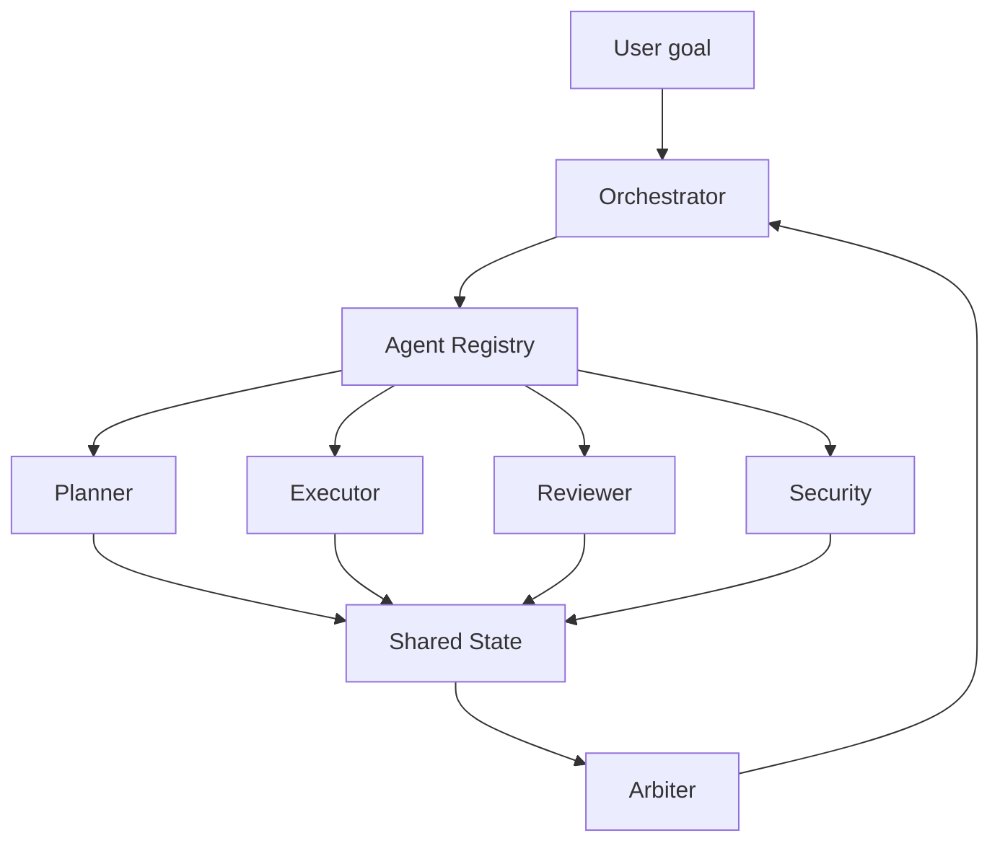

# 多智能体系统相比单 Agent 有什么优势和复杂性？

## 30 秒回答

多智能体的优势是职责隔离和可验证协作。Planner、Executor、Reviewer、Security 等 role 可以分别处理规划、执行、审查和风险。复杂性来自 Orchestrator、Agent Registry、shared state、handoff、arbiter、成本、延迟和循环调用。

## 面试定位

这题考的是你能否判断什么时候该用多 Agent。面试官不想听“多个模型更聪明”，而是看你能否说出收益、代价和验证方式。

回答要包含架构、数据流、指标、取舍和追问。最重要的一点是：多 Agent 是工程拆分，不是炫技。

## 标准回答

单 Agent 适合任务短、状态少、工具边界清晰的场景。多 Agent 适合复杂任务、异构工具、高风险审查和并行子任务。例如调研系统可以拆成 researcher、reader、writer、reviewer 和 citation checker。

多 Agent 的好处是每个 role 的 prompt、工具权限和 eval 可以独立设计。Reviewer 可以基于 rubric 拒绝 Executor 的输出，Security Agent 可以拦截高风险动作。

复杂性也很明显。系统需要 Orchestrator 管理任务图，需要 Agent Registry 描述 capability，需要 shared state 保存产物，还要有 arbiter 处理冲突。否则多个 Agent 会互相等待、重复执行或覆盖状态。

## 架构与运行机制

运行机制是中心化调度更稳。Orchestrator 创建 task_id，Planner 拆任务，Executor 产出 artifact，Reviewer 给 verdict，Arbiter 处理分歧，最终结果和中间 trace 进入 eval。

## 可画图

可以画角色拓扑图。中间放 Orchestrator 和 shared state，四周放不同 role。箭头不要画成 Agent 之间随意聊天，而要通过状态或编排器流转。

## 系统设计案例

做一个技术博客生成 Agent，可以拆成资料检索、来源阅读、结构设计、正文写作、事实审查和图表生成。每个 Agent 只写自己的 artifact，最终由 Orchestrator 汇总。

数据流是：Researcher 输出 source list，Reader 输出 claim table，Writer 生成草稿，Reviewer 标注问题，Citation Checker 验证链接。这样排障时能定位是检索漏源、阅读误解还是写作幻觉。

## 真实问题与排障

多 Agent 最常见问题是 handoff loop、状态覆盖、reviewer 不独立和成本过高。排障先看 task graph、handoff trace、shared state version 和每个 role 的 token 成本。

指标包括 task_success_rate、handoff_success_rate、review_reject_rate、conflict_rate、cost_per_success 和 latency_p95。只看最终答案会掩盖中间协作问题。

## 面试官追问

- 什么时候多 Agent 不如单 Agent？
- shared state 应该如何设计？
- reviewer 与 arbiter 有什么区别？
- 如何防止 Agent 之间无限 handoff？
- 多 Agent 的收益如何用 eval 证明？

## 项目化回答

我会说自己按 role 拆分，而不是按“模型数量”拆分。每个 role 在 Agent Registry 中声明 capability、工具权限和输出 schema，所有中间产物进入 shared state，最终用 trajectory eval 看每个环节是否贡献了质量提升。

## 常见错误

- 为了复杂而拆多个 Agent。
- Agent 之间自由聊天，没有状态模型。
- reviewer 和 executor 共用同一套判断标准。
- 没有 arbiter，冲突无人裁决。
- 成本和延迟没有进入指标。

## 深挖技术细节

多 Agent 系统的第一步是定义 role contract，而不是增加模型数量。每个角色声明 `role_id`、`capability`、`allowed_tools`、`input_schema`、`output_schema`、`state_write_scope`、`review_rubric` 和 `risk_level`。Planner 产出 task graph，Executor 产出 artifact，Reviewer 产出 verdict，Security 产出 policy finding。Orchestrator 管理任务分派、超时、重试、冲突和最终汇总。

Shared State 必须有版本和 owner。Researcher 可以写 source list，Writer 可以写 draft，Citation Checker 可以写 citation verdict，但不能互相覆盖。Arbiter 处理冲突，例如 Writer 认为可发布，Reviewer 判定证据不足。所有角色输出进入 trace，才能做 trajectory eval 和成本归因。

收益要用 baseline 证明。先跑单 Agent，再看多 Agent 是否提升 `task_success_rate`、`citation_precision`、`review_findings_resolved_rate` 或 `safety_block_rate`。同时观察 `handoff_success_rate`、`conflict_rate`、`cost_per_success`、`latency_p95`、`state_conflict_rate`。如果质量提升不明显，多 Agent 只是增加复杂度。

## 边界条件与反例

反例一：多个 Agent 自由聊天，没有 task_id、artifact 和 state owner，最后无法复盘。反例二：Reviewer 只是读 Executor 的总结，没有独立 evidence 或 rubric。反例三：没有成本上限，多个 Agent 循环修改和审查，延迟失控。

边界在于：多 Agent 适合可拆分、可独立验证、工具异构或高风险审查的任务；短任务、强耦合状态和反馈很快的任务，单 Agent 或 workflow 更稳。多 Agent 是工程拆分，不是智能魔法。

## 深问准备

- 问：什么时候多 Agent 不如单 Agent？答：任务短、状态耦合、工具少、验证标准不独立或成本敏感时。
- 问：Reviewer 和 Arbiter 区别？答：Reviewer 给质量 verdict，Arbiter 裁决多个角色冲突和最终走向。
- 问：如何防无限 handoff？答：task graph、最大深度、timeout、manager 仲裁和 loop detection。
- 问：收益怎么证明？答：与单 Agent baseline 对比成功率、成本、延迟、审查发现和安全拦截。

## 来源与延伸阅读

- [OpenAI Agents SDK Handoffs](https://openai.github.io/openai-agents-python/handoffs/)
- [LangChain Multi-agent](https://docs.langchain.com/oss/python/langchain/multi-agent)
- [OpenAI Agents SDK Tracing](https://openai.github.io/openai-agents-python/tracing/)
