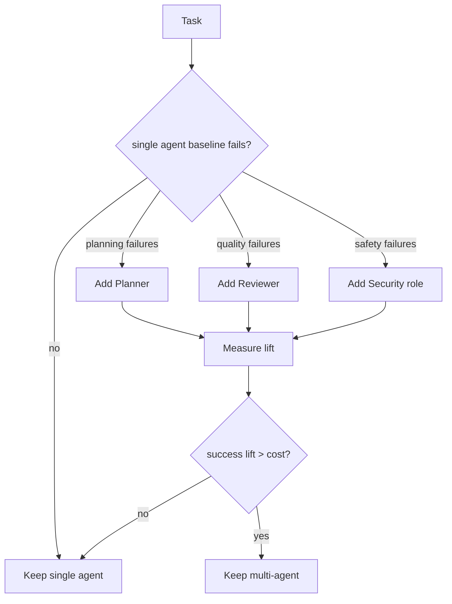

# 什么时候多 Agent 反而不如单 Agent？

## 30 秒回答

当任务短、状态强耦合、工具少、反馈很快或质量可以由单个 verifier 覆盖时，多 Agent 可能不如单 Agent。因为它会引入 handoff、shared state、一致性、成本和延迟。判断标准不是“任务复杂不复杂”，而是拆分后是否让数据流更清晰、验证更独立。

## 面试定位

这题考的是技术取舍。面试官希望你能主动反驳“多 Agent 一定更强”，并给出选择标准。

回答里要把架构、数据流、指标和追问串起来。最好能说出什么时候先用 workflow 或单 Agent baseline，再逐步拆 role。

## 标准回答

多 Agent 不适合三类场景。第一是短链路任务，例如格式转换、简单问答或单个工具调用。第二是状态高度耦合的任务，例如需要连续编辑同一个文件且上下文变化很快。第三是缺少独立验证标准的任务，拆 reviewer 也只会重复同样的偏见。

更稳的路线是先做单 Agent baseline，记录失败模式。如果失败集中在规划不清，可以拆 planner。如果失败集中在事实错误，可以加 citation reviewer。如果失败来自安全风险，再引入 security role。

拆分后要重新评估成本和延迟。多 Agent 只有在成功率、可解释性或风险控制提升超过额外复杂度时才值得。

## 架构与运行机制

图 1：是否拆成多 Agent 的决策树：先看 baseline 失败类型，再看收益是否覆盖成本。

这张图不是从“角色清单”开始，而是从单 Agent baseline 开始。只有当 trace 显示规划、质量、安全等 failure bucket 稳定出现时，才新增 Planner、Reviewer 或 Security role。新增角色后必须回到 Measure lift，比较成功率、延迟、成本、handoff_failure_rate 和 state_conflict_rate。若 success lift 不能覆盖额外成本，就回退到单 Agent 或 workflow。这样能避免为了“架构更高级”而增加无用协作。

运行上要先有 baseline，再根据 trace 归因拆分。没有失败证据就拆 Agent，通常会增加系统噪声。

## 可画图

建议画决策树：任务复杂度、状态耦合、独立验证、工具异构性、风险等级。每个节点给出单 Agent、workflow、多 Agent 的选择。

## 系统设计案例

一个 coding agent 修改单文件 bug 时，多 Agent 往往不划算。Planner、Executor、Reviewer 来回 handoff 会增加延迟，还可能因为 shared state 不一致导致误改。

如果问题变成“跨仓库升级依赖、更新文档、跑兼容性测试、审查安全影响”，多 Agent 才更合理。此时可以让 planner 拆任务，executor 分别处理仓库，reviewer 做差异审查，security role 检查风险。

## 真实问题与排障

如果多 Agent 上线后效果变差，先比较 baseline 与多 Agent 的 task_success_rate、latency、cost_per_success 和 review_reject_rate。再看 handoff trace，确认失败是发生在任务拆解、执行、审查还是汇总。

常见止血是回退到单 Agent 或 manager-only 模式，暂停 peer handoff。长期修复要收紧 role 边界和状态 schema。

## 面试官追问

- 单 Agent baseline 怎么建立？
- 多 Agent 带来的质量提升如何归因？
- 什么任务适合 workflow 而不是 Agent？
- reviewer 不独立时怎么办？
- 如何控制多 Agent 的成本上限？

## 多轮追问模拟

第一轮追问：单 Agent baseline 应该怎么建？  
回答要点：固定任务集、工具、prompt、模型和 eval，记录成功率、失败类型、成本、延迟和 trace。考察点是先有证据再拆架构。陷阱是没有 baseline 就说多 Agent 更强，无法证明收益。

第二轮追问：什么时候用 workflow 而不是多 Agent？  
回答要点：步骤固定、状态明确、工具调用顺序稳定、判断规则可编码时优先 workflow；需要开放式规划、专家视角或独立审查时再考虑多 Agent。考察点是确定性流程与智能协作的边界。陷阱是把任何多步骤任务都拆成多个 Agent。

第三轮追问：Reviewer 为什么必须独立？  
回答要点：Reviewer 要有独立 evidence、rubric 和检查清单，不能只看 Executor 的解释；否则会复述同一偏差。考察点是审查有效性。陷阱是 Reviewer 和 Executor 共享同一错误上下文，审查形同虚设。

第四轮追问：多 Agent 成本失控怎么止血？  
回答要点：设置 max_handoffs、per-role token budget、deadline、manager-only fallback、任务取消和角色合并；线上先回退单 Agent 或 workflow。考察点是运行治理。陷阱是只追求质量提升，不限制 handoff 和重试。

## 项目化回答

我会表达为渐进式架构演进。先用单 Agent 找到失败模式，再用最小新增 role 解决具体问题。每次拆分都要有指标证明，例如成功率提升、返工减少或安全拦截增加。

## 常见错误

- 一开始就设计十几个 Agent。
- 没有 baseline，无法证明收益。
- 把 workflow 问题误判成多 Agent 问题。
- 忽略 shared state 的一致性成本。
- 只看最终答案，不看延迟和费用。

## 深挖技术细节

多 Agent 是否值得，要从失败归因开始，而不是从角色设计开始。先跑单 Agent baseline，记录 `failure_bucket`：planning_error、retrieval_error、tool_error、safety_error、review_error、context_overload。如果失败集中在规划，可以拆 planner；集中在事实，可以加 evidence reviewer；集中在安全，可以加 policy reviewer。每个新增角色必须有输入、输出、状态边界和验收指标。

多 Agent 的成本来自 handoff 和 shared state。Handoff payload 应包含 `task_slice`、`input_refs`、`expected_output_schema`、`constraints`、`deadline`、`allowed_tools` 和 `handoff_reason`。共享状态要有 owner 和 version，避免多个 Agent 同时覆盖同一字段。Reviewer 必须独立于 executor 的上下文，否则只是重复同一偏见。

评估要比较 baseline 与多 Agent：`task_success_rate`、`quality_lift`、`latency_delta`、`cost_delta`、`handoff_failure_rate`、`state_conflict_rate`、`review_reject_rate` 和 `safety_block_rate`。如果质量提升低于成本增加，应回退到单 Agent、workflow 或 manager-as-tools 模式。

## 边界条件与反例

反例一：单文件 bug 修复拆成 planner、coder、reviewer、tester 四个 Agent，handoff 比实际修复更贵。反例二：多个 Agent 都能写同一个 state 字段，最后互相覆盖。反例三：Reviewer 没有独立证据和 rubric，只是复述 Executor 输出。

边界在于：多 Agent 适合任务可拆、工具异构、验证独立、风险高或需要专家视角的场景；状态强耦合、反馈快、工具少、目标简单时单 Agent 或 workflow 更稳。多 Agent 不是“更智能”，而是“更可分工和审查”。

## 深问准备

- 问：单 Agent baseline 怎么建立？答：固定同一批任务、工具和 eval，记录失败类型、成本、延迟和成功率。
- 问：什么时候拆角色？答：失败模式稳定且某个独立角色能明确降低该失败。
- 问：如何防 shared state 冲突？答：状态字段 owner、版本、reducer、锁或合并策略。
- 问：manager-as-tools 和 handoff 区别？答：前者主 Agent 保持最终责任，专家作为工具；后者控制权转移给另一个 Agent。

## 来源与延伸阅读

- [OpenAI Agents SDK Handoffs](https://openai.github.io/openai-agents-python/handoffs/)：用于支持控制权转移、handoff 边界和多 Agent 协作方式。
- [OpenAI Agents Orchestration](https://developers.openai.com/api/docs/guides/agents/orchestration)：用于说明 agent 编排、角色分工和工具化专家的工程取舍。
- [LangChain Multi-agent](https://docs.langchain.com/oss/python/langchain/multi-agent)：用于支持 supervisor、handoff、multi-agent pattern 等实现模式。
