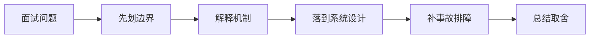

# 如果面试官深挖 No-answer、低置信与冲突证据处理 的生产落地和排障，你怎么回答？

## 面试定位

这道题关联 No-answer、低置信与冲突证据处理，难度 4/5，出现频率 high。面试官真正想看的是：你能否把概念回答升级成架构、数据流、指标、取舍和真实故障处理。
回答主轴可以从「No-answer、低置信与冲突证据处理」切入：生产 RAG 必须知道什么时候不回答、什么时候要求人工、什么时候展示冲突证据，而不是每个问题都生成确定答案。

**第一句话建议**
我会先划清边界，再解释运行机制，最后用一个系统设计案例说明数据流、失败模式、指标和取舍。

**不要只答**
- 无答案也强答
- 置信度只看模型自评分
- 冲突证据不展示来源
- 只给定义，不讲机制、数据流、指标和生产失败模式

## 30 秒回答

先给定义和边界：No-answer、低置信与冲突证据处理 是 AI 工程生产化能力的一部分，关注 no-answer detection、confidence scoring、conflict evidence and human escalation。；confidence verdict、conflict evidence report、escalation event 是团队复盘、验收和面试表达的核心证据。；低置信答案被当事实、冲突证据被忽略 是这个主题最容易被追问的生产风险。；生产 RAG 必须知道什么时候不回答、什么时候要求人工、什么时候展示冲突证据，而不是每个问题都生成确定答案。；no-answer detection、confidence scoring、conflict evidence and human escalation 要服务生产问题。

回答时必须主动补数据流、关键字段、失败模式、指标和取舍，否则很容易停留在背概念。

## 架构与运行机制

### 标准回答骨架

- 先给定义和边界：No-answer、低置信与冲突证据处理 是 AI 工程生产化能力的一部分，关注 no-answer detection、confidence scoring、conflict evidence and human escalation。；confidence verdict、conflict evidence report、escalation event 是团队复盘、验收和面试表达的核心证据。；低置信答案被当事实、冲突证据被忽略 是这个主题最容易被追问的生产风险。；生产 RAG 必须知道什么时候不回答、什么时候要求人工、什么时候展示冲突证据，而不是每个问题都生成确定答案。；no-answer detection、confidence scoring、conflict evidence and human escalation 要服务生产问题。
- 再讲机制：生产 AI 系统要先定义可验证边界，再谈模型效果。；所有关键配置、数据、prompt、模型、工具和评测结果都要可追溯。；质量、延迟、成本、安全和用户体验要一起权衡，不能只优化单一指标。；失败样本要进入回归集，避免同类问题重复发生。；No-answer、低置信与冲突证据处理 的面试重点是把 no-answer detection、confidence scoring、conflict evidence and human escalation 拆成输入、处理、状态、输出、指标和失败路径。。
- 工程落地要说清楚：Versioned artifact registry。；Trace and eval pipeline。；Canary release with rollback。；Human review for high-risk cases。；关键字段至少包含 id、version、owner、tenant、input_hash、output_hash、status、error_code、trace_id 和 created_at。；指标看 no_answer_accuracy、low_confidence_rate、conflict_detection_rate、human_escalation_rate、hallucination_rate，并按场景、租户、模型版本和发布版本分桶。。
- 最后补指标、失败模式和取舍：no_answer_accuracy；low_confidence_rate；conflict_detection_rate；human_escalation_rate；hallucination_rate；无答案也强答；置信度只看模型自评分；冲突证据不展示来源。
- 生产 RAG 必须知道什么时候不回答、什么时候要求人工、什么时候展示冲突证据，而不是每个问题都生成确定答案。
- No-answer、低置信与冲突证据处理 是 AI 工程生产化能力的一部分，关注 no-answer detection、confidence scoring、conflict evidence and human escalation。
- confidence verdict、conflict evidence report、escalation event 是团队复盘、验收和面试表达的核心证据。
- 低置信答案被当事实、冲突证据被忽略 是这个主题最容易被追问的生产风险。
- 生产 AI 系统要先定义可验证边界，再谈模型效果。
- 所有关键配置、数据、prompt、模型、工具和评测结果都要可追溯。
- 质量、延迟、成本、安全和用户体验要一起权衡，不能只优化单一指标。
- 失败样本要进入回归集，避免同类问题重复发生。
- No-answer、低置信与冲突证据处理 的面试重点是把 no-answer detection、confidence scoring、conflict evidence and human escalation 拆成输入、处理、状态、输出、指标和失败路径。
- 生产落地时要保留 confidence verdict、conflict evidence report、escalation event，并能解释它如何支持排障、回归和团队协作。
- 把核心对象、状态变化、执行顺序和异常路径讲出来，避免只说结论。

### 数据流怎么讲

可以按文档接入、PDF/Word/HTML/表格解析、OCR、layout-aware chunking、metadata/ACL、embedding、向量索引、过滤下推、BM25+vector hybrid search、rerank、增量索引、拒答策略、检索观测和权限测试来讲。数据流通常是文档经过解析和权限绑定后分块，embedding 写入向量库，查询时先做租户和 ACL 过滤，再召回、重排、生成和引用校验。

### 落地实现细节

- Versioned artifact registry。
- Trace and eval pipeline。
- Canary release with rollback。
- Human review for high-risk cases。
- 关键字段至少包含 id、version、owner、tenant、input_hash、output_hash、status、error_code、trace_id 和 created_at。
- 指标看 no_answer_accuracy、low_confidence_rate、conflict_detection_rate、human_escalation_rate、hallucination_rate，并按场景、租户、模型版本和发布版本分桶。
- 排障时先定位 confidence verdict、conflict evidence report、escalation event 的版本，再回放 trace、对比 eval、检查最近数据或配置变更。
- 设计时先定义 owner、version、tenant scope、timeout、retry、fallback 和 audit 字段。
- 上线前用 golden cases、trace replay、灰度和 rollback plan 验证 低置信答案被当事实、冲突证据被忽略 不会扩散成生产事故。
- 先定义目标、输入、输出、风险和成功指标，再选模型、工具或框架。
- 把 prompt、model、config、data、eval、trace 和 release 都版本化。
- 上线前准备 golden cases、回归门禁、成本预算、降级策略和人工接管路径。
- 关键接口要有 schema、version、timeout、retry、幂等键和审计字段。
- 关键状态要能恢复，关键动作要能回放，关键结果要有验证器或指标证明。

## 可画图

图 1：这类题不要直接背结论，先划清边界，再沿机制、设计、事故和取舍回答。

## 系统设计案例

### 面试可展开的系统设计

典型设计题是企业知识库、客服 RAG、研发文档问答或合规文档检索。架构上要包含解析沙箱、chunk version、document lineage、embedding model、HNSW/IVF/PQ 选型、hybrid search、reranker、index freshness、no-answer、ablation 和 permission leak test。

**答题时建议画出的模块**
- 摄入解析层：连接器、PDF/Word/HTML/表格解析、OCR、解析沙箱和失败隔离。
- 切分建模层：chunk、parent-child、semantic window、document lineage、metadata、ACL 和版本。
- 索引层：embedding model、向量维度、HNSW/IVF/PQ、BM25、过滤字段和增量构建。
- 检索层：query rewrite、filter pushdown、hybrid search、rerank、citation 和 no-answer 策略。
- 治理层：index freshness、recall@k、groundedness、permission leak test、ablation 和成本延迟看板。

**数据流**
- 文档进入摄入队列后先做权限绑定、解析、OCR、表格/公式保留和解析质量检查。
- 内容按语义和版面切分成 chunk，绑定 document_id、tenant_id、acl、version、source_range 和 lineage。
- embedding 和 BM25 索引按版本写入，删除、更新和 reindex 通过 tombstone 与索引版本保证可追溯。
- 查询时先做租户/ACL/filter 下推，再执行 hybrid search、rerank、证据裁剪、生成、引用和拒答判定。

## 真实问题与排障

真实线上问题一般从文档解析丢表格、OCR 错字、chunk 断裂、metadata 缺失、ACL 泄漏、embedding 维度不一致、索引构建慢、过滤后召回为空、rerank 过慢、删除未生效、引用不可信和 no-answer 误判看起。回答时要沿摄入、切分、索引、检索、重排、生成、权限和观测逐层定位。

**现场排障回答法**
- 先确认是解析质量、chunk 质量、metadata/ACL、embedding、索引、filter、rerank、生成引用还是权限问题。
- 抽取失败 query，查看召回列表、分数、过滤条件、rerank 前后变化和最终引用。
- 检查 document version、chunk lineage、index freshness、delete/reindex 状态和权限快照。
- 用 ablation 对比 BM25、vector、hybrid、rerank 和 query rewrite 对结果的影响。
- 止血可以禁用问题数据源、回滚索引版本、提高 no-answer 阈值或临时关闭高风险回答。

**重点指标**
- no_answer_accuracy
- low_confidence_rate
- conflict_detection_rate
- human_escalation_rate
- hallucination_rate

## 多轮追问模拟

### 追问 1：No-answer、低置信与冲突证据处理 的核心机制是什么？

**回答要点**：我会先划清边界：No-answer、低置信与冲突证据处理 是 AI 工程生产化能力的一部分，关注 no-answer detection、confidence scoring、conflict evidence and human escalation。；confidence verdict、conflict evidence report、escalation event 是团队复盘、验收和面试表达的核心证据。；低置信答案被当事实、冲突证据被忽略 是这个主题最容易被追问的生产风险。；生产 RAG 必须知道什么时候不回答、什么时候要求人工、什么时候展示冲突证据，而不是每个问题都生成确定答案。。然后再解释机制、生产约束和指标，避免只背名词。

**考察点**：边界、机制

### 追问 2：如果把这个点落到真实项目，你会怎么设计？

**回答要点**：我会按输入、配置、运行、失败处理和观测展开：关键字段至少包含 id、version、owner、tenant、input_hash、output_hash、status、error_code、trace_id 和 created_at。；指标看 no_answer_accuracy、low_confidence_rate、conflict_detection_rate、human_escalation_rate、hallucination_rate，并按场景、租户、模型版本和发布版本分桶。；排障时先定位 confidence verdict、conflict evidence report、escalation event 的版本，再回放 trace、对比 eval、检查最近数据或配置变更。；设计时先定义 owner、version、tenant scope、timeout、retry、fallback 和 audit 字段。；上线前用 golden cases、trace replay、灰度和 rollback plan 验证 低置信答案被当事实、冲突证据被忽略 不会扩散成生产事故。。项目表达里要说明数据流、配置来源、回滚方式和指标。

**考察点**：项目设计、数据流

### 追问 3：线上出问题时先看什么？

**回答要点**：先确认影响面和最近变更，再看关键指标：no_answer_accuracy；low_confidence_rate；conflict_detection_rate；human_escalation_rate；hallucination_rate。排查时按入口、运行态、依赖、配置、资源和发布逐层收敛。

**考察点**：排障、指标

### 延伸追问 1：No-answer、低置信与冲突证据处理 的核心机制是什么？

回答时继续沿着边界、架构、数据流、指标、失败模式和取舍展开。可以落到这些项目证据：把回答落到 pe-coding-agent 的工程链路里。；用配置、数据流、指标、失败案例和回滚动作证明不是只会背概念。；补一个错误做法和一次改进动作，可信度会明显更高。

### 延伸追问 2：如果成本、稳定性和安全冲突，你怎么取舍？

回答时继续沿着边界、架构、数据流、指标、失败模式和取舍展开。可以落到这些项目证据：把回答落到 pe-coding-agent 的工程链路里。；用配置、数据流、指标、失败案例和回滚动作证明不是只会背概念。；补一个错误做法和一次改进动作，可信度会明显更高。

### 延伸追问 3：如何把这个知识点讲成项目经验？

回答时继续沿着边界、架构、数据流、指标、失败模式和取舍展开。可以落到这些项目证据：把回答落到 pe-coding-agent 的工程链路里。；用配置、数据流、指标、失败案例和回滚动作证明不是只会背概念。；补一个错误做法和一次改进动作，可信度会明显更高。

## 项目化回答与取舍

**项目证据怎么挂钩**
- 把回答落到 pe-coding-agent 的工程链路里。
- 用配置、数据流、指标、失败案例和回滚动作证明不是只会背概念。
- 补一个错误做法和一次改进动作，可信度会明显更高。

**取舍总结**
生产 RAG 数据工程的取舍是可追溯事实和权限安全换来了数据管道、索引维护、召回质量、延迟成本和隐私治理复杂度。面试追问通常会围绕 chunking、metadata filter、向量索引参数、hybrid search、rerank、增量 reindex、引用 groundedness、no-answer 和权限泄漏展开。

**收尾句**
这类问题最后要回到可验证结果：设计上有什么边界，线上看什么指标，失败后怎么恢复，哪些场景不该用这个方案。这样回答才经得起连续追问。

## 深挖技术细节

- Versioned artifact registry。
- Trace and eval pipeline。
- Canary release with rollback。
- Human review for high-risk cases。
- 关键字段至少包含 id、version、owner、tenant、input_hash、output_hash、status、error_code、trace_id 和 created_at。
- 指标看 no_answer_accuracy、low_confidence_rate、conflict_detection_rate、human_escalation_rate、hallucination_rate，并按场景、租户、模型版本和发布版本分桶。
- 排障时先定位 confidence verdict、conflict evidence report、escalation event 的版本，再回放 trace、对比 eval、检查最近数据或配置变更。
- 设计时先定义 owner、version、tenant scope、timeout、retry、fallback 和 audit 字段。
- 上线前用 golden cases、trace replay、灰度和 rollback plan 验证 低置信答案被当事实、冲突证据被忽略 不会扩散成生产事故。
- 先定义目标、输入、输出、风险和成功指标，再选模型、工具或框架。
- 把 prompt、model、config、data、eval、trace 和 release 都版本化。
- 上线前准备 golden cases、回归门禁、成本预算、降级策略和人工接管路径。
- 生产 RAG 必须知道什么时候不回答、什么时候要求人工、什么时候展示冲突证据，而不是每个问题都生成确定答案。
- No-answer、低置信与冲突证据处理 是 AI 工程生产化能力的一部分，关注 no-answer detection、confidence scoring、conflict evidence and human escalation。
- confidence verdict、conflict evidence report、escalation event 是团队复盘、验收和面试表达的核心证据。
- 低置信答案被当事实、冲突证据被忽略 是这个主题最容易被追问的生产风险。
- 生产 AI 系统要先定义可验证边界，再谈模型效果。
- 所有关键配置、数据、prompt、模型、工具和评测结果都要可追溯。
- 质量、延迟、成本、安全和用户体验要一起权衡，不能只优化单一指标。
- 失败样本要进入回归集，避免同类问题重复发生。
- No-answer、低置信与冲突证据处理 的面试重点是把 no-answer detection、confidence scoring、conflict evidence and human escalation 拆成输入、处理、状态、输出、指标和失败路径。
- 生产落地时要保留 confidence verdict、conflict evidence report、escalation event，并能解释它如何支持排障、回归和团队协作。
- 面试深挖时要把 RAG 讲成数据工程和权限工程，不是把文档塞进向量库。解析、切分、索引、过滤、重排、引用、拒答和观测每层都要有证据。
- 关键链路要说明同步路径、异步路径、失败路径和补偿路径。

## 边界条件与反例

反例一：如果业务需要强事务一致性，不能只靠缓存、搜索索引或异步读模型承载最终正确性。

反例二：如果没有指标、trace 和回归样例，方案在线上出问题时只能靠猜，不能证明稳定性。

反例三：为了追求低延迟而省略权限、幂等、超时或降级，会把局部性能优化变成系统性风险。

## 深问准备

被追问时优先沿四条线展开：为什么需要这个方案、关键数据结构是什么、失败后如何止血和定位、最终用什么指标证明修复有效。

- 准备一个线上事故：影响面、止血、根因、修复、回归。
- 准备一个系统设计：入口、状态、执行、存储、观测。
- 准备一个取舍：一致性、延迟、吞吐、成本和可维护性。

## 来源与延伸阅读

- [OpenAI API Docs: Evals](https://platform.openai.com/docs/guides/evals)：用于确认官方语义边界、命令行为和工程约束。
- [LlamaIndex Documentation: Production RAG](https://developers.llamaindex.ai/python/framework/optimizing/production_rag/)：用于确认官方语义边界、命令行为和工程约束。
