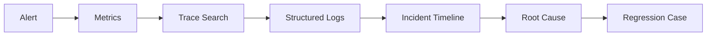

# 线上事故如何用 Trace、日志和指标定位根因？

## 面试定位

这道题考的是事故定位方法。回答要把指标、Trace、日志和事件时间线分工讲清楚：指标发现趋势和影响面，Trace 还原跨服务路径，日志补充局部细节，复盘沉淀 runbook 和回归。

## 30 秒回答

我会先建立影响面和时间线：哪些用户、接口、服务、版本、错误率、p95、依赖和发布事件。指标用来判断症状和范围，Trace 用来定位一次请求经过哪些服务和 span，日志用来解释每个节点的 error_code、参数摘要和状态。

Trace 要跨 HTTP、MQ、线程池和 Agent run 传播；错误和慢请求要提高采样或 tail sampling 保留。事故后要产出根因、止血、回滚、修复、告警调整、runbook 和回归用例。

## 架构与运行机制

图 1 的数据流是：告警触发后从指标确定范围，再用 Trace 找链路，日志补细节，最后形成事故时间线和回归。图中 Regression 是关键，因为没有回归的复盘很容易再次发生。

## 深挖技术细节

Trace 的核心是上下文传播。HTTP 用 `traceparent`，MQ 要把 trace context 放进 message header，线程池要捕获和恢复上下文，Agent run 要把 run_id、tool_call_id 和 trace_id 关联。异步边界最容易断链。

日志要结构化，字段包括 trace_id、span_id、service、route、error_code、tenant、release_id、payload_hash。敏感字段不能直接落日志，尤其是 prompt、用户输入、token 和工具参数。

采样策略要考虑故障证据。普通请求可以低采样，错误、慢请求、高风险操作要强制保留。否则事故发生时只看到指标没有链路。

## 关键数据结构与协议

| 字段 | 作用 | 风险 |
| --- | --- | --- |
| `trace_id` | 串联请求 | 异步断链 |
| `span_id` | 标识操作 | 层级错误 |
| `traceparent` | 跨服务传播 | 伪造和丢失 |
| `error_code` | 错误分类 | 不稳定难聚合 |
| `payload_hash` | 参数摘要 | 摘要不足影响定位 |
| `run_id` | Agent 任务 | 要映射 trace |

## 系统设计案例

设计 Agent 工具调用排障系统：每个 run 创建 trace，每个 tool call 是 span，HTTP/MQ/DB/Redis 调用继续派生 span，日志记录 args_hash、policy verdict、error_code。数据流是 run -> tool span -> downstream span -> metrics/logs -> incident console。

取舍是：全量 Trace 成本高；采样会漏证据；日志越详细越利于排障但隐私风险越高。面试追问通常会问 MQ trace 传播、tail sampling、日志脱敏和 Agent trace replay。

## 真实问题与排障

Agent 工具失败率升高时，先看影响面：哪个工具、哪个版本、哪个 workspace、错误码、模型、权限策略、下游 p95。止血可以禁用工具、回滚 schema、降低并发或转人工。

根因定位沿 Trace 看：模型参数是否错，权限是否拦截，工具是否超时，MQ 是否丢上下文，线程池是否打满。回归要保存失败 run 并加入 replay。

## 边界条件与反例

反例：日志无 trace_id；日志保存完整敏感参数；采样丢错误链路；复盘没有回归。

## 项目表达

项目里可以说：我把传统分布式 Trace 和 Agent run trace 对齐，一次工具事故中通过 trace 发现失败集中在新 tool schema，日志的 args_hash 证明参数校验失败，回滚后把失败 run 加入回放测试。

如果继续追问复盘产物，可以说每次事故至少留下四样东西：修复代码、告警或面板调整、runbook 更新、回归用例。对 Agent 系统，回归用例最好包含原始目标、工具 schema、参数摘要、observation 和 verifier 结果，这样下次模型或工具升级时能自动复测。

还可以补一个排障顺序：先用指标判断是全局还是局部，再用 Trace 找慢 span 或错误 span，最后用日志看 error_code、release_id 和参数摘要。不要反过来一上来翻海量日志，否则很容易被噪声带偏。这个顺序能体现生产排障经验。

如果面试官问“如何证明修好了”，回答要包含回归：同一失败链路能 replay，告警阈值覆盖同类问题，dashboard 能看到错误率和 p95 回落，日志中 error_code 不再出现。没有这些证据，只能算临时恢复。

## 深问准备

1. Trace 和日志的边界？
2. MQ 异步链路怎么传 trace？
3. Tail sampling 为什么有用？
4. 如何做日志脱敏？
5. Agent trace replay 怎么设计？

## 来源与延伸阅读

- OpenTelemetry 官方文档：用于确认 trace/span 和上下文传播。
- Prometheus 官方文档：用于连接指标告警。
