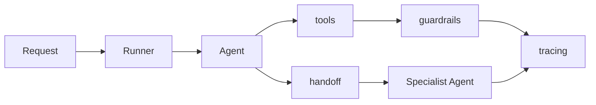

# OpenAI Agents SDK 的核心概念有哪些？

## 面试定位

这题考框架理解。不要只列名词，要说明 Agent、Runner、tools、handoff、guardrails、tracing 在架构、数据流和框架取舍中分别做什么。

## 30 秒回答

OpenAI Agents SDK 的核心概念可以按运行链路讲：Agent 定义 instructions、model、tools、handoffs 和输出契约；Runner 推进一次 run；tools 连接外部能力；handoff 把任务转给更合适的 Agent；guardrails 管输入、输出和动作风险；tracing 记录每一步用于调试和 eval。

SDK 提供编排基础，但业务安全、权限、幂等和质量评测仍要自己设计。

## 标准回答

先讲 Agent。Agent 是职责单元，应该有明确任务边界、可用 tools、handoff target 和输出结构。不要把一个 Agent 写成万能助手。

再讲 Runner。Runner 是运行时入口，负责处理模型输出、工具调用、handoff 和最终结果。它让一次任务可以被 trace。

最后讲生产治理。guardrails 不等于权限系统，tracing 不等于 eval，但它们提供了做安全和评测的基础设施。

## 架构与运行机制

数据流是：用户请求进入 Runner，Runner 初始化 run_id、预算和上下文；Triage Agent 判断意图；Agent 选择 tool 或 handoff；Tool Runtime 执行；guardrails 给出 verdict；tracing 保存模型、工具、handoff 和成本。

## 可画图

## 系统设计案例

客服系统可以用 Triage Agent 分诊订单、退款和物流。订单 Agent 只允许查订单和解释状态，退款 Agent 可以生成退款预览，但真正退款要走 Tool Runtime 的 permission gate 和用户确认。

## 真实问题与排障

如果线上失败，我会看 trace：哪个 Agent 接管，handoff reason 是什么，调用了哪些 tools，guardrail verdict 是什么，最终失败在哪层。指标包括 `handoff_accuracy`、`tool_chain_success_rate`、`guardrail_trigger_rate`、`trace_coverage` 和 `cost_per_task`。

## 面试官追问

### 追问 1：handoff 怎么设计？

传 reason、state summary、constraints、completed steps、open risks 和 return policy。

### 追问 2：guardrails 能替代权限校验吗？

不能。guardrails 帮助判断风险，业务权限必须由后端 deterministic policy 执行。

### 追问 3：什么时候不用 SDK？

需要强自定义运行时、跨供应商抽象或极低层控制时，可以自研 loop。

## 项目化回答

Travel Agent 可以用 Triage、Flight、Hotel、Policy Agent。Coding Agent 可以用 Planner、Executor、Reviewer，但写文件和 shell 仍由受控工具执行。

## 常见错误

- 只背 Agent/Runner 名词。
- 以为 SDK 自动解决安全。
- handoff 没有状态摘要。
- 不开 tracing 就上线。

## 深挖技术细节

Agents SDK 的概念要按 run lifecycle 串起来。Agent 定义 `instructions`、`model`、`tools`、`handoffs`、`output_type` 和 guardrails；Runner 启动 run，维护上下文、预算、工具调用和最终输出；Tool 把模型意图变成受控执行；handoff 把任务转交给更合适的 Agent；tracing 把模型输入输出、tool call、handoff、guardrail verdict 和 token/cost 记录下来。

生产里最重要的是“SDK 编排”和“业务控制”分层。SDK 可以推进 loop，但权限、租户隔离、幂等、人工确认、事务和审计必须在 Tool Runtime 或业务后端实现。比如退款 Agent 可以生成退款 proposal，Runner 可以调工具，但真正 `create_refund` 前要校验用户权限、订单状态、金额上限、idempotency key 和 confirmation token。

## 边界条件与反例

不要把 handoff 设计成“换个 Agent 继续聊天”。好的 handoff payload 应包含 `reason`、`state_summary`、`completed_steps`、`constraints`、`open_questions`、`risk_flags` 和 `return_policy`。如果只把原始对话扔给下一个 Agent，很容易丢失关键状态，导致重复工具调用或越权动作。

也不要把 guardrails 当成万能安全系统。Guardrails 可以检测输入输出风险或拦截某类模型行为，但它不能替代 deterministic permission check。尤其是写文件、发邮件、支付、删除数据这类 side effect tool，必须由后端策略和审计日志兜底。

## 深问准备

如果追问“如何排障一次失败 run”，我会先打开 trace：确认 triage 是否选错 Agent、tool schema 是否导致参数错误、handoff 是否丢状态、guardrail 是否误杀或漏放、最终 output 是否违反结构契约。然后按 `run_id` 聚合 `tool_chain_success_rate`、`handoff_accuracy`、`guardrail_trigger_rate`、`latency_p95` 和 `cost_per_task`。

如果问“什么时候不用 SDK”，可以回答：当你需要极强自定义调度、跨多模型供应商统一抽象、已有成熟 workflow engine，或必须完全控制状态机和重试语义时，可以自研 loop 或用其他框架。判断标准不是“SDK 是否高级”，而是它是否覆盖你的运行时控制、可观测和合规需求。

## 来源与延伸阅读

- [OpenAI Agents SDK](https://platform.openai.com/docs/guides/agents-sdk)
- [OpenAI A practical guide to building agents](https://cdn.openai.com/business-guides-and-resources/a-practical-guide-to-building-agents.pdf)
