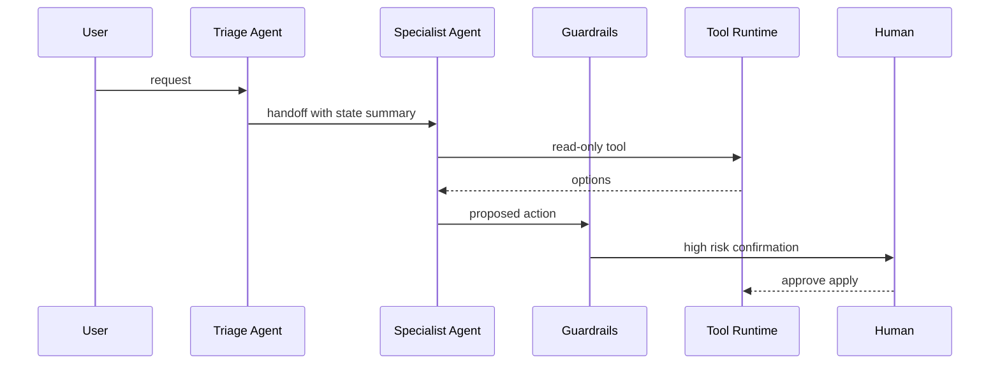

# 如何利用 handoff 和 guardrails 设计一个客服或旅行 Agent？

## 面试定位

这题考系统设计。要说明为什么需要 handoff、guardrails 放在哪、哪些动作必须回到确定性工具和人工确认，以及安全与体验之间的取舍。

## 30 秒回答

我会用 Triage Agent 做意图识别和约束提取，再 handoff 到订单、退款、航班或酒店等 Specialist Agent。handoff payload 要带 reason、state summary、user constraints、completed steps 和 return policy。

guardrails 分三层：输入过滤、工具动作风险检查、输出校验。高风险写操作必须走 preview、permission gate、human confirmation 和 idempotency key。

## 标准回答

第一步是职责拆分。Triage Agent 不做具体业务，只判断用户要什么。Specialist Agent 只拥有自己领域的有限 tools。这样工具面更小，trace 也更清楚。

第二步是 handoff 契约。不能只传一句“交给航班 Agent”。要传用户预算、日期、候选方案、已拒绝条件、风险和返回策略。

第三步是 guardrails。输入 guardrail 拦截敏感或越权请求，tool guardrail 检查高风险动作，output guardrail 检查是否承诺了未确认结果。

## 架构与运行机制

数据流是：请求进入 Runner，Triage Agent 识别 intent，handoff 到 Specialist Agent，Specialist 调只读工具形成 proposal，guardrails 检查风险，写动作进入 Tool Runtime 和人工确认，trace 保存每一步。

## 可画图

## 系统设计案例

旅行 Agent 中，Flight Agent 可以查航班和生成改签预览。真正 apply change 必须由 Tool Runtime 校验用户身份、订单归属、费用差额和幂等键。输出 guardrail 防止 Agent 说“已经改签成功”，除非 apply 工具返回成功 observation。

## 真实问题与排障

常见问题是 handoff 来回跳、Specialist Agent 权限过大、guardrails 误拦截、写工具缺确认。排查看 trace：handoff reason、target、payload、tool call、guardrail verdict 和 final output。

指标包括 `handoff_accuracy`、`handoff_loop_rate`、`unsafe_action_block_rate`、`tool_chain_success_rate`、`human_confirmation_rate` 和 `cost_per_task`。

## 面试官追问

### 追问 1：如何避免 handoff 循环？

限制 return policy，记录 completed steps，设置最大 handoff 次数，并让 arbiter 或 Runner 兜底。

### 追问 2：guardrails 误杀怎么办？

记录 verdict reason，区分硬规则和软规则，用人工复核样本校准阈值。

### 追问 3：客服退款能自动执行吗？

低风险只读可以自动，高风险写操作要 preview、确认、权限和幂等。

## 项目化回答

我会把客服和旅行 Agent 都设计成 hybrid。Agent 负责理解和候选方案，workflow 负责交易动作。这样能讲清楚业务安全边界。

## 常见错误

- 多 Agent 职责重叠。
- handoff 只传自然语言，不传状态。
- guardrails 代替权限系统。
- 写操作没有用户确认。

## 深挖技术细节

这个设计要把 handoff、guardrails 和 Tool Runtime 串成一条可审计链路。Triage Agent 的输出不是一句“交给退款 Agent”，而是结构化 payload：`intent`、`confidence`、`handoff_reason`、`state_summary`、`user_constraints`、`completed_steps`、`risk_flags` 和 `return_policy`。Specialist Agent 只接收自己领域内的上下文和 tools，降低误选工具概率。

Guardrails 要分层放置：input guardrail 检查越权、敏感和恶意请求；tool guardrail 检查 side effect、金额、对象归属、确认状态和 idempotency key；output guardrail 检查是否承诺了未发生的结果。真正的权限校验在 Tool Runtime 或业务后端，guardrail verdict 进入 trace，字段包括 `guardrail_name`、`decision`、`reason`、`risk_level` 和 `user_action_required`。

## 边界条件与反例

客服 Agent 最容易犯的错是把解释、预览和执行混在一起。比如用户问“帮我退款”，Agent 可以解释政策、查订单、生成退款预览；但退款提交必须校验用户身份、订单归属、退款窗口、金额上限和确认 token。输出里也不能说“退款成功”，除非 apply 工具返回成功 observation。

多 Agent 也不是越多越好。订单 Agent、退款 Agent、物流 Agent 如果工具面和职责重叠，会出现 handoff loop。要设置最大 handoff 次数、completed steps、owner agent 和 arbiter fallback；当置信度不足时，应追问用户或转人工，而不是在 Agent 之间来回转。

## 深问准备

如果追问“旅行 Agent 怎么做安全”，我会区分只读和写操作：搜索航班、计算差价、生成 itinerary 可以自动；预订、支付、改签、取消必须 preview + human confirmation + idempotency key + audit。这样安全边界清楚，体验上也不会让用户在每个只读步骤都确认。

如果追问“怎么评估 handoff”，看 `handoff_accuracy`、`handoff_loop_rate`、`specialist_tool_error_rate`、`unsafe_action_block_rate`、`manual_handoff_rate` 和 `task_success_rate`。失败样本要能回放到具体 payload，判断是 triage 错、状态摘要缺失，还是 Specialist tool surface 过大。

## 来源与延伸阅读

- [OpenAI Agents SDK](https://platform.openai.com/docs/guides/agents-sdk)
- [OpenAI A practical guide to building agents](https://cdn.openai.com/business-guides-and-resources/a-practical-guide-to-building-agents.pdf)
