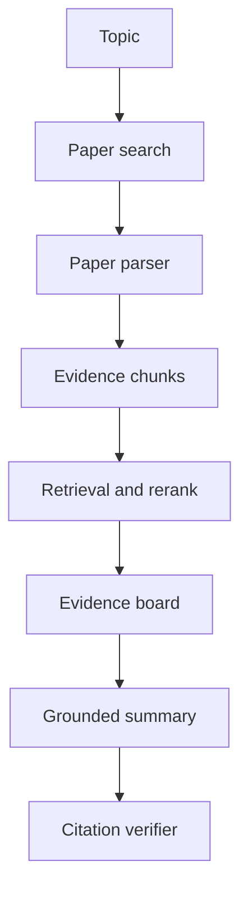

# Paper Agent 项目如何体现 Agent 工程能力？

## 30 秒回答

Paper Agent 能体现 RAG、工具调用、证据链和评测。它不是简单总结 PDF，而是从检索论文、paper parser、chunk、hybrid search、rerank、evidence board、claim extraction 到 citation verifier 的完整数据流。核心指标是 citation_precision、hallucination rate、coverage@k 和 annotation agreement。

## 面试定位

这题考你能否把论文助手讲成工程项目。面试官会追问“是不是把 PDF 丢给模型”，所以要主动讲解析、引用和评测。

回答要覆盖架构、数据流、指标、取舍和追问。重点是证据可追溯。

## 标准回答

我会先说明项目目标：帮助技术调研时快速整理论文证据，而不是代替研究员判断。系统输入是主题、时间范围和阅读目标，输出是带 citation 的综述、对比表或 claim table。

架构上包括 Search API、paper parser、chunk store、citation graph、hybrid retrieval、rerank、evidence board、grounded generator 和 verifier。模型只在规划、抽取和生成环节参与。

最关键的是评测。每个 claim 都要能回到 evidence span。人工 annotation 构建 golden set，用来评估引用准确率和幻觉率。

## 架构与运行机制

数据流里，PDF 解析必须保留 page、section、paragraph 和 evidence_id。没有这些字段，后续引用很难复查。

## 可画图

可以画从论文搜索到引用验证的 pipeline。图上标出 paper parser、citation graph、claim extraction 和 retrieval eval。

## 系统设计案例

用户要求比较三篇 Agent 评测论文。系统检索论文元数据，下载或读取 PDF，解析方法、实验和限制。Evidence board 记录每个结论来自哪页哪段。

生成综述时，模型不能凭印象下结论。每条比较都带 citation，verifier 检查证据是否支持。

## 真实问题与排障

常见失败是 PDF 解析错页、表格读错、引用相关但不支持结论。排障先看 evidence_id 是否能回到原文，再看 rerank 是否选择了 answerable chunk。

指标包括 parse_success_rate、retrieval_recall、citation_precision、claim_support_rate、hallucination rate 和 manual_revision_rate。

## 面试官追问

- 如何评测引用准确率？
- PDF 表格怎么处理？
- citation graph 有什么价值？
- 如何避免只总结 abstract？
- 用户问的问题没有证据怎么办？

## 项目化回答

我会说 Paper Agent 展示的是证据工程。paper parser 保留结构，retrieval eval 保证召回，claim extraction 和 citation verifier 控制幻觉，annotation 样本用于回归。

## 常见错误

- 只把 PDF 文本塞给模型。
- citation 只到论文链接，不到证据段落。
- 不评估 hallucination rate。
- 忽略表格和页码。
- 没有人工标注样本。

## 深挖技术细节

Paper Agent 要把论文处理成可追溯证据，而不是直接喂给模型。Parser 输出应包含 `paper_id`、`title`、`authors`、`venue`、`year`、`section`、`page`、`paragraph_id`、`table_id`、`figure_id`、`span_start`、`span_end` 和 `evidence_id`。表格和图要单独抽取 caption、行列语义和数值单位，否则实验结论很容易被读错。

Evidence Board 是项目亮点。它把用户问题拆成 claim slots，例如方法、数据集、指标、结果、限制、适用场景。Hybrid retrieval 和 rerank 把相关段落、表格和实验结果放进 board；Grounded Generator 只能基于 board 生成综述；Citation Verifier 检查每个 claim 是否被 span 支持。无证据问题应输出 unknown 或要求更多论文，而不是编结论。

评测要有人工 annotation。样本覆盖 abstract-only、表格数值、相似论文、冲突结论、无答案问题和跨论文比较。指标包括 `parse_success_rate`、`table_extraction_accuracy`、`retrieval_recall@k`、`citation_precision`、`claim_support_rate`、`hallucination_rate`、`coverage@k` 和 `manual_revision_rate`。

## 边界条件与反例

反例一：PDF 解析丢页码，答案虽然带引用，但用户无法复查。反例二：只总结 abstract，忽略方法限制和实验细节。反例三：引用相关论文的方法章节，却用来支持实验数值结论。反例四：把图表里的数值单位看错。

边界在于：Paper Agent 可以提高调研效率，但不能替代研究判断。解析失败、权限受限、论文冲突、证据不足时要暴露不确定性。对科研和技术决策场景，claim-level citation 比文档级链接更重要。

## 深问准备

- 问：为什么不是 PDF summarizer？答：Paper Agent 有 parser、evidence board、citation verifier、annotation eval 和 trace。
- 问：表格怎么处理？答：抽取 table_id、caption、行列语义、数值和单位，引用到单元格或行级 span。
- 问：如何避免只总结 abstract？答：按 claim slots 检索方法、实验、限制和消融，不让 abstract 单独覆盖所有结论。
- 问：没有证据怎么办？答：输出 insufficient evidence、补检索或让用户提供论文，不生成无来源结论。

## 来源与延伸阅读

- [Anthropic Claude Citations](https://docs.anthropic.com/en/docs/build-with-claude/citations)
- [LangChain Retrieval](https://docs.langchain.com/oss/python/langchain/retrieval)
- [LangSmith Evaluation](https://docs.smith.langchain.com/evaluation)
