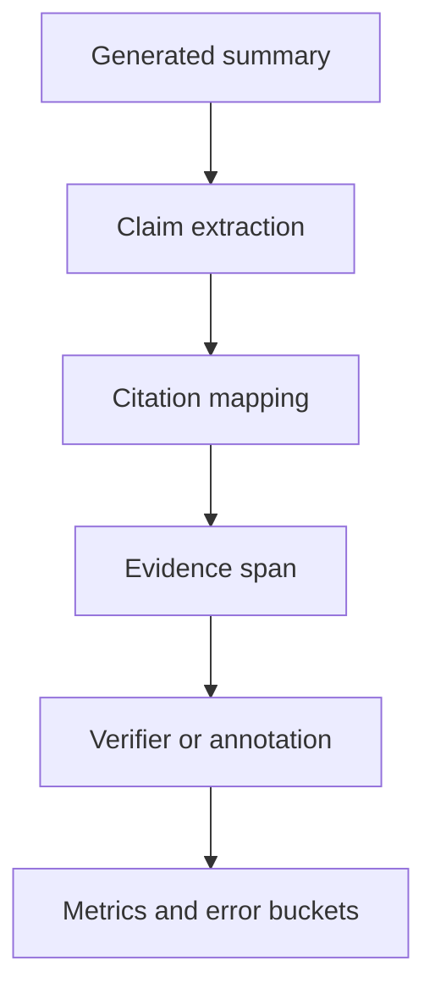

# 如何评测 Paper Agent 的引用准确率和幻觉率？

## 30 秒回答

我会把答案拆成 claim，再检查每个 claim 的 citation 是否被 evidence span 支持。引用准确率看 supported citations 占比，幻觉率看 unsupported 或 contradicted claims 占比。评测集需要人工 annotation，并覆盖相似论文、表格结论和无答案问题。

## 面试定位

这是 Paper Agent 的核心评测题。面试官想确认你能把“读论文”变成可验证任务。

回答要覆盖架构、数据流、指标、取舍和追问。重点是 claim-level evaluation。

## 标准回答

第一步构建 golden set。选择论文主题、问题和期望证据，人工标注每个问题应该引用哪些段落、表格或实验结果。

第二步生成答案并抽取 claim。Claim 可以是方法描述、实验结果、比较结论或限制说明。每个 claim 都要有 citation_id。

第三步验证。人工或 verifier 判断 evidence span 是否支持 claim。结果分 supported、partial、unsupported 和 contradicted。幻觉率按 unsupported 与 contradicted 的 claim 计算。

第四步归因。错误可能来自 parser、retrieval、rerank、generation 或 citation mapping。

## 架构与运行机制

数据流要保存 paper_id、page、section、claim_id、citation_id、verdict 和 reason。这样才能追踪是哪一层导致幻觉。

## 可画图

可以画 claim-level eval 流程图。左边是答案，右边是论文原文，中间是 claim 与 evidence span 的匹配。

## 系统设计案例

答案写道“论文 X 在 HumanEval 上达到 80%”。如果 citation 指向的是方法章节，而不是实验表格，就不能算 supported。若表格中实际是 70%，则是 contradicted。

评测时把这类样本加入 hard negative，帮助 rerank 和 verifier 学会区分“同一篇论文相关”与“证据支持结论”。

## 真实问题与排障

如果 citation_precision 低，先看 parser 是否丢表格，再看 retrieval 是否找到了正确页。若正确 evidence 在候选里但没被选中，问题在 rerank。若 evidence 正确但答案夸大，问题在生成和 verifier。

指标包括 citation_precision、claim_support_rate、hallucination_rate、coverage@k、annotation_agreement 和 table_claim_error_rate。

## 面试官追问

- 人工 annotation 成本怎么控制？
- 表格和图里的证据如何标注？
- partial support 怎么处理？
- verifier 错判怎么办？
- 如何评估综述覆盖度？

## 项目化回答

我会说评测不是看摘要好不好读，而是看 claim 是否被论文证据支持。项目里每个 claim 都有 citation_id 和 evidence span，错误按 parser、retrieval、rerank、generation 分桶。

## 常见错误

- 只让人主观打分摘要质量。
- citation 到论文首页就算正确。
- 不区分 unsupported 和 contradicted。
- 忽略表格数值。
- 没有 hard negative。

## 深挖技术细节

Paper Agent 引用评测要做到 claim-level。每个答案先拆成 `claim_id`、`claim_type`、`claim_text`、`citation_id`、`paper_id`、`page`、`section`、`span` 和 `verdict`。claim_type 可以是 method、dataset、metric、number、comparison、limitation、conclusion。Verifier 判断时不仅看文本相关，还要看对象、条件、数值和范围是否一致。

幻觉率要按 unsupported 和 contradicted claim 计算。Unsupported 表示证据不能支持该 claim；contradicted 表示证据明确相反或数值不一致；partial 表示证据支持一部分但缺关键条件。对表格 claim，要保存 table_id、row、column、unit 和原始数值。对图像或公式，也要保留 caption 和解析来源。人工 annotation 可以抽样复核 verifier，计算 `annotation_agreement`，避免 judge 自己偏。

错误归因必须能回到链路。Parser 丢表格会导致正确证据不存在；retrieval 没召回正确页是 recall 问题；rerank 选相关但不可回答的段落是 answerability 问题；generator 扩大结论是过度推断；citation mapper 指错 span 是引用映射问题。指标包括 `citation_precision`、`claim_support_rate`、`hallucination_rate`、`table_claim_error_rate`、`coverage@k`、`annotation_agreement` 和 `manual_revision_rate`。

## 边界条件与反例

反例一：论文链接正确，但 claim 引用的是 abstract，无法支持具体实验数值。反例二：claim 写“所有数据集都提升”，证据只支持一个数据集，这是 over-generalization。反例三：表格里是 70%，答案写 80%，应判 contradicted，不是 partial。

边界在于：引用准确率高不代表综述完整。系统可能只回答容易引用的部分，所以还要看 coverage 和 no-answer behavior。对于没有证据的问题，正确输出是 insufficient evidence，而不是为了完整性编写。

## 深问准备

- 问：partial support 怎么处理？答：单独分桶，严格评测可不计 supported，诊断报告可给部分分但不能混淆。
- 问：人工 annotation 成本怎么降？答：模型预标、人工抽样复核、高风险和低一致性样本优先标注。
- 问：表格证据怎么标？答：标到 table_id、row、column、unit 和页码，避免只引用整篇论文。
- 问：如何评估覆盖度？答：按预定义 claim slots 或 expected evidence set 计算 coverage@k 和 missing_claim_rate。

## 来源与延伸阅读

- [Anthropic Claude Citations](https://docs.anthropic.com/en/docs/build-with-claude/citations)
- [LangSmith Evaluation](https://docs.smith.langchain.com/evaluation)
- [LangChain Retrieval](https://docs.langchain.com/oss/python/langchain/retrieval)
