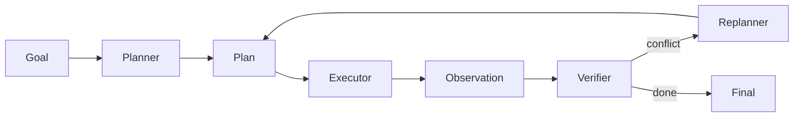

# 目前有哪些主流方法可以赋予 LLM 规划能力？

## 面试定位

这题不是论文名词背诵。要讲 CoT、ToT、Plan-and-Solve、Planner-Executor、Replanner 的适用场景、工程取舍、数据流和指标。

## 30 秒回答

常见方法包括 CoT、ToT、Plan-and-Solve、Planner-Executor 和 Replanner。CoT 帮模型组织步骤，ToT 探索多条候选路径，Plan-and-Solve 先规划再执行，Planner-Executor 把计划和行动拆开，Replanner 在 observation 和计划冲突时修正。

规划能力必须配合 verifier、预算和停止条件，否则会变成昂贵的自我对话。

## 标准回答

我会先区分推理组织和可执行计划。CoT 更像组织思路，Plan-and-Solve 更像生成步骤。工程里更常见的是 structured plan，每一步有目标、工具、预期结果和 done condition。

ToT 适合高价值问题，但成本高。Planner-Executor 适合工具任务，因为执行结果能反馈给 planner。Replanner 解决计划过期问题。

## 架构与运行机制

数据流的关键是 observation 会改变计划，计划不是一次生成后永远正确。

## 可画图

画 planner、executor、verifier、replanner 闭环，比只列 CoT/ToT 更像工程回答。

## 系统设计案例

Travel Agent 先规划查航班、查酒店、组合方案、等用户确认。若航班售罄，Replanner 要回到日期和预算约束重新规划。

## 真实问题与排障

规划失败常见原因是目标不清、计划不可执行、工具结果推翻前提、分支成本过高。指标包括 `plan_success_rate`、`replan_rate`、`avg_plan_steps`、`verifier_reject_rate` 和 `cost_per_task`。

## 面试官追问

### 追问 1：ToT 为什么不能随便用？

分支数、深度、token 和工具调用成本会快速膨胀。

### 追问 2：计划和执行冲突怎么办？

用 observation 触发 Replanner，并记录 replan reason。

## 项目化回答

Coding Agent 可以讲定位、修改、测试计划。Paper Agent 可以讲证据缺口驱动的检索计划。Travel Agent 可以讲约束驱动规划。

## 常见错误

- 只背方法名。
- 计划生成后不更新。
- 不限制 ToT 成本。
- 没有 verifier。

## 深挖技术细节

规划方法要区分“推理提示技巧”和“可执行控制流”。CoT/Plan-and-Solve 更偏一次性组织步骤，Planner-Executor 把计划与工具执行分离，Replanner 处理外部 observation 推翻计划的情况，ToT/搜索式规划会枚举多个候选路径。工程系统里计划最好是结构化对象：`plan_id`、`step_id`、`goal`、`tool_required`、`expected_observation`、`done_condition`、`risk_level`、`fallback`。

Planner 不能脱离 verifier。每个 step 执行后都要检查 expected_observation 是否达成；未达成就进入 retry、fallback 或 replan。ToT 这类多分支方法还要有 branch budget、beam width、depth limit 和 pruning rubric，否则成本会指数增长。复杂任务中，计划还应带 dependency graph，避免后续步骤依赖未完成前提。

指标不能只看最终答案。规划层可以看 `plan_validity_rate`、`step_executable_rate`、`verifier_reject_rate`、`replan_rate`、`avg_plan_steps`、`branch_prune_rate`、`cost_per_task`。这些指标能证明规划方法是否真的提升任务完成率，而不是生成了漂亮步骤。

## 边界条件与反例

反例一：把 CoT 当成可执行计划，没有工具、状态和 done condition。反例二：ToT 分支很多，但没有 verifier 和 pruning，成本膨胀。反例三：计划生成后不随 observation 更新，工具结果已经推翻前提还继续执行。

边界在于：简单线性任务不需要重规划和 ToT；开放、多约束、工具反馈强的任务才值得引入 Planner-Executor 或 Replanner。计划越复杂，越需要可观测状态、预算和停止条件。

## 深问准备

- 问：CoT 和 Planner-Executor 区别？答：CoT 是推理组织，Planner-Executor 是运行时架构，有工具执行和 observation 反馈。
- 问：ToT 为什么不能随便用？答：分支数乘深度导致 token、工具调用和评估成本快速增长。
- 问：计划如何变成工程对象？答：每步有工具、预期结果、done condition、风险和 fallback。
- 问：计划失败怎么定位？答：看 step_executable、verifier verdict、tool error 和 replan reason。

## 来源与延伸阅读

- [Anthropic Building effective agents](https://www.anthropic.com/engineering/building-effective-agents)
