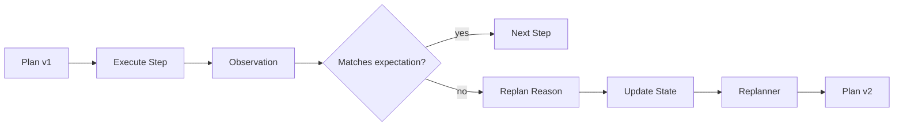

# 如果规划和执行结果冲突，你会如何让 Agent 重规划？

## 面试定位

这题考动态恢复。重点是 observation、verifier、replan reason、状态版本和预算控制。

## 30 秒回答

我会先让 Verifier 判断冲突类型：工具失败、外部状态变化、用户约束变化、证据冲突还是计划假设错误。然后基于当前 State 和 observation 触发 Replanner，生成新 plan version。旧计划不直接删除，要记录 replan reason 和废弃步骤。

重规划也要有预算和次数上限，避免无限规划。

## 标准回答

第一步确认 observation 是否可信。工具结果可能本身错误。第二步定位冲突发生在哪个 step。第三步更新 State，把已完成、失败、不可行的步骤标记清楚。第四步让 Replanner 只改受影响部分，而不是从零开始。

如果冲突涉及高风险业务动作，应该转人工或回到 workflow。

## 架构与运行机制

数据流要保留 plan version，否则无法解释为什么路线变化。

这里的取舍是全量重规划还是局部修补。局部修补成本低，但当目标或关键约束变化时，全量重规划更可靠。

## 可画图

可以画 plan v1 到 plan v2 的状态转移，标出冲突来源和被废弃步骤。

## 系统设计案例

旅行 Agent 计划订周五晚航班，但搜索结果显示无票。Replanner 不应该继续订酒店，而要回到航班时间、预算和备选城市，生成新候选。

## 真实问题与排障

如果频繁重规划，看目标是否太模糊，工具是否不稳定，Verifier 是否过严，预算是否太低。指标包括 `replan_rate`、`replan_success_rate`、`abandoned_step_count` 和 `cost_per_success`。

## 面试官追问

### 追问 1：重规划会不会浪费成本？

会，所以要限制次数，只重写受影响步骤，并用 verifier 控制。

### 追问 2：怎么避免反复推翻计划？

保存不可行原因，把失败约束加入下一轮 planning context。

## 项目化回答

Coding Agent 测试失败后只调整相关 patch。Paper Agent 证据不足时只补检索，不重写整个报告。Travel Agent 航班无票时只重规划交通部分。

## 常见错误

- observation 冲突还硬执行旧计划。
- 每次都从零规划。
- 不记录 replan reason。
- 没有预算上限。

## 深挖技术细节

重规划不是“重新问模型下一步”，而是一个状态迁移。系统要保存 `plan_id`、`plan_version`、`step_id`、`expected_state`、`actual_observation`、`verifier_verdict`、`replan_reason`、`affected_steps`、`abandoned_steps` 和 `budget_remaining`。当 observation 与 expected_state 冲突时，Verifier 先判断冲突类型，再让 Replanner 只修改受影响的步骤。

常见 replan reason 包括 `tool_failed`、`external_state_changed`、`constraint_changed`、`evidence_conflict`、`plan_assumption_invalid`、`risk_policy_blocked`。不同原因对应不同动作：工具失败可换工具或 retry；外部状态变化要刷新事实；用户约束变化要重算计划；高风险策略阻断要转人工或降级。旧计划不要删除，应标记 superseded，方便 trace replay。

重规划要有预算和防抖。连续多次因为同一原因失败，说明计划前提或工具环境有问题，不应无限 replan。指标包括 `replan_rate`、`replan_success_rate`、`same_reason_replan_loop_count`、`abandoned_step_count`、`cost_per_success`、`time_to_recover` 和 `human_handoff_rate`。

## 边界条件与反例

反例一：航班无票后仍按原酒店计划继续，导致后续动作全部建立在错误前提上。反例二：测试失败后 Coding Agent 从零规划，把已确认正确的修复也丢掉。反例三：replan 没有记录 reason，复盘时不知道是工具问题还是计划假设错。

边界在于：局部 replan 成本低，但当前目标、硬约束或关键事实变化时必须全量重规划。高风险业务动作如果已进入 approval 或执行阶段，不能简单 replan，要先确认外部副作用状态。

## 深问准备

- 问：如何避免反复推翻计划？答：把失败原因写入 state，下一轮 planner 必须避开同一不可行假设。
- 问：全量重规划和局部修补怎么选？答：局部步骤失败用局部修补，目标或硬约束变化用全量重规划。
- 问：observation 本身不可信怎么办？答：先验证工具结果或重新观察，不能基于错误 observation 重规划。
- 问：重规划如何进入 trace？答：记录 plan version、replan reason、abandoned steps 和新旧计划 diff。

## 来源与延伸阅读

- [Anthropic Building effective agents](https://www.anthropic.com/engineering/building-effective-agents)
