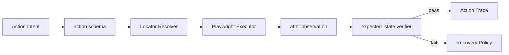

# 如何用 Playwright 封装 Browser Agent 的动作工具？

## 面试定位

这题考动作工具的工程边界。回答要覆盖 action schema、locator、auto-wait、expected_state、verifier、错误码和安全确认。

## 30 秒回答

我会把 Playwright 动作封装成结构化工具。模型输出 action_type、target_description、expected_state 和 risk_level。执行层选择 locator，利用 Playwright auto-wait 执行动作，然后重新 observe。verifier 检查 expected_state，Recovery Policy 根据错误码决定重试、换 locator、关闭弹窗、转人工或停止。

## 标准回答

工具封装不能只是 `page.click`。它要有统一 action schema，包含 action_id、locator_candidates、timeout_ms、input_value、expected_state 和 requiresConfirmation。locator 优先用 role、label、test id 和可见文本，CSS/XPath 只能作为 fallback。

关键取舍是稳定性和成本。强 verifier 会增加一次观察，但能防止“点击成功但业务没完成”。更多 fallback 能提高恢复率，但也会增加误点和重复提交风险。

Playwright 的 auto-wait 解决元素可操作性，但不证明业务完成。点击后仍要看 URL、文本、DOM 状态、下载文件、toast 或截图区域。敏感动作例如删除、付款、提交必须先 preview，再 approval，最后 audit。

## 架构与运行机制

数据流是模型生成 action intent，Action Planner 校验 schema，Locator Resolver 选择定位方式，Executor 调 Playwright，after observation 进入 verifier，失败进入 Recovery Policy。所有动作写入 trace。

## 可画图

图 1：Browser Agent 动作工具从意图到验证的执行链路。图中模型只输出 `Action Intent`，`action schema` 负责约束参数，`Locator Resolver` 将用户语义转成稳定 locator，`Playwright Executor` 负责浏览器动作，`expected_state verifier` 用动作后的观察判断业务结果，失败才进入 Recovery Policy。

这张图说明 `page.click()` 只是链路中的一小段。Playwright 的 actionability/auto-wait 可以减少“元素不可操作”的错误，但不能证明业务目标已完成。真正对外发布的 Browser Agent 必须把 before/after observation、locator candidates、expected_state 和 verifier verdict 都写进 trace。

## 系统设计案例

填写登录表单时，模型不应生成 CSS selector。它只说明“填写邮箱字段”。Resolver 用 label 或 role 定位输入框。fill 后 verifier 检查 value。点击登录后，verifier 检查 URL、用户头像或错误提示，而不是只看 click 没抛异常。

## 真实问题与排障

如果 click 成功但页面没变，查 verifier 是否缺失。selector_not_found 多，查 locator candidates。navigation_timeout 多，查等待条件。wrong_click 多，查 observation 是否过期。关键指标是 `action_success_rate`、`verifier_pass_rate`、`selector_drift_recovery_rate` 和 `wrong_click_rate`。

事故处理按链路拆：影响面先看错误集中在 selector drift、遮挡、导航等待、重复提交还是 verifier 过松；止血先降低自动重试预算，对提交/删除/支付动作启用确认和幂等保护；根因查看 action_id、locator_candidates、strict mode 错误、bbox、before/after screenshot、network/navigation event 和 verifier_failed 原因；回归用登录、分页、弹窗、下载、表单提交和重复点击样本覆盖常见动作类型。

## 面试官追问

- auto-wait 和 verifier 区别？前者保证元素可操作，后者保证业务结果。
- locator fallback 怎么排？role、label、test id、text、局部 CSS。
- 敏感动作怎么做？risk gate、preview、approval 和 audit。

## 多轮追问模拟

**追问 1：为什么不能让模型直接生成 CSS selector？**  
答题要点：selector 脆弱、不可解释，也容易被页面结构变化破坏；模型应描述目标，执行层用 role/name、label、test id、文本等稳定 locator 解析。考察点是模型意图和执行分离。陷阱是把 LLM 当浏览器自动化脚本生成器。

**追问 2：auto-wait 已经会等元素，为什么还要 verifier？**  
答题要点：auto-wait 只证明元素可操作；verifier 证明业务状态变化，例如 URL、toast、DOM、文件或后端数据。考察点是浏览器动作和业务结果的边界。陷阱是 click 没异常就判成功。

**追问 3：重复提交怎么防？**  
答题要点：高风险动作要 preview、confirmation、idempotency key、args hash、after verifier 和重复提交拦截；失败重试前先查外部状态。考察点是副作用治理。陷阱是 verifier 失败后盲目 retry。

## 项目化回答

我会说：我把 browser_click、browser_fill、browser_select 做成统一 action schema。执行前后保存 observation，失败返回结构化 error_code，再由 Recovery Policy 决策。

## 常见错误

- 让模型直接写 selector。
- 用固定 sleep 等页面。
- 点击后不验证 expected_state。
- 对外部副作用动作没有确认。

## 深挖技术细节

Browser action schema 要把“模型意图”和“Playwright 执行”分开。模型输出 `action_type`、`target_description`、`input_value`、`expected_state`、`risk_level` 和 `requires_confirmation`；执行层补全 `locator_candidates`、`timeout_ms`、`retry_budget`、`action_id`。Locator Resolver 按 role、label、test id、visible text、局部 CSS/XPath 的顺序尝试，并记录命中原因。

Playwright auto-wait 只能保证元素可操作，例如 visible、enabled、stable、receives events；它不保证业务成功。每次动作后都要重新 observe，并由 verifier 检查 URL、toast、DOM 状态、表单值、下载文件或 mock server 数据。失败返回结构化 error_code，例如 `selector_not_found`、`strict_mode_violation`、`element_disabled`、`navigation_timeout`、`verifier_failed`。

高风险动作要多一道 policy。删除、付款、提交表单、发送消息、下载敏感数据等动作，执行前要 preview 真实参数和影响范围，用户或策略确认后才能执行。指标包括 `action_success_rate`、`verifier_pass_rate`、`selector_drift_recovery_rate`、`wrong_click_rate`、`duplicate_submit_block_count`、`p95_action_latency`。

## 边界条件与反例

反例一：模型直接输出 `.btn-primary:nth-child(2)`，页面改版就点错。反例二：点击登录按钮后没有检查登录状态，虽然 click 没异常，但其实出现了错误提示。反例三：固定 sleep 2 秒，网络慢时误判失败，网络快时浪费延迟。

边界在于：自动动作适合低风险、可验证页面流程；不可逆或对外副作用动作必须 confirm。坐标点击和 screenshot 辅助可以作为 fallback，但要有 bbox、截图和 expected_state，不应替代稳定 locator。

## 深问准备

- 问：auto-wait 和 verifier 区别？答：auto-wait 保证浏览器动作可执行，verifier 保证业务状态达成。
- 问：locator fallback 怎么排？答：role/name、label、test id、visible text、局部 CSS/XPath，越往后越脆。
- 问：敏感动作怎么做？答：risk gate、preview、approval、args hash、audit 和 after verifier。
- 问：如何排查 wrong click？答：看 observation、locator candidates、bbox、before/after screenshot 和 verifier verdict。

## 来源与延伸阅读

- [Playwright Locators](https://playwright.dev/docs/locators)：官方文档用于说明 role、text、label、test id 等稳定定位方式，支撑 locator resolver 的优先级。
- [Playwright Actionability](https://playwright.dev/docs/actionability)：官方文档用于解释 auto-wait 和 visible、stable、receives events、enabled 等动作前检查。
- [Playwright Trace Viewer](https://playwright.dev/docs/trace-viewer)：官方文档用于说明 action trace、截图和 DOM snapshot 如何支持错误动作回放。
