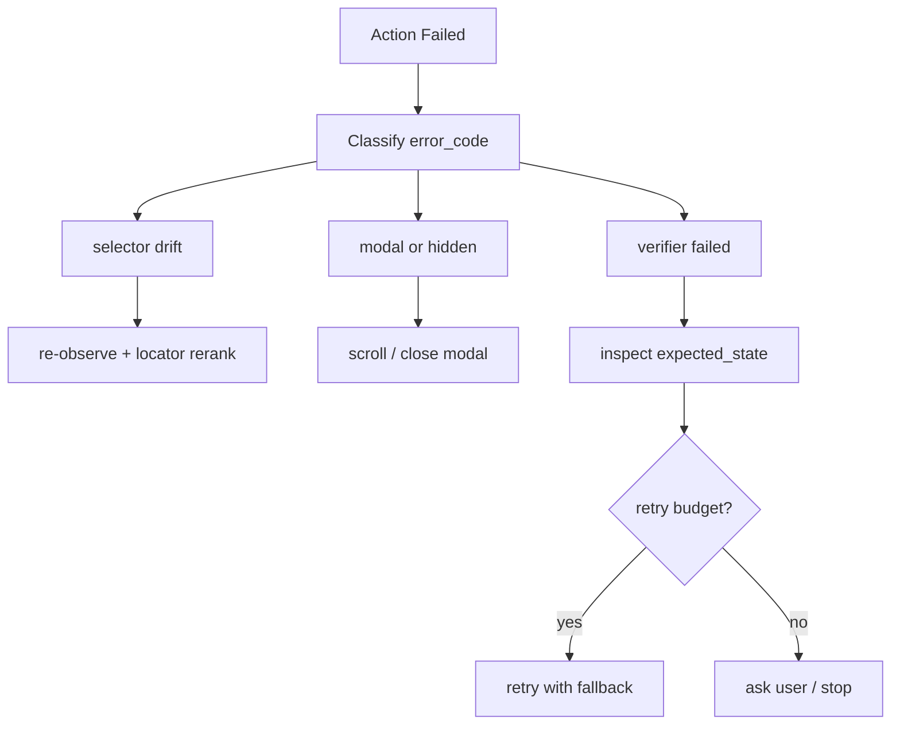

# 页面元素定位失败或点击无效时如何恢复？

## 面试定位

这是 Playwright 动作封装的故障恢复题。面试官想看你能否区分 selector drift、遮挡、disabled、导航慢和业务 verifier 失败。

## 30 秒回答

我会先分类错误。selector 找不到就重新 observe 并 rerank locator。元素隐藏或被遮挡就滚动、关闭 modal 或改用可见候选。disabled 就补齐前置输入。导航 timeout 要等待明确 expected_state。点击无效不能盲目重复，要看 after observation 和 verifier，再决定 retry、fallback、ask user 或 stop。

## 标准回答

恢复策略要基于 error_code，而不是统一重试。`selector_not_found` 说明页面结构变了。`element_hidden` 可能是滚动或遮挡问题。`element_disabled` 常说明状态未满足。`modal_blocking` 需要先处理弹窗。`verifier_failed` 说明 Playwright 动作执行了，但业务结果未达标。

这里的取舍是恢复率和安全边界。自动 recovery 能提升成功率，但重复点击、重复提交和坐标 fallback 可能带来真实副作用。高风险动作宁可转人工。

每次恢复都要有预算。重复点击可能造成重复提交。Recovery Policy 应限制 retry_count，保存 before/after screenshot，并在高风险动作前进入 human-in-the-loop。

## 架构与运行机制

数据流是 Executor 返回 error_code，Recovery Policy 读取 after observation 和 risk_level。低风险定位问题可重排 locator。高风险或多次失败转人工。所有 recovery decision 写入 action trace。

## 可画图

## 系统设计案例

Agent 点击“提交”没有反应。Trace 显示按钮 disabled。正确恢复不是继续点，而是观察表单必填项，发现手机号未填。Agent 应填写缺失字段后再次验证。若提交会发起真实付款，则必须先确认。

## 真实问题与排障

如果恢复率低，看错误码分布。selector drift 多说明 locator 过脆。modal_block_rate 高说明观察层没有识别浮层。verifier_failed 多说明 expected_state 写得不准。指标看 `recovery_success_rate`、`retry_count`、`modal_block_rate` 和 `duplicate_submit_block_count`。

## 面试官追问

- 为什么不能无限重试？浏览器动作有外部副作用，重复提交会造成事故。
- 什么时候用 screenshot？DOM 状态和用户可见状态不一致时。
- 如何降低 wrong click？语义 locator、bbox 校验、after verifier。

## 项目化回答

我会说：我的动作工具返回结构化 error_code，Recovery Policy 根据错误类型重观察、换 locator、处理遮挡或转人工。所有恢复路径都有 retry budget 和 trace。

## 常见错误

- 所有失败都简单 retry。
- 点击无效还声称成功。
- 不保存失败截图。
- 高风险动作失败后继续自动尝试。

## 深挖技术细节

Playwright 动作封装要把失败变成结构化 error，而不是直接把异常文本丢给模型。Action Result 可以包含 `action_id`、`action_type`、`locator_strategy`、`selector_candidates`、`risk_level`、`before_screenshot_ref`、`after_screenshot_ref`、`error_code`、`playwright_error`、`wait_condition`、`verifier_verdict`、`retry_count` 和 `recovery_decision`。常见 error_code 包括 `selector_not_found`、`strict_mode_violation`、`element_hidden`、`element_disabled`、`modal_blocking`、`navigation_timeout`、`verifier_failed`。

恢复策略要按错误类型分流。selector drift 触发 re-observe 和 locator rerank；hidden/遮挡触发滚动、关闭 modal 或重新选择可见候选；disabled 要找前置字段；timeout 要等明确 expected_state 而不是固定 sleep；verifier_failed 表示动作执行了但业务结果不对，不能盲目重复。高风险动作如支付、删除、提交表单失败后，应进入 human-in-the-loop 或 stop。

Verifier 是关键。Click 成功只说明浏览器执行了动作，不说明任务完成。提交后要检查 URL、toast、业务状态、表单状态或 mock server。指标包括 `recovery_success_rate`、`retry_count_p95`、`selector_failure_rate`、`modal_block_rate`、`wrong_click_rate`、`duplicate_submit_block_count`、`verifier_false_pass_rate`。

## 边界条件与反例

反例一：按钮 disabled 时重复 click，永远不会成功，还可能掩盖缺少必填字段。反例二：selector 找不到就用坐标点，viewport 改变后点到危险按钮。反例三：表单提交 timeout 后再次提交，实际第一次已经成功，导致重复订单。

边界在于：低风险阅读和导航可以自动 retry；有外部副作用的动作必须有 retry budget、幂等检查和确认。坐标 fallback 只能用于低风险或有强 verifier 的场景，并且要保存 bbox 与截图用于 replay。

## 深问准备

- 问：为什么不能无限重试？答：浏览器动作可能产生真实副作用，重复提交、删除、付款会造成事故。
- 问：什么时候用 screenshot？答：DOM 与可见状态冲突、modal 遮挡、canvas、图标按钮和 verifier 失败时。
- 问：如何降低 wrong click？答：role/name/test id 优先、bbox 校验、动作前后截图、expected_state verifier。
- 问：click 成功和业务成功区别？答：click 成功是动作层结果，业务成功必须由页面或后端状态断言证明。

## 来源与延伸阅读

- [Playwright Actionability](https://playwright.dev/docs/actionability)
- [Playwright Locators](https://playwright.dev/docs/locators)
- [Playwright Trace Viewer](https://playwright.dev/docs/trace-viewer)
