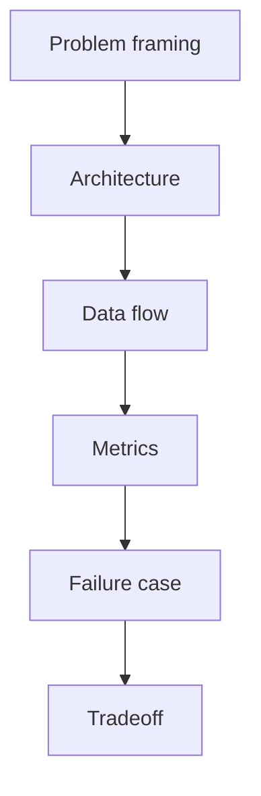

# 如何把 Agent 项目讲成有工程深度的简历项目？

## 30 秒回答

我会按“问题、架构、数据流、指标、失败、取舍”来讲。先用 STAR 做 problem framing，再画系统架构，说明 Context Builder、State、Tools、Guardrails、Eval 和 Trace。最后用成功率、引用准确率、延迟、成本和失败案例证明它不是 demo。

## 面试定位

这题考项目表达能力，但本质是工程抽象。面试官想知道你是否真的理解自己做的 Agent 系统，而不是只接了模型 API。

回答要覆盖架构、数据流、指标、取舍和追问。尤其要主动说清楚哪些能力是 supported，哪些暂时 unsupported。

## 标准回答

第一段讲问题。不要说“我做了一个 AI 项目”，要说它解决了哪个 workflow 的痛点，用户是谁，输入输出是什么，非目标是什么。

第二段讲架构。Agent 项目至少要讲入口、上下文构建、状态管理、工具调用、安全边界、评测和可观测性。讲清楚模型在系统中只是一个决策模块。

第三段讲数据流。从用户请求开始，经过检索、工具、状态更新、验证和输出。每一步最好能对应 trace。

第四段讲指标和失败案例。比如 task_success_rate、citation_precision、latency_p95、cost_per_success、unsafe_action_block_rate。失败案例要有根因和回归措施。

## 架构与运行机制

数据流讲得越清楚，追问越容易接。面试官问到任何模块，都可以回到 trace、schema、指标和失败样本。

## 可画图

可以画一张项目总览图：入口、Agent runtime、Tools、Memory/RAG、Guardrails、Eval、Trace 和 UI。旁边标出每个模块的责任和指标。

## 系统设计案例

讲 Paper Agent 时，可以说目标是降低论文调研成本。架构包括 paper parser、hybrid search、rerank、evidence board、grounded generator 和 citation verifier。

数据流是用户输入主题，系统检索论文，解析 PDF，抽取证据，生成 claim table，再输出带引用综述。指标是 citation_precision、hallucination_rate、coverage@k 和 manual_revision_rate。

## 真实问题与排障

如果面试官问失败案例，可以讲引用错误。比如系统引用了相关论文，但证据不支持结论。根因是 rerank 只看语义相似，没有看 answerability。修复是加入 claim verifier 和 hard negative。

这种回答比“优化 prompt 后好了”更可信，因为它有根因、指标和回归样本。

## 面试官追问

- 这个项目为什么不是 demo？
- 最难的工程点是什么？
- 如何评测效果？
- 上线真实用户还缺什么？
- 失败案例怎么复盘？

## 项目化回答

我会把项目讲成一个可验证系统。模型只是中间决策层，真正体现工程能力的是工具 schema、状态管理、证据链、安全策略、eval 和 trace replay。

## 常见错误

- 把项目讲成产品宣传。
- 只说模型名和框架名。
- 没有失败案例。
- 指标没有定义样本来源。
- 不敢说 unsupported 能力。

## 深挖技术细节

把 Agent 项目讲得有工程深度，核心是把“模型能力”落到系统边界。可以按六个模块讲：Context Builder 如何分层构造输入，State/Memory 如何保存任务连续性，Tool Registry 如何定义工具 schema 和权限，Guardrails 如何限制高风险动作，Eval 如何度量任务和路径，Trace 如何复盘失败。每个模块最好对应一个字段或指标，而不是停留在概念。

例如 Paper Agent 可以讲 `document_id`、`chunk_id`、`citation_id`、`claim_id`、`verifier_verdict`；Coding Agent 可以讲 `changed_files`、`patch_hunk`、`test_command`、`exit_code`、`review_risk`；Travel Agent 可以讲 `constraint_id`、`source_sentence`、`availability_source`、`hard_constraint_pass`。这些细节会让面试官相信你真的做过数据流和排障。

项目表达还要主动讲取舍和 unsupported。比如为了提高 citation precision 引入 verifier，代价是 latency 和成本；为了安全，高风险工具需要 confirm；当前版本不支持真实支付、不支持多租户权限或只做离线 eval。真实边界比“全都支持”更可信。

## 边界条件与反例

反例一：只说“用了 LangGraph + RAG + GPT”，但说不清状态 schema 和失败样本。反例二：把 UI 漂亮当作工程深度，却没有 eval、trace 和权限。反例三：指标没有样本来源，例如“准确率 95%”但不知道是 20 条手工样本还是线上流量。

边界在于：简历项目可以不是生产系统，但必须可验证。你可以说“这是离线验证版，支持 citation eval 和 trace replay，暂不支持真实外部写操作”。这种表达把能力和限制分清，反而更像工程项目。

## 深问准备

- 问：最难的工程点是什么？答：选一个链路说细，例如 claim-to-evidence、tool permission、state recovery 或 trajectory eval。
- 问：怎么证明不是 demo？答：用 golden cases、trace replay、失败分桶、指标趋势和 unsupported 清单。
- 问：如果上线还缺什么？答：权限、审计、监控、数据更新、人工审核、成本控制和真实用户反馈闭环。
- 问：项目失败怎么讲？答：讲一个可复现样本，说明 trace、根因、修复、回归和代价。

## 来源与延伸阅读

- [OpenAI Agents SDK Tracing](https://openai.github.io/openai-agents-python/tracing/)
- [LangSmith Observability](https://docs.smith.langchain.com/observability)
- [LangSmith Evaluation](https://docs.smith.langchain.com/evaluation)
