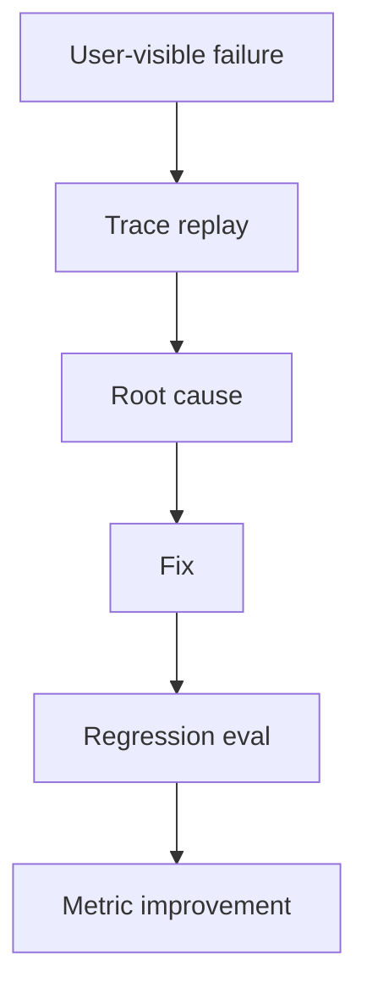

# 面试官追问项目失败案例时，如何回答才可信？

## 30 秒回答

可信的失败案例要讲清影响、根因、定位路径、修复方案和防复发。不要说“模型偶尔不稳定”。要把失败放到架构和数据流里，例如检索漏证据、rerank 选错、工具 schema 太宽、状态丢失或 guardrail 缺失，再用指标说明修复有效。

## 面试定位

这题考真实性。面试官用失败案例判断项目是不是亲手做过，也判断你有没有工程复盘能力。

回答要覆盖架构、数据流、指标、取舍和追问。越具体越可信，但不要编造不存在的线上事故。

## 标准回答

我会按五段回答。第一，用户看到什么问题。第二，系统中哪条链路失败。第三，怎么定位，包括 trace、日志、样本和指标。第四，怎么修复。第五，如何防止复发。

Agent 项目的失败可以选一个典型点：引用幻觉、工具误调用、上下文压缩丢状态、Browser Agent 点击错元素、Travel Agent 忽略营业时间。每个都能落到模块和指标。

回答时要说明取舍。比如更严格的 verifier 降低幻觉，但增加 latency。选择是否值得，要看任务风险和 SLA。

## 架构与运行机制

数据流是从现象回到 trace，再从 trace 找到模块责任。不要只停留在“模型答错了”。

## 可画图

可以画事故复盘图：现象、影响范围、失败模块、修复、回归样本、指标变化。技术面试里这张图很有说服力。

## 系统设计案例

Paper Agent 有一次生成综述时写出“方法 A 在所有数据集上优于方法 B”。trace 显示检索命中了相关论文，但 evidence span 只支持一个数据集。根因是 citation grounding 只检查链接存在，没有检查 claim-to-evidence。

修复是增加 claim extractor 和 verifier，把该样本加入 hard negative。修复后 unsupported_claim_rate 下降，citation_precision 上升。

## 真实问题与排障

如果没有线上用户，也可以讲开发期失败样本，但要诚实说明来源。比如“在离线 eval 中发现 12 个引用不支持 claim 的样本”，这比虚构线上事故更好。

指标包括 failure_reproduction_rate、root_cause_bucket、regression_pass_rate、metric_delta 和 recurrence_rate。

## 面试官追问

- 这个失败影响了哪些用户？
- 为什么测试没发现？
- 修复后如何证明有效？
- 有没有引入新的代价？
- 如果再发生，系统如何降级？

## 项目化回答

我会选择一个能体现工程深度的失败案例。讲清楚 trace 中看到什么，根因落在哪个模块，修复改了什么 contract，最后用回归样本和指标证明它没有复发。

## 常见错误

- 说“模型不稳定”就结束。
- 没有 trace 或日志证据。
- 只讲修复，不讲根因。
- 不提修复代价。
- 把没有做过的线上事故讲得过满。

## 深挖技术细节

失败案例可信的关键是能还原“证据链”。面试时不要只说“后来优化 prompt”，而要讲清 `run_id`、`step_id`、输入样本、工具调用、检索结果、模型输出、verifier verdict 和最终用户影响。比如 citation 失败可以拆成：Retriever 是否召回正确论文，Reranker 是否把正确 span 排进 top_k，Generator 是否扩大 claim，Citation Verifier 是否漏判。每个环节都要有对应 trace 字段和指标。

复盘要有分桶。常见 bucket 包括 retrieval_miss、rerank_wrong、tool_schema_ambiguous、state_lost、permission_bypass、verifier_gap、ui_misleading、data_freshness。每个 bucket 对应不同修复：召回漏证据要改索引和 query rewrite；精排选错要加 hard negative；工具误调用要收窄 schema 和权限；状态丢失要改 checkpoint 或 context budget。这样面试官继续追问时，你能把“问题”落到系统模块，而不是泛泛说模型不稳定。

修复效果也要用发布前后指标证明，例如 `unsupported_claim_rate` 从 8% 降到 2%，`regression_pass_rate` 从 72% 到 95%，`p95_latency` 增加 180ms，`cost_per_success` 增加 0.3 分。把收益和代价一起讲，反而更可信，因为真实工程很少只有正收益。

## 边界条件与反例

反例一：虚构线上事故。面试官追问影响范围、日志字段、修复 PR 和回归样本时很容易露馅。反例二：把失败归因给“LLM 幻觉”，但没有说明数据流中哪一层允许了幻觉进入最终输出。反例三：只说“加了 guardrail”，不说 guardrail 的输入、输出、误杀和延迟成本。

边界在于：没有真实线上流量也可以讲开发期或离线 eval 失败，但要明确样本来源。可以说“这是 regression set 里的失败，不是线上事故”。如果项目还没上线，要诚实说明 unsupported 的部分，例如没有真实支付工具、没有多租户权限、没有人工审核后台。诚实的边界比夸大更像工程师。

## 深问准备

- 问：为什么测试没发现？答：原测试只看最终答案，没有 claim-to-evidence 或 trajectory 检查，所以漏了路径错误。
- 问：修复有没有副作用？答：verifier 提高了引用准确率，但增加 latency 和成本，需要按风险路径启用。
- 问：如何防复发？答：失败样本进入 regression，发布门禁检查同一 bucket，不只检查同一条样本。
- 问：如何讲影响范围？答：用样本数、用户路径、失败率、SLA 或人工返工时间描述，避免夸大。

## 来源与延伸阅读

- [OpenAI Agents SDK Tracing](https://openai.github.io/openai-agents-python/tracing/)
- [LangSmith Evaluation](https://docs.smith.langchain.com/evaluation)
- [OpenTelemetry Traces](https://opentelemetry.io/docs/concepts/signals/traces/)
