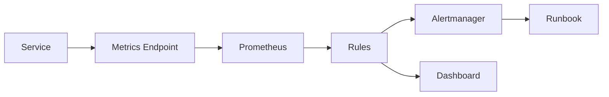

# 如何设计 Prometheus 指标、PromQL 告警和 SLO？

## 面试定位

这道题考的是可观测体系设计，不是 PromQL 语法背诵。回答要覆盖指标类型、标签基数、PromQL 窗口、SLO、告警、runbook，以及 Agent/RAG 的质量指标。

## 30 秒回答

我会先从用户影响和 SLO 出发，而不是先堆大屏。服务指标按 RED/USE 建模：请求量、错误率、延迟、资源利用率、队列和饱和度。指标类型上 Counter 用于请求数和错误数，Gauge 用于队列和内存，Histogram 用于延迟分布和分位数。

PromQL 常用 `rate()`、`increase()`、`histogram_quantile()` 和聚合窗口。标签要控制基数，不能把 `user_id`、`request_id`、`trace_id` 放进指标标签。告警要绑定 SLO 和 runbook，AI/RAG 还要看 `tool_error_rate`、`retrieval_recall@k`、`citation_precision` 和 `eval_pass_rate`。

## 架构与运行机制

图 1 展示指标数据流：服务暴露 metrics，Prometheus 抓取，rules 做聚合和告警，Dashboard 展示趋势，Alertmanager 触发 runbook。图中 runbook 是关键，否则告警只会制造噪声。

## 深挖技术细节

Counter 要用窗口函数看变化率，例如错误率通常是错误 counter 的 rate 除以请求 counter 的 rate。Gauge 可以直接表达当前状态，但瞬时值容易抖动。Histogram 的 bucket 要围绕 SLA 和真实分布设计，例如 100ms、300ms、1s、3s，而不是随便平均切。

标签基数是生产风险。`route`、`method`、`status` 可控，`user_id`、`prompt`、`trace_id` 不可控。高基数字段应该进入日志和 Trace。Recording rules 可以降低复杂查询成本，但也会让指标口径固定，所以要有命名和版本规范。

SLO 告警要区分快慢窗口。短窗口发现快速故障，长窗口避免抖动。AI/RAG 系统不能只看 HTTP 成功率，因为接口成功但引用错误也是用户失败。

## 关键数据结构与协议

| 指标 | 类型 | 用途 |
| --- | --- | --- |
| `http_requests_total` | Counter | 请求量和错误率 |
| `http_request_duration_seconds_bucket` | Histogram | 延迟分位数 |
| `queue_size` | Gauge | 积压状态 |
| `tool_error_total` | Counter | 工具失败 |
| `retrieval_recall_at_k` | Gauge | 检索质量 |
| `citation_precision` | Gauge | 引用质量 |

## 系统设计案例

设计 RAG 服务看板：服务暴露 HTTP、检索、生成、工具、成本、JVM 指标，Prometheus 采集，rules 计算 p95、错误率、SLO burn rate、recall 和 citation precision。数据流是 metrics -> rules -> dashboard/alert -> incident。

取舍是：指标越细定位越好但成本越高；质量指标更贴近用户但计算更慢；高敏感告警发现早但噪声大。面试追问通常围绕标签基数、Histogram、SLO 和 AI 指标。

## 真实问题与排障

RAG 答案质量下降时，先看影响面：哪些 workspace、哪些 query、HTTP p95、recall、citation precision、rerank latency、embedding lag 和模型错误率。止血可以回滚检索配置、切旧索引、关闭新 rerank 或降级回答。

根因定位按指标时间线：是服务慢、检索差、引用差、模型差还是数据新鲜度差。回归要把失败 query 加入 golden set。

## 边界条件与反例

反例：只看 CPU；标签放 user_id；告警没有 runbook；AI 服务只看 200 状态码。

## 项目表达

项目里可以说：我把服务 RED 指标、JVM 指标、MQ/Redis 指标和 RAG 质量指标放到同一套看板，用 SLO burn rate 触发告警，并把每次事故的失败样本进入回归。

面试收束可以补一句：指标上线也要评审，检查命名、标签基数、bucket、告警阈值和 runbook，避免监控系统本身变成新的事故源。

如果追问“一个新接口怎么从零加监控”，可以按入口、依赖、资源、业务四层回答：入口是 QPS、错误率和 p95；依赖是 DB、Redis、MQ、模型 API；资源是 JVM、线程池和连接池；业务是订单数、任务成功率或 RAG 质量。最后再说所有告警都要能跳到 runbook。

## 多轮追问模拟

1. 追问：Counter、Gauge、Histogram 怎么选？
   - 回答要点：Counter 用于单调递增事件，比如请求数、错误数、重试数，查询时用 `rate()` 或 `increase()`；Gauge 用于当前状态，比如队列长度、连接数、内存；Histogram 用于延迟和大小分布，通过 bucket 聚合后计算近似分位数。延迟不要只看平均值，p95/p99 更接近用户体验。
   - 考察点：指标类型和查询方式是否匹配。
   - 常见坑：用 Gauge 统计累计请求，或者用平均延迟替代尾延迟。

2. 追问：`histogram_quantile()` 有什么限制？
   - 回答要点：它基于 bucket 近似计算，准确性取决于 bucket 边界和样本分布；聚合时必须保留 `le` 标签，通常写成 `histogram_quantile(0.95, sum(rate(x_bucket[5m])) by (le, route))`。如果 bucket 设计没有围绕 SLA，比如只有 1s、10s、60s，p95 对 300ms 目标就没有解释力。
   - 考察点：是否知道 PromQL 语义背后的数据结构。
   - 常见坑：聚合时丢掉 `le`，或者把 Summary 的客户端分位数跨实例聚合。

3. 追问：高基数标签为什么会把监控系统拖垮？
   - 回答要点：Prometheus 按标签组合形成时间序列，`user_id`、`request_id`、`trace_id`、完整 URL、原始 prompt 会造成 series 数爆炸，带来 scrape、存储、查询和 rule evaluation 压力。高基数字段应该进入日志/Trace，指标标签保留低基数维度，比如 service、route、method、status、tenant_tier。
   - 考察点：生产指标治理能力。
   - 常见坑：为了排障方便把一切上下文字段都放进 metric label。

4. 追问：SLO 告警怎么避免又慢又吵？
   - 回答要点：要用多窗口 burn rate：短窗口发现快速故障，长窗口避免短暂抖动；告警应绑定用户影响和 runbook，不只绑定 CPU。RAG/Agent 还要补质量 SLO，例如 citation precision、retrieval recall、tool error rate、eval pass rate，否则 HTTP 200 但答案错误也不会告警。
   - 考察点：能否从机器监控走到用户体验。
   - 常见坑：告警只看单点阈值，没有 SLO、抑制、路由和处理动作。

## 深问准备

1. Counter/Gauge/Histogram 区别？
2. 高基数标签为什么危险？
3. `histogram_quantile` 有什么限制？
4. SLO 告警怎么设计？
5. RAG 应该有哪些质量指标？

## 来源与延伸阅读

- [Prometheus Metric Types](https://prometheus.io/docs/concepts/metric_types/)：用于确认 Counter、Gauge、Histogram、Summary 的语义和适用场景。
- [Prometheus Query Functions](https://prometheus.io/docs/prometheus/latest/querying/functions/)：用于支撑 `rate()`、`increase()`、`histogram_quantile()` 等 PromQL 函数的正确用法。
- [Prometheus Alerting Rules](https://prometheus.io/docs/prometheus/latest/configuration/alerting_rules/)：用于说明告警规则、表达式、标签和注释如何落到生产告警。
- [Prometheus Alerting Practices](https://prometheus.io/docs/practices/alerting/)：用于支持告警应连接用户影响、可执行动作和噪声控制的结论。
- [OpenTelemetry Metrics](https://opentelemetry.io/docs/concepts/signals/metrics/)：用于连接指标、Trace 和跨系统观测语义。
