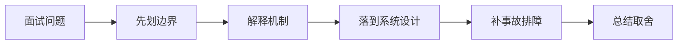

# 如果面试官深挖 Python 运行环境、虚拟环境与依赖打包 的生产落地和排障，你怎么回答？

## 面试定位

这道题关联 Python 运行环境、虚拟环境与依赖打包，难度 4/5，出现频率 high。面试官真正想看的是：你能否把概念回答升级成架构、数据流、指标、取舍和真实故障处理。
回答主轴可以从「Python 运行环境、虚拟环境与依赖打包」切入：Python AI 服务首先要保证解释器、虚拟环境、依赖版本、镜像和启动命令可复现，否则模型能力会被环境漂移拖垮。

**第一句话建议**
我会先划清边界，再解释运行机制，最后用一个系统设计案例说明数据流、失败模式、指标和取舍。

**不要只答**
- 只在本机 notebook 能跑
- 依赖不锁版本
- 镜像里混入开发 secret
- 只给定义，不讲机制、数据流、指标和生产失败模式

## 30 秒回答

先给定义和边界：Python 运行环境、虚拟环境与依赖打包 是 AI 工程生产化能力的一部分，关注 解释器版本、venv、pip、依赖锁定、包构建和镜像复现。；requirements/lockfile、Dockerfile、runtime manifest 是团队复盘、验收和面试表达的核心证据。；依赖漂移、环境不一致和供应链风险 是这个主题最容易被追问的生产风险。；Python AI 服务首先要保证解释器、虚拟环境、依赖版本、镜像和启动命令可复现，否则模型能力会被环境漂移拖垮。；解释器版本、venv、pip、依赖锁定、包构建和镜像复现 要服务生产问题。

回答时必须主动补数据流、关键字段、失败模式、指标和取舍，否则很容易停留在背概念。

## 架构与运行机制

### 标准回答骨架

- 先给定义和边界：Python 运行环境、虚拟环境与依赖打包 是 AI 工程生产化能力的一部分，关注 解释器版本、venv、pip、依赖锁定、包构建和镜像复现。；requirements/lockfile、Dockerfile、runtime manifest 是团队复盘、验收和面试表达的核心证据。；依赖漂移、环境不一致和供应链风险 是这个主题最容易被追问的生产风险。；Python AI 服务首先要保证解释器、虚拟环境、依赖版本、镜像和启动命令可复现，否则模型能力会被环境漂移拖垮。；解释器版本、venv、pip、依赖锁定、包构建和镜像复现 要服务生产问题。
- 再讲机制：生产 AI 系统要先定义可验证边界，再谈模型效果。；所有关键配置、数据、prompt、模型、工具和评测结果都要可追溯。；质量、延迟、成本、安全和用户体验要一起权衡，不能只优化单一指标。；失败样本要进入回归集，避免同类问题重复发生。；Python 运行环境、虚拟环境与依赖打包 的面试重点是把 解释器版本、venv、pip、依赖锁定、包构建和镜像复现 拆成输入、处理、状态、输出、指标和失败路径。。
- 工程落地要说清楚：Versioned artifact registry。；Trace and eval pipeline。；Canary release with rollback。；Human review for high-risk cases。；关键字段至少包含 id、version、owner、tenant、input_hash、output_hash、status、error_code、trace_id 和 created_at。；指标看 build_success_rate、dependency_vulnerability_count、image_size、cold_start_time、runtime_drift_count，并按场景、租户、模型版本和发布版本分桶。。
- 最后补指标、失败模式和取舍：build_success_rate；dependency_vulnerability_count；image_size；cold_start_time；runtime_drift_count；只在本机 notebook 能跑；依赖不锁版本；镜像里混入开发 secret。
- Python AI 服务首先要保证解释器、虚拟环境、依赖版本、镜像和启动命令可复现，否则模型能力会被环境漂移拖垮。
- Python 运行环境、虚拟环境与依赖打包 是 AI 工程生产化能力的一部分，关注 解释器版本、venv、pip、依赖锁定、包构建和镜像复现。
- requirements/lockfile、Dockerfile、runtime manifest 是团队复盘、验收和面试表达的核心证据。
- 依赖漂移、环境不一致和供应链风险 是这个主题最容易被追问的生产风险。
- 生产 AI 系统要先定义可验证边界，再谈模型效果。
- 所有关键配置、数据、prompt、模型、工具和评测结果都要可追溯。
- 质量、延迟、成本、安全和用户体验要一起权衡，不能只优化单一指标。
- 失败样本要进入回归集，避免同类问题重复发生。
- Python 运行环境、虚拟环境与依赖打包 的面试重点是把 解释器版本、venv、pip、依赖锁定、包构建和镜像复现 拆成输入、处理、状态、输出、指标和失败路径。
- 生产落地时要保留 requirements/lockfile、Dockerfile、runtime manifest，并能解释它如何支持排障、回归和团队协作。
- 把核心对象、状态变化、执行顺序和异常路径讲出来，避免只说结论。

### 数据流怎么讲

可以按 Python 运行环境、依赖锁定、FastAPI 入口、Pydantic schema、异步 HTTP client、模型 SDK、结构化输出、后台任务、测试夹具、配置密钥、OpenTelemetry 和限流成本治理来讲。数据流通常是请求进入 API 后完成鉴权和 schema 校验，再调用模型网关或 provider SDK，流式或结构化返回经过 verifier、trace、quota 和错误映射后交给调用方。

### 落地实现细节

- Versioned artifact registry。
- Trace and eval pipeline。
- Canary release with rollback。
- Human review for high-risk cases。
- 关键字段至少包含 id、version、owner、tenant、input_hash、output_hash、status、error_code、trace_id 和 created_at。
- 指标看 build_success_rate、dependency_vulnerability_count、image_size、cold_start_time、runtime_drift_count，并按场景、租户、模型版本和发布版本分桶。
- 排障时先定位 requirements/lockfile、Dockerfile、runtime manifest 的版本，再回放 trace、对比 eval、检查最近数据或配置变更。
- 设计时先定义 owner、version、tenant scope、timeout、retry、fallback 和 audit 字段。
- 上线前用 golden cases、trace replay、灰度和 rollback plan 验证 依赖漂移、环境不一致和供应链风险 不会扩散成生产事故。
- 先定义目标、输入、输出、风险和成功指标，再选模型、工具或框架。
- 把 prompt、model、config、data、eval、trace 和 release 都版本化。
- 上线前准备 golden cases、回归门禁、成本预算、降级策略和人工接管路径。
- 关键接口要有 schema、version、timeout、retry、幂等键和审计字段。
- 关键状态要能恢复，关键动作要能回放，关键结果要有验证器或指标证明。

## 可画图

图 1：这类题不要直接背结论，先划清边界，再沿机制、设计、事故和取舍回答。

## 系统设计案例

### 面试可展开的系统设计

典型设计题是把一个 RAG、Agent tool、评测服务或 Java 主系统旁路的 Python AI 服务做成生产 API。架构上要包含 venv/lockfile、FastAPI 生命周期、timeout/retry、streaming、JSON Schema、pytest fixture、trace_id、secret 管理、rate limit、cost budget 和跨语言契约。

**答题时建议画出的模块**
- 运行环境层：使用 venv/uv/poetry、lockfile、Python 版本和 Docker 镜像固定依赖边界。
- API 契约层：FastAPI 路由、Pydantic schema、OpenAPI、错误码和 streaming response 固定调用契约。
- 模型调用层：httpx/provider SDK 管理 timeout、retry、rate limit、streaming、structured output 和 fallback。
- 后台执行层：异步任务、队列、取消、幂等、状态机和 Java/Spring 主系统回调管理长任务。
- 质量与观测层：pytest fixture、mock provider、OpenTelemetry trace、日志脱敏、成本指标和 quota 证明可运行。

**数据流**
- 请求进入 FastAPI 后生成 request_id，完成鉴权、租户、输入 schema 和业务参数校验。
- 服务层选择同步调用、streaming、后台任务或队列，并组装 provider SDK 请求和结构化输出 schema。
- 模型响应经过 Pydantic/JSON Schema 校验、错误映射、成本统计和 trace 记录后返回调用方。
- 失败样本进入 pytest fixture 或 eval 数据集，依赖、prompt、模型和配置版本一起纳入回归。

## 真实问题与排障

真实线上问题一般从依赖版本漂移、启动失败、请求超时、stream 中断、schema validation error、provider 429/5xx、pytest flaky、后台任务取消、trace 缺失、secret 泄漏和成本异常看起。回答时要先确认影响面，再沿运行环境、API 契约、模型调用、异步任务、观测和限额逐层定位。

**现场排障回答法**
- 先确认是启动、依赖、API 契约、provider、异步任务、配置密钥、观测还是成本异常。
- 检查 Python 版本、lockfile、环境变量、镜像 digest、SDK 版本和最近发布。
- 检查 request trace、httpx timeout、retry、429/5xx、stream chunk、schema validation error 和日志脱敏。
- 对 flaky 测试使用 mock provider、recorded fixture、固定 seed 和超时预算复现。
- 止血可以降级模型、关闭 streaming、降低并发、切换 fallback、暂停后台任务或回滚配置。

**重点指标**
- build_success_rate
- dependency_vulnerability_count
- image_size
- cold_start_time
- runtime_drift_count

## 多轮追问模拟

### 追问 1：Python 运行环境、虚拟环境与依赖打包 的核心机制是什么？

**回答要点**：我会先划清边界：Python 运行环境、虚拟环境与依赖打包 是 AI 工程生产化能力的一部分，关注 解释器版本、venv、pip、依赖锁定、包构建和镜像复现。；requirements/lockfile、Dockerfile、runtime manifest 是团队复盘、验收和面试表达的核心证据。；依赖漂移、环境不一致和供应链风险 是这个主题最容易被追问的生产风险。；Python AI 服务首先要保证解释器、虚拟环境、依赖版本、镜像和启动命令可复现，否则模型能力会被环境漂移拖垮。。然后再解释机制、生产约束和指标，避免只背名词。

**考察点**：边界、机制

### 追问 2：如果把这个点落到真实项目，你会怎么设计？

**回答要点**：我会按输入、配置、运行、失败处理和观测展开：关键字段至少包含 id、version、owner、tenant、input_hash、output_hash、status、error_code、trace_id 和 created_at。；指标看 build_success_rate、dependency_vulnerability_count、image_size、cold_start_time、runtime_drift_count，并按场景、租户、模型版本和发布版本分桶。；排障时先定位 requirements/lockfile、Dockerfile、runtime manifest 的版本，再回放 trace、对比 eval、检查最近数据或配置变更。；设计时先定义 owner、version、tenant scope、timeout、retry、fallback 和 audit 字段。；上线前用 golden cases、trace replay、灰度和 rollback plan 验证 依赖漂移、环境不一致和供应链风险 不会扩散成生产事故。。项目表达里要说明数据流、配置来源、回滚方式和指标。

**考察点**：项目设计、数据流

### 追问 3：线上出问题时先看什么？

**回答要点**：先确认影响面和最近变更，再看关键指标：build_success_rate；dependency_vulnerability_count；image_size；cold_start_time；runtime_drift_count。排查时按入口、运行态、依赖、配置、资源和发布逐层收敛。

**考察点**：排障、指标

### 延伸追问 1：Python 运行环境、虚拟环境与依赖打包 的核心机制是什么？

回答时继续沿着边界、架构、数据流、指标、失败模式和取舍展开。可以落到这些项目证据：把回答落到 pe-coding-agent 的工程链路里。；用配置、数据流、指标、失败案例和回滚动作证明不是只会背概念。；补一个错误做法和一次改进动作，可信度会明显更高。

### 延伸追问 2：如果成本、稳定性和安全冲突，你怎么取舍？

回答时继续沿着边界、架构、数据流、指标、失败模式和取舍展开。可以落到这些项目证据：把回答落到 pe-coding-agent 的工程链路里。；用配置、数据流、指标、失败案例和回滚动作证明不是只会背概念。；补一个错误做法和一次改进动作，可信度会明显更高。

### 延伸追问 3：如何把这个知识点讲成项目经验？

回答时继续沿着边界、架构、数据流、指标、失败模式和取舍展开。可以落到这些项目证据：把回答落到 pe-coding-agent 的工程链路里。；用配置、数据流、指标、失败案例和回滚动作证明不是只会背概念。；补一个错误做法和一次改进动作，可信度会明显更高。

## 项目化回答与取舍

**项目证据怎么挂钩**
- 把回答落到 pe-coding-agent 的工程链路里。
- 用配置、数据流、指标、失败案例和回滚动作证明不是只会背概念。
- 补一个错误做法和一次改进动作，可信度会明显更高。

**取舍总结**
Python AI 服务的取舍是 AI 生态丰富、迭代快、SDK 便利，换来了依赖治理、异步语义、运行时性能、类型边界和生产运维成本。面试追问通常会围绕 FastAPI async、Pydantic 校验、httpx timeout、OpenAI/Anthropic SDK、结构化输出、pytest fixture、OpenTelemetry、配置密钥和 Java/Spring 集成展开。

**收尾句**
这类问题最后要回到可验证结果：设计上有什么边界，线上看什么指标，失败后怎么恢复，哪些场景不该用这个方案。这样回答才经得起连续追问。

## 深挖技术细节

- Versioned artifact registry。
- Trace and eval pipeline。
- Canary release with rollback。
- Human review for high-risk cases。
- 关键字段至少包含 id、version、owner、tenant、input_hash、output_hash、status、error_code、trace_id 和 created_at。
- 指标看 build_success_rate、dependency_vulnerability_count、image_size、cold_start_time、runtime_drift_count，并按场景、租户、模型版本和发布版本分桶。
- 排障时先定位 requirements/lockfile、Dockerfile、runtime manifest 的版本，再回放 trace、对比 eval、检查最近数据或配置变更。
- 设计时先定义 owner、version、tenant scope、timeout、retry、fallback 和 audit 字段。
- 上线前用 golden cases、trace replay、灰度和 rollback plan 验证 依赖漂移、环境不一致和供应链风险 不会扩散成生产事故。
- 先定义目标、输入、输出、风险和成功指标，再选模型、工具或框架。
- 把 prompt、model、config、data、eval、trace 和 release 都版本化。
- 上线前准备 golden cases、回归门禁、成本预算、降级策略和人工接管路径。
- Python AI 服务首先要保证解释器、虚拟环境、依赖版本、镜像和启动命令可复现，否则模型能力会被环境漂移拖垮。
- Python 运行环境、虚拟环境与依赖打包 是 AI 工程生产化能力的一部分，关注 解释器版本、venv、pip、依赖锁定、包构建和镜像复现。
- requirements/lockfile、Dockerfile、runtime manifest 是团队复盘、验收和面试表达的核心证据。
- 依赖漂移、环境不一致和供应链风险 是这个主题最容易被追问的生产风险。
- 生产 AI 系统要先定义可验证边界，再谈模型效果。
- 所有关键配置、数据、prompt、模型、工具和评测结果都要可追溯。
- 质量、延迟、成本、安全和用户体验要一起权衡，不能只优化单一指标。
- 失败样本要进入回归集，避免同类问题重复发生。
- Python 运行环境、虚拟环境与依赖打包 的面试重点是把 解释器版本、venv、pip、依赖锁定、包构建和镜像复现 拆成输入、处理、状态、输出、指标和失败路径。
- 生产落地时要保留 requirements/lockfile、Dockerfile、runtime manifest，并能解释它如何支持排障、回归和团队协作。
- 面试深挖时要把 Python 的快迭代优势讲成生产 API 能力：依赖可复现、契约可校验、异步可取消、模型调用可观测、成本可治理。
- 关键链路要说明同步路径、异步路径、失败路径和补偿路径。

## 边界条件与反例

反例一：如果业务需要强事务一致性，不能只靠缓存、搜索索引或异步读模型承载最终正确性。

反例二：如果没有指标、trace 和回归样例，方案在线上出问题时只能靠猜，不能证明稳定性。

反例三：为了追求低延迟而省略权限、幂等、超时或降级，会把局部性能优化变成系统性风险。

## 深问准备

被追问时优先沿四条线展开：为什么需要这个方案、关键数据结构是什么、失败后如何止血和定位、最终用什么指标证明修复有效。

- 准备一个线上事故：影响面、止血、根因、修复、回归。
- 准备一个系统设计：入口、状态、执行、存储、观测。
- 准备一个取舍：一致性、延迟、吞吐、成本和可维护性。

## 来源与延伸阅读

- [Python Documentation: venv](https://docs.python.org/3/library/venv.html)：用于确认官方语义边界、命令行为和工程约束。
- [Python Packaging User Guide](https://packaging.python.org/)：用于确认官方语义边界、命令行为和工程约束。
