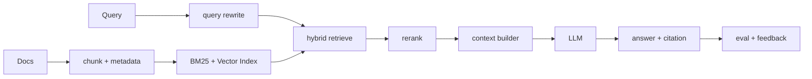

# 请讲一下 RAG 的完整流程。

## 面试定位

这题不能答成“向量库检索后塞进 prompt”。要讲完整架构、数据流、指标、取舍和追问，尤其要说明 RAG 的核心是证据链路和可评测性。

## 30 秒回答

RAG 的完整流程是：文档 ingest、解析、chunk、metadata、embedding、索引；用户 query 经过 rewrite 后做 hybrid retrieve；候选证据 rerank；Context Builder 选择 evidence；模型基于 evidence 生成答案和 citation；最后用 eval 检查检索、引用和答案质量。

所以 RAG 不是向量库，而是一条从知识入库到证据引用的工程链路。

## 标准回答

先讲离线链路。文档要解析、清洗、去重、切分 chunk，并保存 source、title、section、version、permission、timestamp 和 hash。文本字段可以进 BM25，语义向量进 vector index。

再讲在线链路。用户问题先做 query rewrite，得到 keyword query、semantic query 和 metadata filters。Retriever 做 BM25 + vector + filter 的 hybrid retrieve。Reranker 判断候选 evidence 是否真的能支撑答案。Generator 只能基于 selected evidence 生成，并输出 citation。

最后讲评测。检索看 `retrieval_recall@k` 和 MRR，引用看 `citation_precision`，生成看 faithfulness 和 answer relevance，线上还要看权限泄漏、延迟和成本。

## 架构与运行机制

RAG 的数据流要拆成 retrieval 和 generation。检索失败时，模型再强也没有证据。证据进了上下文但答案仍错，才主要看生成、prompt、引用策略和 verifier。

## 可画图

图 1 里最重要的是把 retrieval、rerank、context builder、generation 和 eval 分开讲。面试时沿图说明：检索失败要修 chunk、metadata 和 retriever；证据被召回但没进上下文要修 rerank 和 context budget；证据进了上下文仍答错才重点看 prompt、generator 和 verifier。

## 系统设计案例

企业知识库 RAG 要先做权限过滤。员工只能检索自己有权限的文档。每个 chunk 带 permission scope。Retriever 在召回前或召回中应用 filter，不能最后把答案文本过滤一下。

## 真实问题与排障

如果用户说答案错了，我会先查 trace：query rewrite 是什么，topK 候选有哪些，正确 evidence 是否进入候选，rerank 是否丢掉，selected evidence 是否支持 claim，最终答案是否引用错。

指标包括 `retrieval_recall@k`、`citation_precision`、`faithfulness`、`answer_relevance`、`stale_doc_rate`、`permission_leak_count` 和 `p95_latency`。

## 面试官追问

### 第一轮追问：hybrid search 在哪一层解决问题？

BM25 负责精确词、编号、错误码和术语匹配，向量召回负责语义相近表达，metadata filter 负责权限、租户、时间和业务范围。三者组合是为了让召回既能覆盖自然语言问题，也不丢失精确约束。

### 第二轮追问：chunk 设计如何影响证据链？

先按标题、章节、语义边界和表格边界切分，再补 parent-child chunk 或 sliding window。核心不是把块切得越小越好，而是让召回块可定位、上下文块可解释、引用能回到原文。

### 第三轮追问：引用质量怎么验证？

不能只检查答案里有没有链接，要做 claim-to-evidence 校验：每个关键 claim 是否被引用证据支持，引用页码和 chunk id 是否能回到原文，unsupported claim 是否进入失败样本集。

## 多轮追问模拟

### 追问 1：为什么要 hybrid search？

BM25 擅长精确词、编号和错误码，向量擅长语义相似，metadata filter 处理权限和业务约束。

### 追问 2：chunk 怎么设计？

按标题、章节和语义边界切分。可以用父子 chunk，小 chunk 召回，父 chunk 补上下文。

### 追问 3：引用如何评测？

看 claim 是否真的被 cited evidence 支持，而不是只检查链接存在。

### 追问 4：如果答案错了，你先修检索还是修 prompt？

先看 trace，不直接猜。正确 evidence 没进 topK，优先修 ingest、chunk、metadata、hybrid search 或 embedding；正确 evidence 进了 topK 但 rerank 丢掉，修 reranker 和特征；证据进入 context 但答案仍错，才重点看 prompt、context budget、generator 和 verifier。这样能把问题定位到组件，而不是把所有错误都归因给模型。

### 追问 5：企业知识库 RAG 如何避免权限泄漏？

权限过滤要发生在召回前或召回中，chunk 必须带 `permission_scope`、tenant、doc_version 和 source。不能把无权限 chunk 放进上下文后再过滤答案，因为模型可能已经利用了证据。线上要监控 `permission_filter_hit_count`、`permission_leak_count` 和无权限访问审计，并把越权样本加入回归集。

## 项目化回答

Paper Agent 可以用 page、section 和 chunk id 做 citation。后端经验可以迁移到数据同步、索引版本、权限过滤、缓存、告警和回归测试。

## 常见错误

- 把 RAG 说成向量库。
- 不做权限过滤。
- 引用存在但不支持结论。
- 只看最终答案，不看检索指标。

## 深挖技术细节

RAG 的核心是 evidence pipeline。离线侧要把文档解析成可追踪的 chunk，每个 chunk 至少带 `doc_id`、`chunk_id`、`source_uri`、`title_path`、`section`、`page`、`version`、`updated_at`、`permission_scope`、`content_hash` 和 `embedding_version`。这些字段决定了后续能不能做权限过滤、增量更新、引用定位和 stale doc 排查。

在线侧要保存完整 trace：原始 query、rewrite query、metadata filters、BM25 candidates、vector candidates、merged topK、rerank score、selected evidence、context budget、answer claims 和 citations。检索失败和生成失败的修复方向完全不同，所以不能只记录最终答案。`retrieval_recall@k`、MRR、`citation_precision`、faithfulness、`permission_leak_count` 和 `p95_latency` 要分层监控。

## 边界条件与反例

向量召回不是万能。错误码、订单号、API 名称、字段名和版本号通常更适合 BM25 或 keyword filter；语义问题适合 vector；权限、时间、产品线适合 metadata filter。只用向量库会让精确实体被相似语义淹没，也会让权限过滤变得危险。

另一个反例是“最后再过滤权限”。如果没有权限的 chunk 已进入上下文，模型可能已经利用了它的信息，即使最终答案不展示原文也可能泄漏。企业 RAG 应该在召回前或召回中做 permission filter，并在 trace 中记录 filter 命中情况。

## 深问准备

被问“chunk 怎么切”时，可以回答按结构优先：标题、章节、段落、表格和代码块要保留语义边界。小 chunk 适合召回，大 chunk 适合生成上下文，所以常用 parent-child chunk：用小块检索，用父级段落补上下文。chunk 过小会丢失定义和条件，过大会降低召回精度并浪费 context budget。

被问“如何评价引用”时，要强调 claim-to-evidence，而不是链接存在。每个结论都要能被 cited evidence 支持；如果证据只相关但不能支撑，就算 citation precision 失败。高质量系统会把 unsupported claim 加入回归集，分别测试 retrieval、rerank 和 generation。

## 来源与延伸阅读

- [OpenAI: A practical guide to building agents](https://cdn.openai.com/business-guides-and-resources/a-practical-guide-to-building-agents.pdf)：用于支持 Agent/RAG 系统里的 evidence、tools、eval 与 guardrails 组合思路。
- [Elastic Search API](https://www.elastic.co/guide/en/elasticsearch/reference/current/search-search.html)：用于说明 keyword/BM25 查询、filter 与向量检索组合时的搜索 API 边界。
