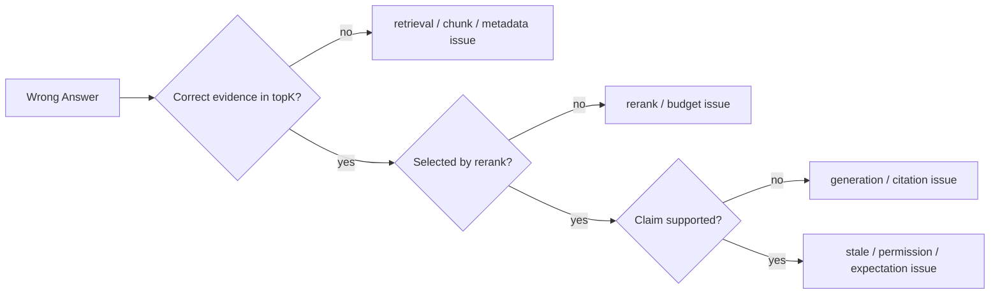

# 如果 RAG 答案错了，你如何区分检索问题和生成问题？

## 面试定位

这是一道排障题。面试官想看你能否沿数据流定位，并说明检索、重排、生成之间的工程取舍，而不是一看到错答案就调 prompt 或换模型。

## 30 秒回答

我会先看正确证据有没有进入候选集。如果没有进入 topK，优先是 ingest、chunk、metadata、query rewrite 或 retriever 问题。如果正确证据进了候选但没进上下文，是 rerank 或 context budget 问题。如果证据进了上下文但答案仍错，才重点看 generator、prompt、citation policy 和 verifier。

一句话：先证明有没有证据，再判断有没有正确使用证据。

## 标准回答

第一步看 trace。查原始 query、rewrite 后的 query、filters、topK candidates、scores、rerank result、selected evidence、answer citations 和 final verdict。

第二步分层归因。召回不到正确证据，是检索链路问题。召回到了但 rerank 丢掉，是证据筛选问题。证据进上下文但回答不忠实，是生成或引用问题。证据过期或无权限，是数据治理问题。

第三步沉淀回归。把失败 query 加入 golden set，分别测 retrieval recall、rerank quality、citation precision 和 answer faithfulness。

## 架构与运行机制

RAG 排障的数据流是从 query 反向追 evidence。不要只看最终答案。每一层都要有可观测输出，否则无法判断错误发生在哪。

## 可画图

## 系统设计案例

Paper Agent 回答论文结论时，如果引用错页码，先看正确段落是否在 candidates。如果没有，检查 PDF 解析和 chunk。如果在 candidates 但没进 selected evidence，检查 reranker。如果 selected evidence 正确但答案张冠李戴，检查生成约束和 claim-to-evidence verifier。

## 真实问题与排障

常见问题有：chunk 太小导致上下文断裂，metadata 缺 page 或 permission，query rewrite 丢掉关键实体，向量召回忽略错误码，rerank 偏向语义相似但不支持答案，generator 自行补充无证据结论。

关键指标是 `retrieval_recall@k`、MRR、`citation_precision`、faithfulness、unsupported_claim_rate 和 stale_doc_rate。

## 面试官追问

### 追问 1：如果 topK 没有正确证据怎么办？

看 ingest、chunk、embedding、BM25、metadata filter 和 query rewrite。必要时加入 hybrid search。

### 追问 2：如果证据有但模型不用怎么办？

限制生成必须引用 evidence id，增加 claim-to-evidence verifier，并减少无关上下文。

### 追问 3：如何防止同类错误复发？

把失败样本进入 golden set，分层跑 retrieval、rerank、generation 和 citation eval。

## 项目化回答

我会在 RAG trace 中保存 query、filters、候选 evidence、rerank reason、selected evidence 和 claims。这样项目答辩时能展示一次失败如何从 trace 定位到 chunk 或 generator。

## 常见错误

- 错了就调 prompt。
- 不保存候选证据。
- 只看最终答案准确率。
- 引用链接存在就认为 citation 正确。

## 深挖技术细节

RAG 错误归因要按 evidence lifecycle 做。第一层是 ingest：文档有没有解析完整，表格、页码、标题层级、权限和版本是否正确。第二层是 retrieve：rewrite 是否保留关键实体，BM25/vector/filter 的候选是否覆盖正确证据。第三层是 rerank/context：正确证据是否被预算挤出。第四层是 generation：claim 是否被 selected evidence 支撑。

排障 trace 最好保存 `raw_query`、`rewritten_queries`、`filters`、`candidate_ids`、`candidate_scores`、`rerank_reasons`、`selected_evidence_ids`、`context_tokens`、`answer_claims`、`citation_ids` 和 `verifier_verdict`。这样一次错答可以被打标签为 `missing_ingest`、`retrieval_miss`、`rerank_drop`、`context_truncation`、`unsupported_generation`、`stale_evidence` 或 `permission_policy_error`。

## 边界条件与反例

如果正确证据没有进 topK，调 prompt 通常没用；应该检查 chunk、索引、embedding version、metadata filter 和 query rewrite。如果正确证据进了 topK 但没进上下文，换更强模型也未必有用；应该调 reranker、context budget 和去重策略。如果证据进了上下文但答案仍错，才重点约束生成和引用。

还有一种反例是用户预期和文档事实冲突。系统回答“无相关规定”可能被用户认为错，但 trace 显示正确证据确实不存在。这时应返回可解释的 empty state，说明检索范围、文档版本和缺口，而不是让模型补一个听起来合理的答案。

## 深问准备

如果追问“如何防止复发”，我会把失败样本拆成四套回归：retrieval eval 测正确 evidence 是否进入 topK，rerank eval 测是否进入 selected evidence，citation eval 测 claim 是否被引用支撑，answer eval 测最终可读性和完整性。每次修复都要确认是哪个层级指标改善。

如果追问“线上如何告警”，不只看用户点踩。可以看 `retrieval_zero_hit_rate`、`topK_low_score_rate`、`citation_missing_rate`、`unsupported_claim_rate`、`stale_doc_rate`、`permission_denial_spike` 和 `latency_p95`。这些指标能在大规模错答前提前暴露数据或检索链路问题。

## 来源与延伸阅读

- [Elastic Search API](https://www.elastic.co/guide/en/elasticsearch/reference/current/search-search.html)
- [OpenAI A practical guide to building agents](https://cdn.openai.com/business-guides-and-resources/a-practical-guide-to-building-agents.pdf)
