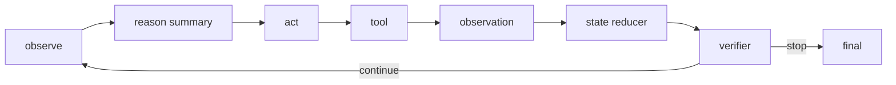

# 请解释 ReAct 框架如何把思维链和行动结合起来。

## 面试定位

这题不要暴露或复述完整 chain-of-thought。应该讲 reason summary、action、observation、state 和 verifier 的工程闭环。

## 30 秒回答

ReAct 把 reason 和 act 交替组织。模型先根据目标和上下文形成下一步行动摘要，然后调用工具。工具返回 observation 后，系统更新 State，再让模型决定继续、重试、停止或最终回答。

生产实现通常保存 decision summary 和 trace，不把完整隐式思考输出给用户。

## 标准回答

ReAct 的价值是让模型不只靠内部知识，而是通过外部工具获得反馈。比如先搜索资料，再根据结果决定是否继续检索。工具结果是外部事实，应该写入 State 和 Trace。

工程上，action 要结构化，可以是 tool_call、ask_user、revise_plan 或 final_answer。每一步要有 stop policy，避免无限循环。

## 架构与运行机制

图 1：ReAct 的核心闭环。数据流从 Observe 读取当前目标和状态开始，Reason 只产出可审计的决策摘要，Act 选择受控动作，Tool 返回 observation，State Reducer 把 observation 写成状态变化，Verifier 决定继续、停止或转人工。图中最关键的边界是 observation：没有真实外部反馈，ReAct 只是模型在错误假设上继续自我对话。

关键取舍是循环灵活性和可控性。让模型自由选择下一步更灵活，但必须用指标和 stop policy 限制成本、重复动作和工具误用。

## 可画图

画 observe、reason、act、observation、verify 的循环，再补充 max steps、timeout 和 error recovery。

## 系统设计案例

Paper Agent 回答问题时，先观察问题，检索论文段落，再根据证据判断是否需要补充检索，最后生成带 citation 的答案。

## 真实问题与排障

Loop 失败常见原因是空 observation、工具错误被吞、stop condition 缺失、模型重复选择同一动作。排查看 `avg_steps`、`loop_timeout_rate`、`tool_error_rate`、`repeat_action_rate` 和 `verifier_reject_rate`。

完整事故链路可以这样讲：影响面先按 `task_type`、`tool_name`、`model_version` 和 `state_version` 分组，判断是全局循环失控还是某个工具返回格式变更；止血时降低 `max_steps`、关闭高风险工具、把写操作切到人工确认或直接回退到固定 workflow；根因通常落在 observation 为空、state reducer 没写入新事实、工具错误没有结构化、verifier 只看自然语言结论或 stop policy 缺少重复动作检测；回归时用固定 trace replay，检查同一任务的步骤数、工具错误、最终答案和 stop reason。

## 面试官追问

### 追问 1：ReAct 和普通 CoT 区别？

ReAct 有外部行动和 observation，CoT 更偏内部推理组织。

### 追问 2：生产环境如何呈现推理过程？

生产中输出可审计摘要和依据即可，完整隐式推理不适合直接暴露。

## 多轮追问模拟

### 追问 1：ReAct 和 workflow 怎么取舍？

回答要点：路径固定、风险低、步骤明确的任务优先 workflow；需要根据 observation 动态选择下一步的开放任务才适合 ReAct。考察点是控制流和成本意识。容易踩坑的是把所有 Agent 都写成自由循环，结果成本、权限和可复现性都失控。

### 追问 2：为什么不输出完整思维链？

回答要点：生产系统应该输出决策摘要、证据、工具结果和 trace，而不是暴露完整隐式推理；这既保护推理过程，也让审计聚焦可验证事实。考察点是模型产品安全边界。容易踩坑的是把 ReAct 论文里的 prompt 展示格式照搬成用户可见内容。

### 追问 3：observation 如何进入下一轮？

回答要点：工具返回先进入 event log，再由 reducer 生成 state diff；下一轮 Context Builder 只投影必要 observation、错误状态和约束。考察点是状态管理。容易踩坑的是把工具结果只追加到聊天文本里，导致去重、恢复、回放和权限过滤都做不了。

## 项目化回答

Coding Agent 的 read、patch、test 是典型 ReAct。Web Agent 的 observe、click、observe 也是典型闭环。

## 常见错误

- 把 ReAct 当成输出思维链。
- 没有 stop policy。
- 工具结果不写 State。
- 失败后让模型凭空继续。

## 深挖技术细节

ReAct 的生产实现应保存 reason summary，而不是暴露完整隐式思维链。每轮可以结构化为 `step_id`、`state_version`、`decision_summary`、`action_type`、`tool_call`、`observation_ref`、`verifier_verdict`、`next_state_diff`、`stop_reason`。Action 不是自由文本，而是 tool_call、ask_user、revise_plan、final_answer 等受控类型。

Observation 是闭环的事实来源。工具返回必须进入 Event Log，再由 State Reducer 写入 State；Context Builder 下一轮只投影必要 observation。没有 observation 的循环只是自我对话，容易在错误假设上越走越远。Stop Policy 需要 max steps、timeout、cost budget、重复动作检测、verifier pass、human handoff 等条件。

排障看 loop trace。重复调用同一工具通常是 stop condition 或 state update 缺失；工具错误被吞说明 structured error 不完整；最终答错但工具结果正确，可能是 Context Builder 或 generator 问题。指标包括 `avg_steps`、`tool_error_rate`、`verifier_reject_rate`、`repeat_action_rate`、`loop_timeout_rate` 和 `cost_per_success`。

## 边界条件与反例

反例一：把 ReAct 写成“Thought: ... Action: ...”并把完整思维链展示给用户，这既不必要也不利于生产审计。反例二：工具失败后模型直接猜下一步。反例三：没有 max steps，搜索和观察循环无限跑。

边界在于：ReAct 适合需要工具反馈的开放任务；固定流程、低风险、路径确定的任务更适合 workflow。外部副作用动作仍要由权限层控制，不能因为 ReAct loop 灵活就让模型自动执行。

## 深问准备

- 问：ReAct 和 CoT 区别？答：ReAct 有外部 action 和 observation，CoT 主要是内部推理组织。
- 问：为什么不输出完整思维链？答：生产中输出决策摘要、依据和 trace 即可，完整隐式推理不作为用户产物。
- 问：observation 如何进入下一轮？答：写 event log，经 reducer 成为 state diff，再由 Context Builder 投影。
- 问：如何防无限循环？答：max steps、重复动作检测、预算、stop reason 和 verifier。

## 公开阅读校验

这篇文章要帮读者把 ReAct 从论文格式翻译成工程闭环。生产系统不需要把完整 thought 暴露给用户，真正要保存的是可审计的 decision summary、受控 action、工具 observation、state diff、verifier verdict 和 stop reason。这样既能复盘每一步，也能避免把不可验证的内部推理当成产品输出。

ReAct 的成败关键是 observation 质量。工具返回为空、格式变更、错误被吞掉、权限被拒绝却没有结构化 error，都会让下一轮决策建立在坏状态上。成熟实现要让 observation 先进入 event log，再经 reducer 变成 state diff；下一轮 Context Builder 只投影必要事实和错误状态，而不是把所有工具输出塞回聊天历史。

公开评审时，可以看四个风险指标：重复动作率是否高，平均 step 是否持续膨胀，tool error 是否被正确分类，stop reason 是否可解释。只要这些指标缺失，ReAct loop 就可能从“灵活探索”退化成“昂贵循环”。读者也要记住：固定流程和高风险副作用不适合自由 ReAct，应该回到 workflow 和权限网关。

## 来源与延伸阅读

- [ReAct: Synergizing Reasoning and Acting in Language Models](https://arxiv.org/abs/2210.03629)：用于说明 reason/action/observation 交替的原始方法和适用场景。
- [Anthropic Building effective agents](https://www.anthropic.com/engineering/building-effective-agents)：用于支持 workflow 与 agent 的取舍，以及生产中用可控模式约束循环。
