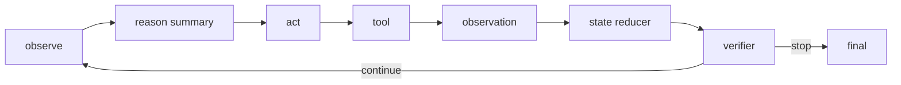

# 请解释 ReAct 框架如何把思维链和行动结合起来。

## 面试定位

这题不要暴露或复述完整 chain-of-thought。应该讲 reason summary、action、observation、state 和 verifier 的工程闭环。

## 30 秒回答

ReAct 把 reason 和 act 交替组织。模型先根据目标和上下文形成下一步行动摘要，然后调用工具。工具返回 observation 后，系统更新 State，再让模型决定继续、重试、停止或最终回答。

生产实现通常保存 decision summary 和 trace，不把完整隐式思考输出给用户。

## 标准回答

ReAct 的价值是让模型不只靠内部知识，而是通过外部工具获得反馈。比如先搜索资料，再根据结果决定是否继续检索。工具结果是外部事实，应该写入 State 和 Trace。

工程上，action 要结构化，可以是 tool_call、ask_user、revise_plan 或 final_answer。每一步要有 stop policy，避免无限循环。

## 架构与运行机制

数据流的关键是 observation。没有真实 observation，ReAct 只是模型自言自语。

关键取舍是循环灵活性和可控性。让模型自由选择下一步更灵活，但必须用指标和 stop policy 限制成本、重复动作和工具误用。

## 可画图

画 observe、reason、act、observation、verify 的循环，再补充 max steps、timeout 和 error recovery。

## 系统设计案例

Paper Agent 回答问题时，先观察问题，检索论文段落，再根据证据判断是否需要补充检索，最后生成带 citation 的答案。

## 真实问题与排障

Loop 失败常见原因是空 observation、工具错误被吞、stop condition 缺失、模型重复选择同一动作。排查看 `avg_steps`、`loop_timeout_rate`、`tool_error_rate` 和 `verifier_reject_rate`。

## 面试官追问

### 追问 1：ReAct 和普通 CoT 区别？

ReAct 有外部行动和 observation，CoT 更偏内部推理组织。

### 追问 2：为什么不输出完整思维链？

生产中输出可审计摘要和依据即可，完整隐式推理不适合直接暴露。

## 项目化回答

Coding Agent 的 read、patch、test 是典型 ReAct。Web Agent 的 observe、click、observe 也是典型闭环。

## 常见错误

- 把 ReAct 当成输出思维链。
- 没有 stop policy。
- 工具结果不写 State。
- 失败后让模型凭空继续。

## 深挖技术细节

ReAct 的生产实现应保存 reason summary，而不是暴露完整隐式思维链。每轮可以结构化为 `step_id`、`state_version`、`decision_summary`、`action_type`、`tool_call`、`observation_ref`、`verifier_verdict`、`next_state_diff`、`stop_reason`。Action 不是自由文本，而是 tool_call、ask_user、revise_plan、final_answer 等受控类型。

Observation 是闭环的事实来源。工具返回必须进入 Event Log，再由 State Reducer 写入 State；Context Builder 下一轮只投影必要 observation。没有 observation 的循环只是自我对话，容易在错误假设上越走越远。Stop Policy 需要 max steps、timeout、cost budget、重复动作检测、verifier pass、human handoff 等条件。

排障看 loop trace。重复调用同一工具通常是 stop condition 或 state update 缺失；工具错误被吞说明 structured error 不完整；最终答错但工具结果正确，可能是 Context Builder 或 generator 问题。指标包括 `avg_steps`、`tool_error_rate`、`verifier_reject_rate`、`repeat_action_rate`、`loop_timeout_rate` 和 `cost_per_success`。

## 边界条件与反例

反例一：把 ReAct 写成“Thought: ... Action: ...”并把完整思维链展示给用户，这既不必要也不利于生产审计。反例二：工具失败后模型直接猜下一步。反例三：没有 max steps，搜索和观察循环无限跑。

边界在于：ReAct 适合需要工具反馈的开放任务；固定流程、低风险、路径确定的任务更适合 workflow。外部副作用动作仍要由权限层控制，不能因为 ReAct loop 灵活就让模型自动执行。

## 深问准备

- 问：ReAct 和 CoT 区别？答：ReAct 有外部 action 和 observation，CoT 主要是内部推理组织。
- 问：为什么不输出完整思维链？答：生产中输出决策摘要、依据和 trace 即可，完整隐式推理不作为用户产物。
- 问：observation 如何进入下一轮？答：写 event log，经 reducer 成为 state diff，再由 Context Builder 投影。
- 问：如何防无限循环？答：max steps、重复动作检测、预算、stop reason 和 verifier。

## 来源与延伸阅读

- [Anthropic Building effective agents](https://www.anthropic.com/engineering/building-effective-agents)
