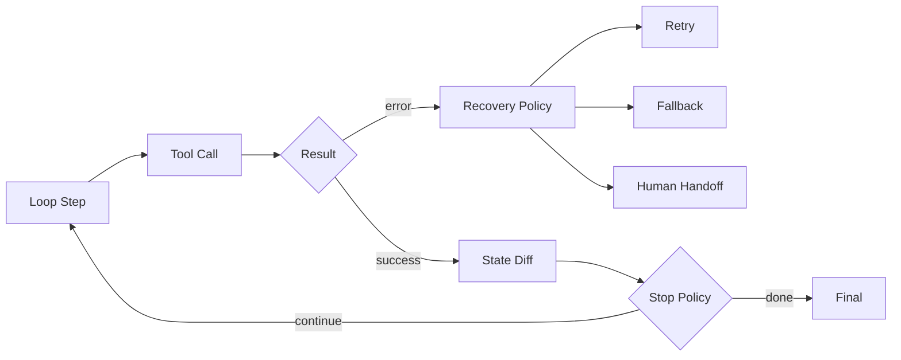

# 如何设计 Agent Loop 的停止条件、错误恢复和 trace？

## 面试定位

这题考生产化 Loop。重点是 stop policy、structured error、state diff、trace 和指标。

## 30 秒回答

我会把 Agent Loop 设计成受控循环。每轮都有 max steps、timeout、预算、风险阈值和 verifier。工具失败返回 structured error，宿主根据 retryable、幂等和风险决定重试、降级、追问用户或转人工。

Trace 要记录 action、arguments、observation、state diff、latency、cost 和 stop reason。

## 标准回答

停止条件包括任务完成、验证通过、预算耗尽、重复失败、风险触发、需要用户补充信息和人工接管。不要让模型自己决定无限继续。

错误恢复要按错误分类。timeout 可以在幂等前提下重试，permission denied 要拒绝或解释，invalid args 可以让模型修参，partial success 要查状态和补偿。

## 架构与运行机制

数据流要保证每个分支都有 trace，否则事故后无法复盘。

关键取舍是尽早停止还是继续恢复。继续恢复能提高任务完成率，但在风险升高或预算不足时应输出 unsupported 或转人工。

## 可画图

可以画“成功路径 + 错误恢复 + 停止策略”的三分支流程图。

## 系统设计案例

Coding Agent 运行测试失败后，不是立刻结束。Verifier 判断是否是预期失败、是否还有预算、是否需要重新读文件。连续失败超过阈值就停止并说明风险。

## 真实问题与排障

如果循环跑太久，查 stop_reason 是否为空，重复 action 是否过多，工具错误是否被误判为 retryable。指标包括 `avg_steps`、`loop_timeout_rate`、`retry_success_rate`、`human_handoff_rate` 和 `cost_per_task`。

## 面试官追问

### 追问 1：max steps 怎么设？

按任务复杂度和成本预算设，不同任务不同上限。

### 追问 2：工具失败是否都重试？

不是。只有 retryable 且幂等安全的错误才重试。

## 项目化回答

Web Agent 需要每次点击后验证页面状态。Travel Agent 提交失败要查状态再决定补偿。Coding Agent 要保留 patch 和测试 trace。

## 常见错误

- 没有停止条件。
- 所有错误都重试。
- trace 只保存最终答案。
- 不区分只读和写操作。

## 深挖技术细节

Agent Loop 要有显式 loop state。每轮保存 `loop_id`、`step_id`、`state_version`、`action_type`、`tool_name`、`args_hash`、`risk_level`、`observation_ref`、`state_diff`、`latency_ms`、`cost`、`error_code`、`retryable`、`idempotent` 和 `stop_reason`。Stop Policy 读取这些字段，而不是让模型凭感觉决定继续。

错误恢复要按 error taxonomy。`invalid_args` 可以让模型修参；`permission_denied` 不能重试，应解释或申请权限；`timeout` 只有在幂等安全时重试；`partial_success` 要查询外部状态；`verifier_failed` 要 re-observe 或 replan；`risk_policy_blocked` 进入 human-in-the-loop。写操作必须有 idempotency key 和补偿方案。

Trace 要能支持 replay 和指标。每轮 action、arguments、observation、state diff、verifier、policy verdict 都进入 trace。指标包括 `avg_steps`、`loop_timeout_rate`、`retry_success_rate`、`repeat_action_rate`、`human_handoff_rate`、`cost_per_task`、`unsafe_action_block_rate`。这些能判断 loop 是灵活还是失控。

## 边界条件与反例

反例一：所有工具失败都重试，permission denied 也反复调，浪费成本且可能触发风控。反例二：提交表单 timeout 后直接 retry，造成重复提交。反例三：loop 只看 max steps，不看重复动作和 verifier reject。

边界在于：只读动作可更积极恢复；写入和外部副作用动作要更保守。任务完成不是模型说完成，而是 verifier 或用户验收通过。预算耗尽时应输出 partial result、unsupported 或 ask user，而不是继续消耗。

## 深问准备

- 问：max steps 怎么设？答：按任务类型、风险和成本预算设，不同任务不同上限。
- 问：工具失败是否都重试？答：只有 retryable 且 idempotent 的错误才自动重试。
- 问：stop reason 有哪些？答：verifier_pass、budget_exhausted、repeat_failure、risk_blocked、need_user、human_handoff。
- 问：如何排查 loop 失控？答：看 repeat_action、state diff 是否更新、error taxonomy 和 stop policy。

## 来源与延伸阅读

- [OpenAI Agents Guide](https://cdn.openai.com/business-guides-and-resources/a-practical-guide-to-building-agents.pdf)
