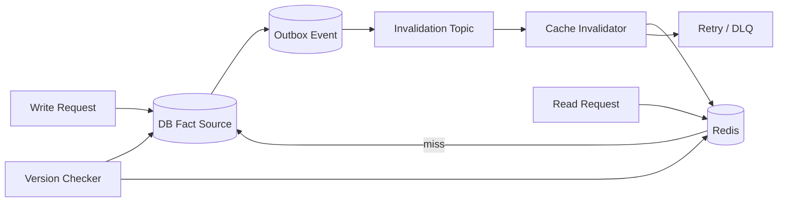

# Redis 缓存和数据库如何保证一致性？

## 面试定位

这道题考的不是 Redis 命令，而是你能否把缓存当成读模型，把数据库当成事实源，并讲清楚架构、数据流、失败恢复、指标和取舍。面试追问通常会从“为什么删缓存”一路追到“删除失败怎么办”和“如何证明没有旧值”。

## 30 秒回答

我会先说明边界：Redis 是可重建读模型，数据库才是事实源，所以缓存一致性不是做 Redis 和 DB 的强事务，而是控制不一致窗口并保证失败可恢复。

常见方案是 cache-aside：读先查缓存，miss 回源 DB 并写缓存；写先更新 DB，再删除缓存。删除缓存通常比同步更新缓存更稳，因为并发读可能把旧 DB 值回填并覆盖新缓存。

生产上还要处理删除失败和并发窗口：删除失败进入 retry、DLQ 或 outbox；重要变更通过 MQ/CDC 统一失效；缓存 value 带 `source_version`，避免旧值覆盖；巡检任务对账 DB 和缓存版本。指标看 `stale_read_rate`、`cache_delete_fail_count`、`event_publish_lag`、`backend_fallback_qps` 和 DB p95。

## 架构与运行机制

图 1 的回答主线是：写路径先保证事实源正确，再通过事件删除缓存；读路径只把缓存当读模型；补偿链路负责修复删除失败。图中 Retry/DLQ 和 Version Checker 是面试加分点，因为它们说明你没有把一致性寄托在一次 Redis delete 上。核心数据流是写 DB、写 outbox、发失效事件、删除 Redis、失败重试，以及读 Redis miss 后回源重建。

这张图用于说明官方 Redis 文档只定义缓存能力，工程答案还要把 DB 事务、MQ 可靠投递、版本字段和巡检补偿连成链路。

## 深挖技术细节

第一层讲 cache-aside。读请求根据 key schema 查 Redis，命中直接返回，miss 时回源数据库并写回 Redis。写请求先更新数据库，提交成功后删除缓存，让下一次读重新构建。这个模式简单、通用、可恢复，但它不是强一致，核心是控制不一致窗口。

第二层讲为什么“删缓存”通常比“更新缓存”安全。更新缓存会遇到并发覆盖：线程 A 更新 DB 后准备 set 新值，线程 B 在 A 提交前读到旧值并回源，B 最后把旧值写入缓存。删除缓存把重建交给下一次读，并且可以通过 `source_version` 拒绝旧值覆盖。如果业务读很热，可以配合 singleflight、短期 stale value 和预热，而不是直接同步 set。

第三层讲失败恢复。Redis delete 失败、MQ 消费失败、网络抖动和权限异常都不能只打日志。删除事件要有 `event_id`、`aggregate_id`、`source_version`、`cache_keys`、`retry_count` 和 `last_error`。失败进入 retry，超过阈值进入 DLQ。巡检任务按 DB `updated_at` 或版本号抽样对账缓存，发现 stale cache 后删除并记录指标。

第四层讲一致性等级。商品展示可以接受几秒旧值；用户权限、库存扣减和支付状态不能只依赖缓存，关键决策要回查 DB 或校验版本。RAG 文档状态、模型路由配置、工具权限缓存也要按风险分级：旧配置可能导致错误检索、错误授权或错误模型选择。

## 关键数据结构与协议

| 字段 | 出现位置 | 作用 | 面试表达 |
| --- | --- | --- | --- |
| `cache_key` | Redis key | 定位业务实体和视图 | key schema 要版本化 |
| `schema_version` | Redis value | value 结构版本 | 支持灰度和回滚 |
| `source_version` | Redis value / DB | 防旧值覆盖 | 读写时可比较版本 |
| `generated_at` | Redis value | 缓存生成时间 | 判断 stale 窗口 |
| `event_id` | Outbox/MQ | 失效事件幂等 | 支持重复消费 |
| `retry_count` | Invalidation task | 删除失败重试 | 防止静默失败 |
| `trace_id` | 全链路 | 串联写库、删缓存、回源 | 支持事故复盘 |

这些字段让答案从“思路”变成“可落地协议”。尤其是 `source_version` 和 `event_id`，一个解决旧值覆盖，一个解决失效事件重复或失败。

## 边界条件与反例

反例一：写 DB 后直接 set Redis 新值。这个做法看起来减少 miss，但在多字段聚合、并发读写和旧快照回填时容易产生旧值覆盖。更稳的是删缓存，必要时加版本拒绝旧写。

反例二：延迟双删被说成强一致方案。延迟双删只能降低并发旧值回填概率，不能覆盖慢查询、长事务、MQ 延迟和删除失败。它是补丁，不是证明。

反例三：DB 超时后把结果缓存为空。空值缓存只适合确认 not_found 的合法 key；timeout、rate_limited、internal_error 不能缓存为空，否则会把事故固化进 Redis。

反例四：所有业务都同一个策略。展示类数据可以 stale-while-revalidate，权限和资金类数据必须强校验或绕缓存。

## 真实问题与排障

如果线上出现旧价格事故，我会按四步处理。

第一步看影响面：哪些商品、哪些 key、哪些用户、从哪个版本开始、是否影响交易决策。第二步止血：批量删除相关 key、临时绕缓存读 DB、关闭非核心展示或返回安全默认值。第三步查根因：DB 是否提交、outbox 是否写入、MQ 是否积压、Invalidator 是否失败、是否有旧值回填、`source_version` 是否落后。第四步回归：补并发读写、删除失败、MQ 延迟和慢回源测试，用 `stale_read_rate` 和 `cache_delete_fail_count` 验证改进。

这里要主动提到降级、隔离和回滚：例如暂停错误的预热任务、隔离异常 invalidator、回滚错误 key schema，避免修复动作继续扩大影响面。

## 系统设计案例

以商品详情缓存为例，架构由 API Service、Redis、Product DB、Outbox、MQ、Cache Invalidator 和 Consistency Checker 组成。数据流上，读请求先查 Redis，miss 后回源 DB 并写缓存；写请求先提交 DB，再通过 outbox 发布缓存失效事件；Invalidator 删除详情、列表和活动页 key，失败进入 retry 和 DLQ。

关键取舍是：删缓存会让下一次读承担重建成本，但比同步 set 缓存更少旧值覆盖；MQ/CDC 失效降低写路径延迟，但要治理重复、积压和删除失败；强制读 DB 能提升正确性，但会牺牲延迟和吞吐。面试追问里要把这些取舍和指标一起讲，而不是只背顺序。

## 项目表达

我在项目里会这样讲：商品详情缓存使用 `product:detail:v2:{id}`，value 包含 `source_version` 和 `generated_at`。后台改价时写 DB 和 outbox，Invalidator 消费 MQ 删除详情、列表和活动页缓存。删除失败进入 retry 和 DLQ，巡检任务抽样对账 DB version 与缓存 version。上线指标包括命中率、旧值率、删除失败、事件延迟、回源 QPS 和 DB p95。

这个表达也可以迁移到 AI 系统：RAG 文档状态、用户权限、模型路由配置和工具开关都可能缓存到 Redis。缓存旧值不是小问题，可能导致错误证据进入上下文、权限误判或工具执行错误。

## 深问准备

1. 为什么删缓存不是更新缓存？答并发旧值覆盖、多字段聚合和事实源重建。
2. 延迟双删怎么设置时间？答根据慢查询、事务提交、读路径耗时和业务 SLA 估算，但不能证明严格一致。
3. MQ 删除事件重复怎么办？答删除操作幂等，event_id 去重，失败重试。
4. 删除缓存失败怎么办？答 retry、DLQ、巡检、告警和人工修复。
5. 如何证明一致性改善？答 stale_read_rate 下降、delete_fail_count 清零、event lag 收敛、事故回归通过。

## 多轮追问模拟

第一轮追问：为什么你说“先更新 DB 再删缓存”，不是“先删缓存再更新 DB”？

回答要点：先删缓存再更新 DB 会打开一个窗口：并发读 miss 后可能读取旧 DB 值并回填缓存，随后写事务才提交，旧缓存就被延长。先提交 DB 再删缓存，把事实源更新放在前面；如果删除失败，可以通过 outbox、retry、DLQ 和巡检继续补偿。

考察点：是否能从并发窗口解释方案，而不是背诵顺序。

陷阱：说“顺序固定就不会有不一致”。cache-aside 的目标是控制窗口和可恢复，不是提供分布式事务。

第二轮追问：删除缓存失败时，如何保证不会静默留下旧值？

回答要点：删除动作要事件化，事件有 `event_id`、`source_version`、`cache_keys` 和 `retry_count`。失败进入重试队列，超过阈值进入 DLQ；同时用 consistency checker 抽样比较 DB version 和 cache version，发现旧值就删除并告警。

考察点：是否把失败恢复设计成系统链路，而不是“打日志”。

陷阱：只说“重试一下”，没有幂等、告警、死信和巡检。

第三轮追问：哪些场景不能只依赖缓存一致性方案？

回答要点：权限、支付、库存扣减、风控和工具执行许可这类高风险决策不能只读缓存，必须回查 DB、校验版本或使用强一致服务。缓存可以做读模型和加速层，但不应该成为最终授权依据。

考察点：是否能按业务风险分层。

陷阱：把所有业务统一成同一种缓存策略。

## 来源与延伸阅读

- [Redis key eviction](https://redis.io/docs/latest/develop/reference/eviction/)：用于支持“Redis 缓存是持久数据副本、可被淘汰并重建”的边界判断。
- [Redis client-side caching](https://redis.io/docs/latest/develop/clients/client-side-caching/)：用于说明缓存失效和 invalidation message 的官方语义，帮助区分缓存通知与数据库事务一致性。
- [Apache Kafka documentation](https://kafka.apache.org/documentation/)：用于支撑失效事件的 topic、consumer、offset 和消费积压治理思路。
- [MySQL InnoDB transaction isolation levels](https://dev.mysql.com/doc/refman/en/innodb-transaction-isolation-levels.html)：用于说明数据库事实源、事务提交和隔离级别是缓存一致性讨论的底层边界。
