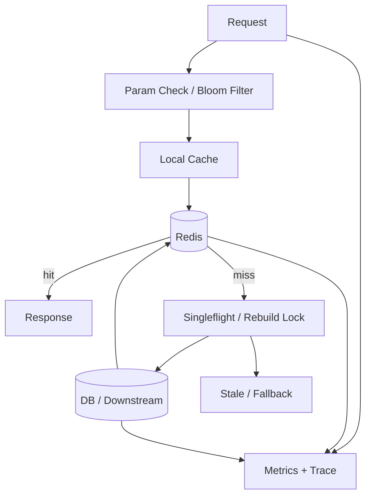

# Redis 热 key、缓存击穿、穿透和雪崩分别怎么处理？

## 面试定位

这道题考的是缓存稳定性治理能力，不是概念背诵。合格回答要能按故障机制分类，进一步讲出架构、数据流、指标、取舍、止血和回归。面试追问通常会围绕热 key 如何发现、分布式锁怎么避免旧写覆盖、空值缓存会不会污染结果展开。

## 30 秒回答

我会先把四类问题区分开：热 key 是少数 key QPS 过高；击穿是热点 key 失效后大量并发回源；穿透是查询不存在的数据导致缓存永远 miss；雪崩是大量 key 同时失效或 Redis 整体不可用，导致大面积回源。

处理要按机制来：热 key 用热点发现、本地缓存、key 拆分和限流；击穿用 singleflight、互斥重建、stale value、预热和 TTL 抖动；穿透用参数校验、Bloom filter 和短 TTL 空值缓存；雪崩用 TTL jitter、分批失效、回源限流、熔断、降级和多级缓存。

生产事故先保护 DB：看影响面，限流异常入口，返回旧值或默认值，暂停批量删除，预热核心 key，再查根因。指标看 `hot_key_qps`、`cache_miss_rate`、`backend_fallback_qps`、`redis_latency_p95`、`db_latency_p95`、`degrade_count` 和 `stale_return_count`。

## 架构与运行机制

图 1 的主线是先过滤无效请求，再用多级缓存吸收热点，miss 后由重建协调器控制回源。图中 Stale/Fallback 是事故止血层，Metrics/Trace 是定位层。没有这两个模块，系统只能在 miss 风暴里被动扩容。核心数据流是 request -> 参数校验/Bloom filter -> 本地缓存 -> Redis -> singleflight/lock -> DB -> stale/fallback。

这张图用于说明官方 Redis 文档之外的工程语义：缓存稳定性不是一个命令，而是一套入口过滤、回源保护、降级和可观测链路。

## 深挖技术细节

热 key 的本质是访问分布倾斜。少数 key 可能打满单个 Redis 分片、单条网络链路、应用连接池或下游 DB。发现热 key 不能只看平均 QPS，要从客户端采样、代理层聚合、Redis slowlog、command stats、trace 标签和业务接口维度看 per-key QPS。生产上一般记录 key hash、key prefix 和实体类型，避免把完整业务 key 放进高基数字段。

击穿的本质是热点 key 重建并发失控。解决思路是同一 key 同时只允许一个请求回源，其它请求短等待、返回旧值、快速失败或降级。singleflight 适合同进程，Redis 锁适合跨进程，但锁要有过期时间、owner token、版本校验和最大等待时间。否则锁过期后旧请求最后写回，可能覆盖新缓存。

穿透的本质是无效请求绕过缓存。随机 id、恶意扫描、客户端 bug 或非法参数都会导致 Redis miss，然后 DB 查不到。参数校验可以挡住明显非法格式；Bloom filter 可以挡住大部分不存在 id；空值缓存可以缓存确认不存在的合法 key。但 timeout、rate_limited、permission_denied 和 internal_error 不能缓存为空，这是非常常见的反例。

雪崩的本质是整体回源压力突然放大。原因可能是大量 key 同时过期、发布脚本批量删除、Redis 分片故障、网络抖动或降级策略错误。预防靠 TTL 随机抖动、分批失效、热点预热、多级缓存、回源队列限速和熔断降级。事故现场先止血，等 DB 和核心接口稳定后再重建缓存。

## 关键数据结构与协议

| 字段 | 用途 | 对应问题 | 面试加分点 |
| --- | --- | --- | --- |
| `cache_key_hash` | 聚合单 key 访问 | 热 key | 降低指标基数和泄露风险 |
| `cache_status` | hit/miss/stale/bypass | 击穿、雪崩 | trace 中能看缓存路径 |
| `backend_fallback_qps` | 统计回源压力 | 击穿、雪崩 | DB 保护核心指标 |
| `lock_owner_token` | 标识重建锁持有者 | 击穿 | 防误释放和旧写覆盖 |
| `source_version` | 缓存版本 | 击穿、一致性 | 拒绝旧值覆盖新值 |
| `not_found_ttl` | 空值缓存时间 | 穿透 | 不能用于下游错误 |
| `fallback_reason` | 降级原因 | 雪崩 | 事故复盘和回滚依据 |
| `stale_until` | 旧值可用时间 | 击穿、雪崩 | 控制用户可见风险 |

这些字段让回答具备工程粒度。尤其是 `backend_fallback_qps`，它能把缓存问题转成 DB 保护问题；`fallback_reason` 能说明降级不是乱返回旧值，而是有审计和回归依据。

## 边界条件与反例

反例一：把穿透、击穿、雪崩都说成“缓存没命中”。这种回答太粗。穿透要过滤无效请求，击穿要控制单 key 重建，雪崩要控制大面积回源。

反例二：所有热点都加分布式锁。锁会增加等待和尾延迟，锁超时、误释放和旧值覆盖都可能出事故。热点读更常用本地缓存、预热、stale value 和限流组合。

反例三：DB 超时后写空值缓存。这个会把临时下游故障缓存成“数据不存在”。必须区分 not_found 和 timeout。

反例四：TTL 全部设置成整点过期。这样会人为制造雪崩。TTL 要加随机抖动，发布删除也要分批。

## 真实问题与排障

线上发现活动页接口超时，我会先看影响面：接口 QPS、Redis miss rate、hot key 分布、DB p95、Redis latency、是否刚发布、是否有批量删除。止血动作包括网关限流、返回 stale value、关闭非核心模块、暂停预热或批量删除任务、给回源队列限速、临时预热核心 key。隔离动作包括按 key prefix 或活动 id 隔离异常流量，把随机 id 请求挡在 Bloom filter 前。

根因分析再展开：如果是热点 key，就看是否单 key QPS 过高、是否本地缓存失效；如果是击穿，看 TTL、重建锁、锁等待和 DB 慢查询；如果是穿透，看参数、id 分布、not_found 比例和空值缓存；如果是雪崩，看 TTL 分布、发布任务、Redis 故障和批量删除。回滚可以是恢复旧 key 版本、撤销新 TTL 策略、关闭新活动入口或切回静态配置。回归要模拟热点过期、随机 id、Redis 高延迟和 DB 限流。

这段里要明确说“先保护 DB”。缓存层已经失守时，如果继续无限回源，根因还没找到，事实源会先被打挂。

## 系统设计案例

以高并发活动页为例，架构由 Gateway、Application Local Cache、Redis Cluster、Rebuild Coordinator、DB、Fallback Layer 和 Observability Stack 组成。数据流上，入口先限流和参数校验，应用先查本地缓存，再查 Redis；Redis miss 后进入重建协调器，只有一个请求回源，其它请求短等待或返回旧值；回源成功后写 Redis 和本地缓存。

关键取舍包括：本地缓存降低 Redis 压力但增加失效成本；返回旧值提升可用性但牺牲新鲜度；互斥重建保护 DB 但增加尾延迟；Bloom filter 降低穿透但有误判和重建成本。面试追问如果问“为什么不用一个锁解决所有问题”，就按热 key、击穿、穿透、雪崩四类机制拆开回答。

## 项目表达

项目里可以讲活动页缓存：活动配置和商品榜单是热 key，应用用本地缓存 + Redis 两级缓存。发布系统分批失效，TTL 加 10% 抖动。miss 后进入 singleflight，同一 key 只有一个请求回源，其它请求短等待或返回 30 秒内 stale value。Bloom filter 过滤非法活动 id，空值缓存只用于确认不存在的 id。Prometheus 看板展示 per-key QPS、miss rate、fallback QPS、Redis p95、DB p95、锁等待和降级次数。

这个答案也能迁移到 AI 项目：热门知识库检索结果、模型路由配置、工具权限、Agent 状态摘要都可能成为热点 key。缓存击穿会把压力打到向量库、数据库或模型 API，最终体现为延迟、限流和成本飙升。

## 深问准备

1. 如何发现热 key？答客户端采样、代理层聚合、slowlog、trace、key hash 和业务维度。
2. singleflight 和分布式锁有什么区别？答 singleflight 是进程内合并请求，分布式锁跨实例但要处理过期、owner 和版本。
3. Bloom filter 有什么问题？答误判、删除困难、重建成本和多租户隔离。
4. 空值缓存 TTL 怎么定？答短 TTL，只缓存确认不存在，不缓存下游错误。
5. 雪崩时为什么先限流降级？答先保护 DB 和核心链路，再恢复缓存。
6. 如何做回归？答压测热点 key 过期、随机 id 穿透、批量过期、Redis 高延迟和 DB rate limit。

## 来源与延伸阅读

- Redis 官方文档：用于确认 key、TTL、slowlog 和数据结构语义。
- Redis 分布式锁官方文档：用于确认锁过期、owner value 和释放校验边界。
- Prometheus 官方文档：用于支持缓存命中率、回源 QPS、延迟和降级告警。
- OpenTelemetry 官方文档：用于支持 trace 中记录 cache_status、fallback_reason 和 source_version。
