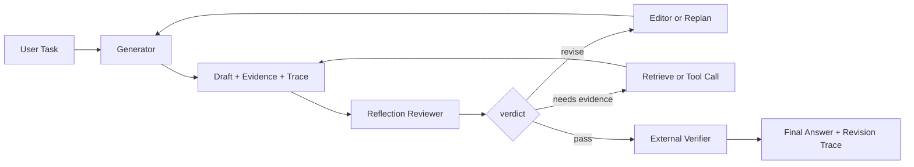

# Reflection 在 Agent 中有什么作用？

## 面试定位

这道题不要只把 Reflection 解释成“让模型再想一遍”。面试官更想看你能不能把它放进 Agent 架构里讲清楚：哪些结果需要审查，审查依据来自哪里，数据流如何回到执行循环，指标如何证明质量提升，以及什么时候必须停止。好的回答会强调一个边界：reflection 是质量控制信号，不是事实来源。

## 30 秒回答

Reflection 的作用是让 Agent 对自己的草稿、计划、工具调用结果或中间推理做结构化审查，输出 verdict、问题列表、证据缺口和修订建议。它适合提升答案完整性、发现约束遗漏、减少低级错误。生产系统里不能让模型无限自评，必须配合外部 verifier、测试、citation check、预算和停止条件。我的取舍是把 reflection 当成 reviewer，把事实校验交给工具和规则，把最终通过条件写进可观测指标。

## 标准回答

我会从三个层次解释。第一是输入，reflection 看的不是裸 prompt，而是 draft、plan、tool trace、retrieved evidence、用户约束和当前状态。第二是输出，reviewer 应该返回结构化结果，例如 `verdict`、`issues`、`severity`、`missing_evidence`、`suggested_fix`、`confidence`。第三是控制，orchestrator 根据 verdict 决定修订、重新检索、补工具调用、转人工或停止。

它和普通重试的区别在于，reflection 不是失败后盲目再跑一次，而是先定位质量缺口。比如 RAG 答案里有 unsupported claim，reviewer 应该指出缺哪条 citation。代码修复里测试失败，reviewer 应该把失败断言和候选原因映射到下一次 patch，而不是泛泛说“代码有问题”。

## 架构与运行机制

架构上可以拆成 Generator、Reviewer、Editor、Verifier 和 Trace Store。Generator 产出初稿和证据引用。Reviewer 按 rubric 做审查。Editor 根据问题清单修订结果或触发新的工具调用。Verifier 做硬性校验，例如单测、schema validation、citation grounding 或安全策略。Trace Store 记录每一轮数据流、成本、延迟和 verdict，方便后续评测。

关键指标包括 `verifier_pass_rate`、`unsupported_claim_rate`、`revision_success_rate`、`avg_revision_rounds`、`self_approval_false_positive_rate`。如果 reflection 增加成本但没有提升 verifier 通过率，就说明 rubric 或触发策略需要收紧。

## 可画图

这张图的讲法是：reviewer 只提出质量判断和修订方向，真正的事实补充来自检索、工具或测试。最终答案必须经过 verifier，而不是由自评直接放行。

## 系统设计案例

以“面试知识问答 Agent”为例，系统先根据题目生成一版回答，同时附带引用、关键概念和示例项目。Reflection Reviewer 检查回答是否覆盖边界、架构、数据流、指标、取舍和追问。如果发现“只讲概念，没有故障案例”，Editor 会补充一个真实问题与排障段落。如果发现事实依据不足，系统回到 RAG 检索，而不是让模型凭空补细节。

上线时我会把不同任务使用不同 rubric。知识问答关注 citation 和概念边界，代码 Agent 关注测试结果和 diff 风险，工具型 Agent 关注权限、幂等和外部副作用。这样 reflection 才是工程模块，不是 prompt 里的一句“请仔细检查”。

## 真实问题与排障

最常见的问题是 reviewer 过度自信，给错误答案打高分。排查时先看 trace：它是否拿到了 evidence，rubric 是否有硬性检查项，verifier 是否真正阻断了 unsupported 输出。第二类问题是循环修订，表现为多轮改写但质量没有提升。解决方式是设置最大轮数、无改进停止条件、差异摘要和人工升级策略。

还有一种隐蔽问题是 reflection 把风格优化当成事实修正。比如答案更流畅了，但引用仍然不支持结论。对此要把指标拆开，分别看 clarity、grounding、test pass 和 safety，不要只看一个综合分。

## 面试官追问

- 如果 reviewer 和 verifier 冲突，你信谁？我会优先信 verifier，因为它连接外部证据、规则或测试。reviewer 只能解释可能原因。
- Reflection 应该每次都跑吗？不一定。高风险写操作、长答案、代码修改和低置信度检索适合触发，短问答可以用轻量规则。
- 怎么防止成本失控？用 retry budget、触发阈值、缓存 reviewer 结果和 early stop。

## 项目化回答

在项目里我会说：我们把 reflection 做成一个可配置 reviewer pipeline，每个任务绑定 rubric、verifier 和停止策略。回答类任务记录 citation gap 和 unsupported claim，代码类任务记录测试失败和修复轮次，工具类任务记录 permission denial 和 retryable error。最终用 `revision_success_rate`、`cost_per_passed_answer`、`avg_revision_rounds` 来判断这个模块有没有真实收益。

## 常见错误

- 把 reflection 当作事实来源，忽略检索、测试和工具结果。
- 只让模型输出自然语言评价，没有结构化 verdict。
- 没有停止条件，导致成本升高和循环修订。
- 只优化表达，不检查架构边界、数据流和指标。

## 深挖技术细节

Reflection 应该是一条 reviewer pipeline，而不是一句“再检查一下”。Reviewer 输入包括 draft、用户约束、tool trace、evidence pack、rubric 和已知风险；输出应结构化为 `verdict`、`issues[]`、`severity`、`missing_evidence`、`suggested_fix`、`requires_tool_call` 和 `confidence`。Orchestrator 再决定修订、补检索、跑测试、转人工或停止。

更严谨的设计会把 reflection 和 verifier 分开。Reviewer 可以发现“回答缺少边界条件”，但不能证明事实正确；事实正确要靠 citation verifier、unit tests、schema validation、权限策略或人工确认。最终发布条件应该写成可观测 gate，而不是 reviewer 自信度。

## 边界条件与反例

Reflection 不适合无限轮次。多轮自评可能把错误答案润色得更像真的，尤其当 reviewer 和 generator 共享同一错误上下文时。必须有 max rounds、no-improvement stop、预算和 hard verifier；连续没有新增证据或测试改善时要停止或降级。

另一个反例是只做风格审查。答案更流畅不代表 grounded，代码解释更完整不代表测试通过。rubric 要按任务拆分：RAG 看 claim support，代码看 test 和 diff，工具任务看权限和副作用，项目文档看架构、数据流和指标。

## 深问准备

如果追问“什么时候触发 reflection”，可以回答：长答案、高风险输出、低置信度检索、代码补丁、工具失败恢复、用户明确要求严谨时触发；简单问答不一定全量跑，避免成本和延迟失控。

如果问“如何衡量 reflection 是否有用”，看 `verifier_pass_rate` 是否提升、`unsupported_claim_rate` 是否下降、`revision_success_rate`、`avg_revision_rounds`、`cost_per_passed_answer` 和 `self_approval_false_positive_rate`。如果成本升高但 verifier 通过率没变，就要收紧触发策略或改 rubric。

## 来源与延伸阅读

- [OpenAI Evals](https://github.com/openai/evals)
- [OpenAI A practical guide to building agents](https://cdn.openai.com/business-guides-and-resources/a-practical-guide-to-building-agents.pdf)
