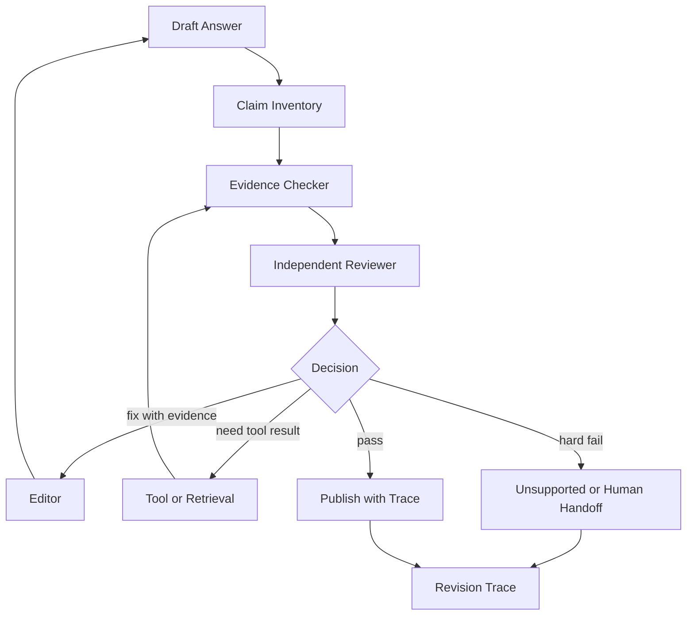

# 如何避免反思机制让错误结论被不断强化？

## 面试定位

这道题考的是你是否理解 reflection 的失败模式。深一点的回答不能停在“加一个 reviewer”，而要解释为什么自评会放大错误，以及如何用外部证据、独立 verifier、停止条件和 trace 把风险关住。面试官会关注你的架构设计是否能避免模型在同一条错误路径上越走越远。

## 30 秒回答

避免错误强化的核心是不要让同一个模型在同一份上下文里既当作者又当最终裁判。Reflection 只能提出候选问题，事实判断必须回到 citation、工具 observation、测试、规则 verifier 或人工确认。工程上我会做 claim inventory、evidence check、independent review、retry budget、no-improvement stop 和 revision trace，用指标观察 `self_approval_false_positive_rate`、`unsupported_claim_rate`、`loop_stop_rate`。

## 标准回答

错误强化通常来自三种情况。第一，初始答案缺证据，但 reviewer 只看语言是否顺畅，于是把编造内容润色得更可信。第二，reviewer 和 generator 共享错误上下文，无法跳出原假设。第三，系统没有硬性停止条件，多轮修订只是在同一错误上换说法。

我的设计会把 reflection 拆成软判断和硬校验。软判断负责发现答案是否覆盖问题、是否遗漏约束、是否需要更多证据。硬校验负责决定能不能发布，包括 citation grounding、unit test、schema check、权限检查和业务规则。只要 hard verifier 不通过，最终输出就不能把不确定内容包装成确定结论。

## 架构与运行机制

运行链路可以先做 claim inventory，把答案里的关键断言提取出来，再逐条匹配 evidence。Reviewer 只能评价断言是否完整、是否有风险和下一步应补什么。Evidence Checker 负责判断 citation 是否支持 claim。Stop Policy 判断是否继续修订，依据是剩余预算、质量增益、重复问题和风险级别。

为了降低同源偏差，可以让 reviewer 使用不同 prompt、不同模型、不同上下文窗口，或者至少不给它完整的生成推理过程，只给输出、证据和 rubric。更关键的是保留修订链路，记录每轮改了什么、为什么改、指标有没有改善。没有改善时停止，比盲目多跑几轮更安全。

## 可画图

图里的重点是 evidence checker 在 reviewer 前后都能发挥作用。Reviewer 不负责“相信自己”，它负责把问题转成可执行的修订任务。

## 系统设计案例

假设一个论文解读 Agent 总结某篇论文的实验结论。初稿可能说“方法在所有数据集上领先”，但 citation 只支持两个数据集。Claim Inventory 抽出这条断言，Evidence Checker 标记为 partial support。Reviewer 不能直接改成更强结论，只能建议缩小表达、补充表格引用或重新检索实验段落。

如果连续两轮仍找不到证据，系统输出应降级为“不支持该结论”，并把缺口写进 trace。这样数据流从生成到审查再到发布都有可追踪依据。指标上看 `citation_precision`、`claim_support_rate`、`unsupported_downgrade_count` 和 `human_handoff_rate`。

## 真实问题与排障

线上如果发现答案越来越自信但事实越来越差，我会先检查 reviewer 输入。它是不是只拿到了最终文本，没有拿到证据和约束。再看 rubric，是否明确要求 unsupported claim 降级。最后看 stop policy，是否允许同一问题重复修三次以上。

另一个常见故障是 verifier 太弱，只检查格式不检查事实。比如 schema 合法不代表结论正确。修复时要把 verifier 分层，格式由 schema 管，事实由 citation 管，代码由测试管，安全由策略管。不同指标分开看，才能知道是表达问题、证据问题还是执行问题。

## 面试官追问

- 可不可以让模型自己判断答案是否正确？可以作为辅助信号，但不能作为最终事实裁判。
- 多模型 reviewer 是否一定更好？不一定，它降低同源偏差，但会增加成本和一致性问题，仍然需要外部 verifier。
- 什么时候转人工？高风险写操作、证据冲突、连续无改进、权限不明确时应转人工或输出 unsupported。

## 项目化回答

我会把这个能力落到一个 Review Orchestrator：输入是 draft、claim list、evidence map 和 tool trace，输出是 revision plan 或 publish decision。每次发布都保存 revision trace，包含轮次、问题类型、证据状态、最终取舍和关键指标。面试中可以结合知识库问答、代码修复、自动生成报告三个场景说明，证明你不是只会背 reflection 这个词。

## 常见错误

- 让同一个上下文里的模型同时生成和裁判，导致错误假设被继承。
- 只看语言质量，不检查 claim 是否被证据支持。
- 没有 no-improvement stop，修订轮数越多越像正确答案。
- 忽略 trace，事后无法知道错误从哪一轮开始扩散。

## 深挖技术细节

Reflection 的工程关键是把“自我改进”拆成可验证的 revision protocol。初稿生成后先做 `claim_inventory`，把每个关键结论拆成 claim、source requirement、risk level 和 evidence id。Reviewer 只能输出 revision plan，例如缺证据、表达过强、引用不匹配、需要工具查询；最终是否发布由 Evidence Checker、测试、schema verifier 或 policy verifier 决定。

为了避免同源偏差，reviewer 最好使用不同上下文：只给 draft、claim list、evidence map 和 rubric，不给原始长对话里的错误推理。每轮修订要记录 `revision_id`、`changed_claims`、`evidence_status`、`verifier_verdict`、`quality_delta` 和 `stop_reason`。如果连续两轮没有新增证据或质量增益，就触发 no-improvement stop。

## 边界条件与反例

Reflection 不适合替代外部事实校验。论文结论、代码正确性、权限安全、支付状态这些问题不能靠模型说“我检查过了”。论文要 citation verifier，代码要测试，权限要 deterministic policy，支付要外部状态查询。模型 review 只能发现风险，不能成为最终事实来源。

另一个反例是 reviewer 过度润色。初稿说“可能提升”，reviewer 为了表达顺畅改成“显著提升”，但证据并不支持。这种错误会让答案更自信也更危险。所以 output guardrail 要允许降级表达，例如“不支持该结论”“证据只覆盖两个数据集”“需要人工确认”。

## 深问准备

如果面试官问“多模型 review 是否能解决问题”，可以回答：它能降低同源偏差，但仍需要外部 verifier。两个模型都没有证据时，可能只是用不同语言强化同一个错误。关键是 claim-to-evidence、测试、规则和 trace，而不是 reviewer 数量。

如果追问“如何评估 reflection”，看 `claim_support_rate`、`unsupported_claim_rate`、`self_approval_false_positive_rate`、`revision_improvement_rate`、`no_improvement_stop_rate` 和 `human_handoff_rate`。这些指标比“修订轮数”更有意义，因为多轮不一定更好。

## 来源与延伸阅读

- [OpenAI Evals](https://github.com/openai/evals)
- [OpenAI A practical guide to building agents](https://cdn.openai.com/business-guides-and-resources/a-practical-guide-to-building-agents.pdf)
