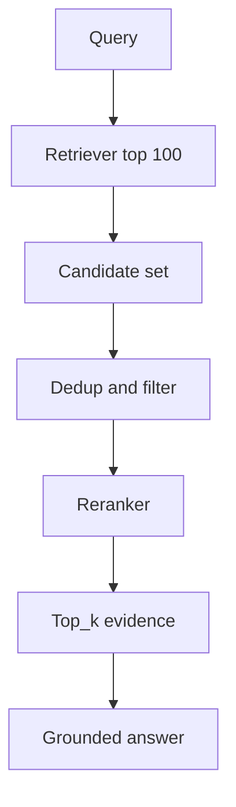

# RAG 中 rerank 的作用是什么？

## 30 秒回答

Rerank 的作用是把召回阶段较宽的 candidate set 精排成少而准的 evidence。Retriever 追求不漏，reranker 追求进入上下文的证据能回答问题。它会给 query-candidate 对打 relevance score，再选 top_k，代价是 latency 和 cost 增加。

## 面试定位

这题考 retrieve 和 rerank 的职责边界。面试官想知道你能不能把 RAG 的质量问题拆到召回、精排、生成和引用验证各层。

回答要覆盖架构、数据流、指标、取舍和追问。不要把 rerank 当成万能补丁。

## 标准回答

初始检索通常 top_k 较大，因为它要保证 recall。这个候选集合里会有相关但不能回答、版本过旧、重复和噪声文档。Rerank 在较小候选集上做更贵的判断，选择 answerability 更强的证据。

Reranker 可以是 cross-encoder、专门 rerank API、规则加权，也可以是 LLM judge。排序目标要跟业务一致。事实问答看能否回答，论文综述看覆盖和权威性，客服知识库看时效和权限。

Rerank 之后进入上下文的证据要少而准，并保留 relevance score、selected_reason 和 evidence_id。

## 架构与运行机制

数据流里，rerank 不替代检索。候选集中没有正确证据时，rerank 无法凭空创造答案，只能暴露召回失败。

## 可画图

可以画漏斗：全量文档、粗召回、candidate set、rerank、top_k evidence、生成答案。旁边标注每层优化目标。

## 系统设计案例

用户问“如何配置 webhook 重试”。Retriever 召回了多篇包含 webhook 的文档。Reranker 将包含“重试策略、退避时间、失败码”的段落排到前面，把只提到 webhook 概念的文档降权。

生成阶段只看到精排后的 evidence，因此答案更短、更准，也更容易做 citation grounding。

## 真实问题与排障

如果答案仍然错，先看正确证据是否进入 candidate set。没进就是 retrieval 问题。进了但被降权，就是 rerank 目标、模型或样本问题。

指标包括 precision@k、nDCG、answerability_rate、citation_precision、latency_p95 和 cost_per_success。

## 面试官追问

- candidate set 多大合适？
- cross-encoder 和 LLM reranker 怎么取舍？
- rerank 带来的延迟如何控制？
- 如何构造 hard negative？
- rerank 是否会降低 recall？

## 项目化回答

我会说项目里把 RAG 拆成“召回保覆盖，rerank 保证据质量”。每条入选证据都有 relevance score 和 selected_reason。线上排障时能判断问题来自召回漏证据，还是精排选错证据。

## 常见错误

- 以为 rerank 能解决召回漏掉的问题。
- 只按语义相似排序，不看 answerability。
- top_k 不根据任务调。
- 没有 hard negative。
- 只报质量，不报延迟和费用。

## 深挖技术细节

Rerank 的输入不是全量语料，而是 retriever 召回的 candidate set。典型数据结构包括 `query`、`candidate_id`、`chunk_text`、`bm25_score`、`vector_score`、`metadata`、`permission_scope`、`freshness`、`dedup_key`。Reranker 输出 `rerank_score`、`rank`、`selected_reason` 和 `answerability_label`。如果候选集中没有正确证据，rerank 只能把错误候选重新排序，不能创造事实。

常见方案有 cross-encoder、专用 rerank API、LLM judge、规则混排和 RRF。Cross-encoder 准确但 latency 和成本高；RRF 适合融合 BM25 与向量检索，成本低但语义判断弱；LLM reranker 灵活但慢且不稳定。生产上常用粗召回 top 50-200，再 dedup/filter，再 rerank top 5-20 进上下文。权限过滤应在 rerank 前后都做，避免越权文档被模型看到。

评估时不要只看相似度。RAG 更关心 evidence 是否能回答问题，所以要看 `recall@candidate_k`、`precision@context_k`、`nDCG`、`answerability_rate`、`citation_precision`、`p95_rerank_latency`、`cost_per_query`。Hard negative 很关键：语义相关但不能回答的 chunk、过期版本、同名实体、只包含定义不包含步骤的文档，都能逼 reranker 学会“相关”和“可回答”的区别。

## 边界条件与反例

反例一：初始 top_k 太小，正确证据没进候选集，rerank 再强也没用。反例二：只按语义相似，导致“webhook 概念介绍”排在“webhook 重试配置”前面。反例三：rerank 后丢掉原始 score、source 和 selected_reason，排障时不知道为什么选这段。

边界在于：rerank 会增加延迟和成本，不是每个查询都必须启用。短问题、低风险、召回质量稳定时可以跳过；复杂问答、长文档、合规引用和高价值任务应启用。若文档权限复杂，rerank 服务也必须在同一权限边界内运行。

## 深问准备

- 问：candidate set 多大合适？答：看召回曲线，先保证正确证据进入候选，再用 latency/cost 选择 top 50、100 或 200。
- 问：RRF 和 reranker 关系？答：RRF 是轻量融合排序，reranker 是更强的 query-candidate 相关性判断，可以串联使用。
- 问：如何构造 hard negative？答：找相似但不支持答案、旧版本、同名实体、缺关键条件的 chunk。
- 问：rerank 降低 recall 怎么办？答：增大候选、调 top_k、加入 coverage/diversity，或在生成阶段保留多来源证据。

## 来源与延伸阅读

- [Elasticsearch Reciprocal Rank Fusion](https://www.elastic.co/guide/en/elasticsearch/reference/current/rrf.html)
- [Cohere Rerank](https://docs.cohere.com/docs/reranking-with-cohere)
- [LangChain Contextual compression](https://python.langchain.com/docs/how_to/contextual_compression/)
