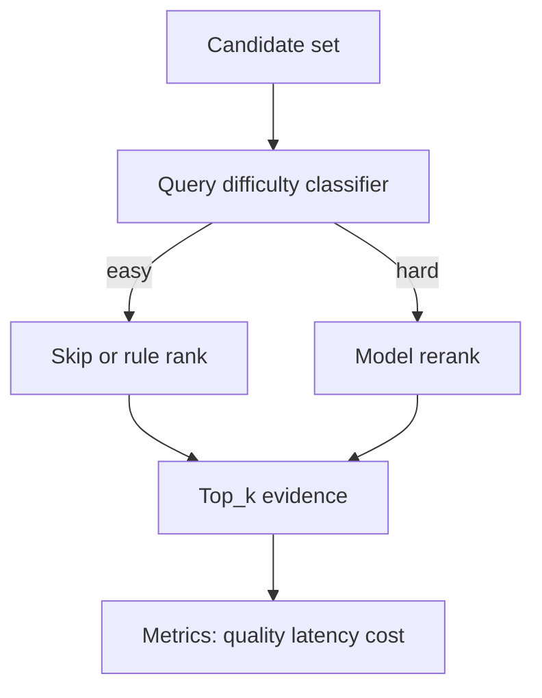

# 如何权衡 rerank 带来的准确率提升和延迟成本？

## 30 秒回答

我会先量化 rerank 对 precision、citation_precision 和 answer success 的提升，再看 latency_p95、cost_per_query 和吞吐下降。策略上可以按 query 难度启用 rerank，先用轻量规则缩小 candidate set，再用 cross-encoder 或 rerank API 精排。

## 面试定位

这题考工程取舍。面试官想听到你不是盲目加模型，而是能根据任务价值和 SLA 做分层策略。

回答要覆盖架构、数据流、指标、取舍和追问。重点是按场景决定，而不是固定开启或关闭。

## 标准回答

先做离线实验。比较无 rerank、轻量规则 rerank、cross-encoder rerank、LLM-as-reranker。质量看 precision@k、nDCG、answerability 和引用准确率。成本看延迟、费用和资源占用。

然后做线上策略。简单 query 或高置信 BM25 命中可以跳过 rerank。复杂问答、多跳问题、企业知识库高风险答案可以开启 rerank。热门 query 可以缓存 rerank 结果。

还可以做两阶段 rerank。第一阶段用规则过滤过期、低权限和重复 chunk。第二阶段只对较小 candidate set 使用昂贵模型。

## 架构与运行机制

图 1：Rerank 策略层先判断 query 难度和风险，再决定跳过、规则排序或模型精排，最后统一输出 top_k evidence 并记录质量、延迟和成本。

这张图的关键不是 reranker 本身，而是 `Query difficulty classifier`。它把 rerank 从全局开关变成按价值启用的策略：精确错误码、高置信 top1 或低风险查询可以走轻量路径；多跳、政策、论文、合规和需要引用的查询才进入模型精排。Metrics 节点要记录“启用 rerank 是否真的改善答案”，否则系统只是在增加模型调用。

数据流里要记录每个 query 是否启用 rerank、候选数量、模型耗时、质量收益和最终答案结果。决策日志至少包括 `rerank_policy`、`candidate_count`、`model_version`、`timeout_ms`、`fallback_used` 和 `selected_evidence_ids`。

## 可画图

可以画分层决策图。query 先进入难度分类器，低风险走轻量排序，高风险走模型 rerank，最后统一进入 evidence pack。

## 系统设计案例

客服知识库中，用户输入精确错误码时 BM25 命中官方文档，可以跳过昂贵 rerank。用户问“为什么部署后偶发超时”，语义宽泛且可能多原因，就开启 hybrid+rerank。

数据流是：query classifier 判断复杂度，retriever 输出候选，策略层决定 rerank 路径。最终指标看质量提升是否覆盖额外延迟。

## 真实问题与排障

如果 rerank 后 p95 延迟变差，先看 candidate set 是否过大，再看模型批处理、缓存和并发。若质量提升很小，检查 eval set 是否已经被 BM25 覆盖，或者 reranker 目标不匹配。

指标包括 rerank_enabled_rate、quality_lift、latency_delta、cost_delta、cache_hit_rate 和 cost_per_success。

## 面试官追问

- 如何判断 query 难度？
- rerank 缓存如何失效？
- 如果 SLA 很紧怎么办？
- LLM rerank 的 judge bias 怎么控制？
- 是否可以只对无答案风险高的 query 开启？

## 多轮追问模拟

### 追问 1：query difficulty classifier 具体看什么？

回答要点：可以看 query 长度、是否包含错误码/ID、BM25 top1 分数、向量 top1 分数、候选分数间隔、是否多跳、是否高风险领域、是否要求 citation、历史失败率和用户权限范围。分类器不一定要先上模型，规则和统计特征已经能覆盖很多生产场景。

考察点：是否能把“按需 rerank”落成可实现的特征和策略。

容易掉坑：只说“复杂问题开 rerank”，但复杂度没有可观测字段，线上无法调参。

### 追问 2：rerank 缓存为什么不能只按 query 文本？

回答要点：因为同一个 query 在不同权限、文档版本、语言、tenant 和 reranker 版本下可能对应不同候选。缓存 key 应绑定 query normalization、tenant/scope、doc snapshot、candidate hash、reranker version 和 top_k。否则会返回旧证据、越权证据或和当前索引不一致的结果。

考察点：是否理解 RAG 缓存和权限/新鲜度耦合。

容易掉坑：只为降低成本缓存 query 文本，忽略数据安全和文档更新。

### 追问 3：SLA 很紧但答案风险很高怎么办？

回答要点：可以设置时间预算和降级路径：先规则过滤和轻量 rerank，模型 rerank 设置 timeout；超时则返回高置信规则结果或触发人工审核，不让模型无限拖慢链路。高风险场景可以牺牲部分延迟，但要有 p95/p99、cost_per_success 和 unsupported_claim_rate 的上线阈值。

考察点：是否能同时处理质量目标和系统约束。

容易掉坑：把“高风险”直接等同于“无条件用最贵 reranker”。

## 项目化回答

我会说 rerank 是按价值启用的精排层。项目里会用消融实验确认收益，再用 query difficulty、缓存和两阶段排序控制成本。最终看质量提升、延迟增加和单位成功成本。

## 常见错误

- 所有 query 都开启最贵 reranker。
- 只看准确率，不看 p95 延迟。
- candidate set 太大，导致成本失控。
- 没有缓存和降级策略。
- 不记录 rerank 是否真正改善答案。

## 深挖技术细节

Rerank 的取舍要在 query 级别做决策。线上可以维护 `query_features`，包括 query 长度、是否包含错误码/ID、BM25 top1 分数、vector top1 分数、候选分数差距、是否多跳、是否高风险领域、是否需要 citation。策略层根据这些特征输出 `skip`、`rule_rank`、`cross_encoder_rerank` 或 `llm_rerank`。这样 rerank 是有条件启用，而不是全局开关。

两阶段方案更稳。第一阶段规则过滤过期文档、无权限文档、重复 chunk、低质量来源和明显不匹配语言；第二阶段只把 20-50 个候选交给昂贵模型。结果要记录 `candidate_count`、`rerank_model`、`rerank_latency_ms`、`rerank_score`、`selected_reason`、`cache_key` 和 `cache_ttl`。缓存失效要和文档版本、embedding 模型、reranker 版本、权限 scope 绑定，否则会返回旧证据。

质量收益要用 delta 证明。对每个 query 记录 no-rerank 与 rerank 的 `precision@k`、`citation_precision`、`answer_success` 和 latency。只有当 `quality_lift / latency_delta / cost_delta` 在业务阈值内，才默认启用。SLA 紧时可以采用 timeout fallback：超过预算就返回规则排序结果，并在 trace 中标记 degraded。

## 边界条件与反例

反例一：所有 query 都走 LLM reranker，p95 延迟和成本失控。反例二：缓存只按 query 文本，不按权限和文档版本，导致用户看到旧或越权证据。反例三：候选集过大，把噪声都交给 reranker，既贵又不准。

边界在于：rerank 只能在已有候选里排序。召回阶段漏掉正确证据时，应调 BM25、embedding、chunk 和 query rewrite，而不是继续加重 reranker。低风险、精确词命中、高置信 top1 的查询可以跳过；合规、论文、政策、长问答和多跳问题更适合启用。

## 深问准备

- 问：query difficulty 如何判断？答：看候选分数分布、query 类型、是否精确词、是否多跳、是否高风险和历史失败率。
- 问：缓存怎么失效？答：绑定 query、文档版本、权限 scope、reranker 版本和 top candidates hash。
- 问：SLA 很紧怎么办？答：两阶段 rerank、批处理、缓存、timeout fallback、只对高价值 query 启用。
- 问：LLM reranker bias 怎么控？答：用人工标注和 hard negative 校准，输出理由只作诊断，排序看固定 rubric。

## 来源与延伸阅读

- [Cohere Rerank](https://docs.cohere.com/docs/reranking-with-cohere)：用于支持 rerank 是对候选文档进行相关性重排的独立阶段，并会引入额外延迟和成本。
- [Elasticsearch Reciprocal Rank Fusion](https://www.elastic.co/guide/en/elasticsearch/reference/current/rrf.html)：用于支持融合检索和 rerank 可以组合，但应分清候选召回与精排职责。
- [LangChain Contextual compression](https://python.langchain.com/docs/how_to/contextual_compression/)：用于支持在进入生成前压缩或筛选上下文，减少噪声证据进入答案。
