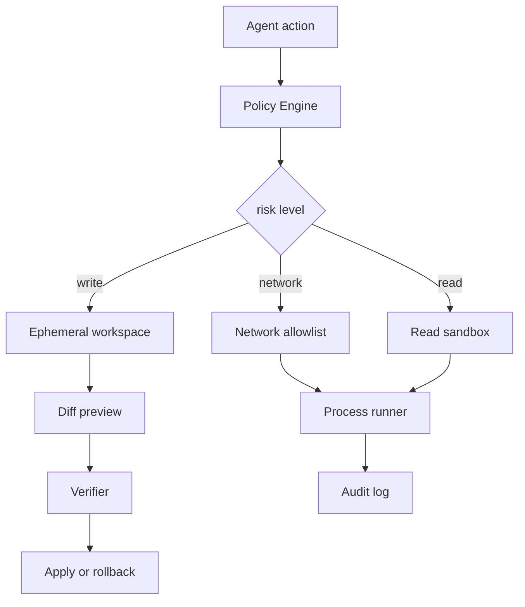

# Agent 执行代码或浏览器动作时为什么需要 sandbox？

## 30 秒回答

因为 Agent 的动作有副作用。执行代码、改文件、跑浏览器或访问网络时，模型错误和 prompt injection 都可能造成文件损坏、数据外泄或凭据滥用。sandbox 用 filesystem、network、process、credential 和 policy 隔离风险，并通过 audit、preview、rollback 控制影响面。

## 面试定位

这题考执行层安全。面试官想听到的不只是 Docker，而是完整架构和数据流：动作请求如何授权，在哪里执行，怎么限制网络和凭据，失败如何回滚。

## 标准回答

我会把 Agent 动作分成只读、写文件、运行命令、访问网络和使用凭据。不同风险等级进入不同 sandbox。

只读操作可以在受限工作目录执行。写操作先在 ephemeral workspace 里生成 diff preview，通过验证或用户确认后再 apply。命令执行要有 timeout、CPU、内存和输出大小限制。网络默认关闭或走白名单。凭据通过 broker 按需短期注入，不能直接暴露给所有进程。

执行结果必须进入 audit log，包括命令、路径、policy verdict、stdout、stderr、exit code、资源用量和 rollback 结果。

这里的核心取舍是安全边界和开发效率。限制越严格，误操作和数据外泄风险越低，但依赖安装、浏览器调试和本地复现会更慢，所以要按动作风险分级。

## 架构与运行机制

sandbox 的关键是把模型意图变成宿主策略。模型可以建议动作，但最终是否执行由 Policy Engine 决定。

## 可画图

可以画三层：Agent action、Policy Engine、Sandbox Runtime。旁边列出 filesystem、network、process、credential 和 rollback 五个隔离面。

## 系统设计案例

本地 coding agent 修改代码时，应先在临时工作区应用 patch，运行测试，生成 diff 和结果。只有验证通过，才把变更写回真实仓库。它不应访问用户主目录，也不应随意联网下载脚本。

数据流是：模型提出 patch，Policy Engine 检查路径，sandbox 执行测试，verifier 判断结果，audit 记录全过程。失败时删除临时工作区并保留日志。

## 真实问题与排障

如果误删文件，先查 audit log 和 policy verdict。确认写操作是否绕过 preview，rollback 是否成功，路径 allowlist 是否过宽。止血时冻结写权限，恢复 snapshot，并把动作加入 forbidden regression case。

指标包括 unauthorized_write_block、egress_denial_rate、timeout_rate、secret_access_denial、rollback_success_rate 和 policy_bypass_count。

## 面试官追问

- sandbox 和 Tool Permission Gate 的边界是什么？
- 写文件如何做到可预览？
- 网络要完全禁用吗？
- secret 如何按需注入？
- Docker 是否足够安全？

## 项目化回答

我会说自己把执行层拆成 Policy Engine、Ephemeral Workspace、Process Runner、Credential Broker、Audit Log 和 Rollback。每个动作都有风险等级和策略裁决，高风险动作必须确认。

## 常见错误

- 让 Agent 直接在真实目录执行写命令。
- 网络默认全开。
- 长期 secret 暴露给所有进程。
- 没有 diff preview 和 rollback。
- audit 只记录最终结果。

## 深挖技术细节

Sandbox 要按动作风险分层。只读动作需要 path allowlist 和 redaction；写文件进入 ephemeral workspace；命令执行进入受限 process/container/microVM；网络通过 egress allowlist；凭据通过 Credential Broker 短期注入。每次动作都带 `action_id`、`actor`、`cwd`、`risk_level`、`policy_verdict`、`resource_scope`、`timeout_ms`、`network_scope`、`secret_scope` 和 `rollback_ref`。

文件写入建议采用 copy-on-write 或临时工作区。Agent 生成 patch，sandbox 应用 patch 并运行 verifier，最终只把通过的 diff apply 回真实仓库。路径检查要处理 `..`、符号链接、挂载点和 realpath，不能只做字符串前缀。命令执行要限制 CPU、内存、文件描述符、子进程、输出大小和运行时间。

Audit 不是只记最终 pass/fail，而要记录命令、参数 hash、stdout/stderr 摘要、exit code、资源用量、网络尝试、secret redaction、diff preview 和 rollback 结果。指标包括 `unauthorized_write_block`、`egress_denial_rate`、`secret_access_denial`、`sandbox_timeout_rate`、`rollback_success_rate`、`policy_bypass_count`。

## 边界条件与反例

反例一：把项目放进 Docker 就认为安全，但挂载了整个 home 和所有环境变量。反例二：为了安装依赖打开全网，依赖脚本可以外传数据。反例三：命令有 timeout 但没有输出截断，日志撑爆 trace。反例四：写操作直接落真实目录，失败后无法恢复用户改动。

边界在于：sandbox 和 Tool Permission Gate 分工不同。Permission Gate 决定动作能不能做，sandbox 控制动作在哪里、用什么资源、能影响什么。低风险本地 lint 不一定需要 microVM；不可信代码、多租户、凭据或强隔离场景才需要更重的运行时。

## 深问准备

- 问：写文件如何预览？答：在临时工作区应用 patch，生成 diff preview、before hash 和 rollback ref。
- 问：网络要完全禁吗？答：默认禁，必要时按域名、端口、命令和时间开 allowlist。
- 问：secret 如何注入？答：Credential Broker 按 action 短期注入，执行后回收，日志采集层脱敏。
- 问：Docker 足够安全吗？答：取决于挂载、权限、网络、内核隔离和 secret 策略；高风险用 microVM 更稳。

## 来源与延伸阅读

- [OpenAI Agents SDK Tools](https://openai.github.io/openai-agents-python/tools/)
- [OpenAI Agents SDK Guardrails](https://openai.github.io/openai-agents-python/guardrails/)
- [OWASP LLM06: Excessive Agency](https://genai.owasp.org/llmrisk/llm06-excessive-agency/)
