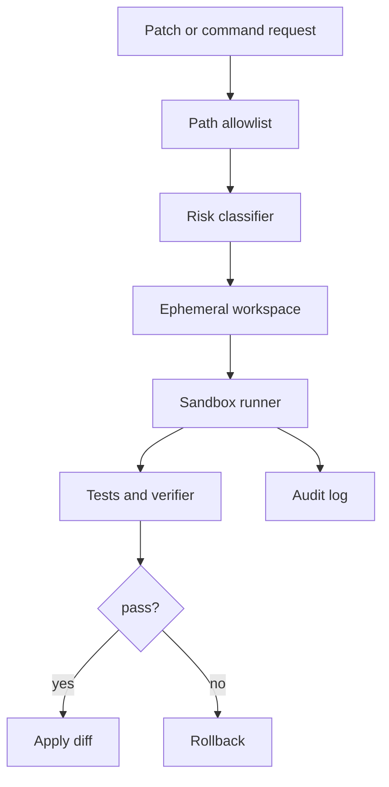

# 如何设计一个本地 coding agent 的最小权限执行环境？

## 30 秒回答

我会采用最小权限原则。读操作限制在 workspace，写操作进入临时工作区并生成 diff preview，命令执行放在受限 process 或 container，网络默认关闭或白名单，credential 通过 broker 短期注入。所有动作都要有 policy verdict、audit 和 rollback。

## 面试定位

这题考你能否把 coding agent 从 demo 做到可用。面试官希望你讲清楚文件、进程、网络、凭据和用户确认的边界。

回答要包含架构、数据流、指标、取舍和追问。不要只说“用 Docker 跑一下”。

## 标准回答

第一层是 workspace 隔离。Agent 只能读取授权目录，不能扫描用户主目录。写入必须先产生 patch 或 diff，不能直接覆盖文件。

第二层是执行隔离。测试、构建和脚本运行在受限 process、container 或 microVM 中，设置 timeout、CPU、内存和输出限制。依赖缓存可以只读挂载，避免每次联网。

第三层是网络和凭据。默认禁止外联，需要访问包仓库或 API 时走 allowlist。secret 由 Credential Broker 按任务注入，执行结束立即回收，日志中必须脱敏。

第四层是恢复和审计。每个动作记录 command、cwd、path、policy、diff、exit code 和资源用量。失败时 rollback 临时改动。

## 架构与运行机制

这个架构把真实仓库保护起来。Agent 只能提出变更，sandbox 负责验证，最终 apply 是受控动作。

## 可画图

可以画成从真实 workspace 到临时 workspace 的单向复制，再从临时环境输出 diff。真实 workspace 只接受经过 verifier 的 patch。

## 系统设计案例

用户要求修一个 TypeScript bug。Agent 先读取相关文件，生成 patch，在临时目录应用，运行 npm test 或项目指定命令。如果测试通过，系统展示 diff preview。用户或 policy 确认后，再 apply 到真实 repo。

数据流是：读取授权文件，生成变更，sandbox 验证，记录 audit，应用或回滚。网络只有在依赖缺失且命中 allowlist 时打开。

## 真实问题与排障

如果命令卡住，检查 timeout、资源限制和网络策略。若测试因为不能下载依赖失败，不应直接全开网络，而要配置依赖缓存或精确 allowlist。

如果出现越权读写，查看 path allowlist、符号链接处理和 cwd 约束。指标包括 sandbox_escape_attempt、unauthorized_path_denial、network_block_count、test_timeout_rate 和 rollback_success_rate。

## 面试官追问

- 符号链接绕过路径限制怎么办？
- 依赖安装需要网络时如何处理？
- 如何避免 secret 出现在日志？
- 临时工作区和真实工作区如何同步？
- 什么情况下需要 microVM 而不是 container？

## 项目化回答

我会把 coding agent 的执行环境描述为“真实仓库只读、临时工作区可写、验证后应用”。这套机制配合网络白名单、凭据 broker、资源限额和 audit，可以让模型有生产力，同时把副作用控制在可回滚范围内。

## 常见错误

- 直接给 Agent 整个 home 目录权限。
- 忽略符号链接和路径穿越。
- 测试失败就放开全部网络。
- secret 写进环境和日志。
- 没有独立 verifier。

## 深挖技术细节

本地 Coding Agent 的最小权限环境要从 threat model 开始。需要防的不是“模型故意作恶”一种情况，还包括工具调用误判、依赖脚本副作用、测试命令读写越界、符号链接逃逸、日志泄露 secret、网络外传和用户未保存改动被覆盖。运行时至少要有 `workspace_root`、`read_scope`、`write_scope`、`command_allowlist`、`network_policy`、`resource_limits`、`secret_policy`、`audit_id` 和 `rollback_ref`。

文件层要做真实路径解析，不能只用字符串前缀判断。所有路径先 `realpath`，再检查是否在允许 root 内；符号链接、`..`、挂载点和临时目录都要处理。写入最好发生在 ephemeral workspace，Agent 生成 patch，Verifier 在隔离区跑测试，最后由受控 apply 把 diff 写回真实工作区。命令层要限制 cwd、环境变量、timeout、CPU、内存、输出长度和可执行 allowlist。

网络和凭据是高风险点。默认禁网，依赖安装走只读缓存或精确域名 allowlist；凭据由 broker 按任务短期注入，只给子进程最小 scope，并在 stdout/stderr、trace、artifact 中做采集层脱敏。指标可以看 `unauthorized_path_denial`、`symlink_escape_block_count`、`network_block_count`、`secret_redaction_count`、`test_timeout_rate`、`rollback_success_rate`、`sandbox_overhead_ms`。

## 边界条件与反例

反例一：Docker 里直接挂载整个 home 目录，容器隔离了进程但没隔离数据。反例二：允许 `npm install` 任意联网，postinstall 脚本可能读环境变量或修改文件。反例三：测试失败后为了省事打开全网和所有路径，短期通过、长期风险失控。

边界在于：强隔离会增加延迟和环境维护成本。低风险只读分析可以用进程级限制；运行不可信依赖、执行用户项目脚本、处理密钥或多租户任务时，应使用 container、microVM 或远程 sandbox。无论隔离强度如何，真实完成证据仍来自独立 verifier 和审计 trace。

## 深问准备

- 问：符号链接绕过怎么办？答：对目标路径做 realpath，检查 resolved path、mount 和 inode，不用字符串 startsWith。
- 问：依赖安装必须联网怎么办？答：先用只读缓存，必要时打开包源 allowlist，并记录域名、命令和 hash。
- 问：secret 如何不进日志？答：broker 短期注入、子进程最小环境、采集层 redaction、禁止 echo 和 artifact 权限控制。
- 问：什么时候需要 microVM？答：多租户、不可信代码、强网络隔离、内核攻击面和高价值凭据场景。

## 来源与延伸阅读

- [OpenAI Agents SDK Tools](https://openai.github.io/openai-agents-python/tools/)
- [OpenAI Agents SDK Tracing](https://openai.github.io/openai-agents-python/tracing/)
- [OWASP LLM06: Excessive Agency](https://genai.owasp.org/llmrisk/llm06-excessive-agency/)
