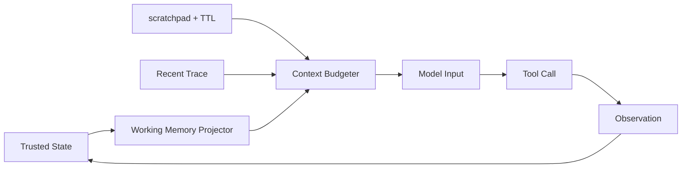

# Agent 的短期记忆应该如何设计？

## 面试定位

这题考的是工作记忆设计。面试官想听你区分 working memory、scratchpad、State 和长期 Memory，并说明数据流、指标、取舍和追问。

## 30 秒回答

短期记忆服务当前任务，保存 goal、constraints、current plan、recent observations、open risks 和 next actions。它通常由可信 State 投影而来，再按 context window 预算裁剪。scratchpad 可以保存临时假设，但要有来源、TTL 和 evidence_status。临时内容只有被工具、测试、citation 或用户确认支持后，才能进入可信 State。

## 标准回答

我会把短期记忆拆成三层。第一是 structured working memory，保存当前 run 的可执行摘要。第二是 scratchpad，保存临时假设、尝试过的路径和待验证事项。第三是 recent trace，保存最近几步 observation 的摘要。它不等于完整聊天历史，也不等于长期用户画像。

关键取舍是信息量和污染风险。短期记忆越多，连续性越强，但 token 成本和旧信息干扰也更高。生产系统要用 Context Budgeter 固定保留目标和硬约束，再按 relevance、recency、risk、state version 选择其余内容。

## 架构与运行机制

数据流是：State Store 保存可信事实，Working Memory Projector 生成当前步骤摘要，Scratchpad Store 保存带 TTL 的临时内容，Context Budgeter 组装本轮上下文。工具 observation 先进入 State，再进入下一轮短期记忆。

## 可画图

## 系统设计案例

Debug Agent 可以把当前错误、已排除假设、最近日志摘要和下一步排查计划放入 working memory。比如“数据库连接池不是根因”这类内容要带证据和过期条件。若新证据推翻它，scratchpad 项应被降权或删除。

## 真实问题与排障

如果模型按旧页面继续点击，检查 recent observation 是否过期。如果用户硬约束丢失，检查 Context Budgeter 是否给 constraints 固定预算。指标看 `lost_constraint_rate`、`scratchpad_stale_rate`、`working_memory_tokens` 和 `state_projection_precision`。

## 面试官追问

- 短期记忆和长期 Memory 区别是什么？短期绑定当前任务，长期跨任务复用。
- scratchpad 什么时候过期？按 step、时间、证据状态和任务结束过期。
- 为什么不用向量库保存短期记忆？很多短期事实需要结构化和顺序，不是相似检索。

## 项目化回答

我会说：我的 Agent 每轮由 State 投影 working memory，大 observation 只保存引用，scratchpad 带 TTL。这样既能保持连续性，也能避免旧假设污染下一步动作。

## 常见错误

- 把最近对话直接当短期记忆。
- scratchpad 没有 TTL。
- 工具输出原文全塞进上下文。
- 临时假设未经验证就进入可信 State。

## 深挖技术细节

短期记忆在工程实现上更像 thread-scoped state，而不是一段“最近聊天记录”。一次 agent run 可以维护 `thread_id`、`state_version`、`goal`、`constraints`、`plan`、`tool_results`、`open_questions`、`last_observation_ids` 和 `risk_flags`。每个 tool observation 先写入 State Store 或 checkpoint，再由 Working Memory Projector 生成压缩摘要。这样模型看到的是当前任务所需的状态投影，而不是无限增长的历史消息。

Context Budgeter 要有固定预算规则：硬约束和当前目标永不裁剪；最近失败、待确认动作和高风险权限优先保留；大型日志、网页和文件内容只保留引用、摘要和 hash；scratchpad 项必须带 `created_at`、`ttl_steps`、`confidence`、`evidence_status`。如果下一轮工具结果推翻了旧假设，Projector 要把旧项标为 superseded，而不是继续把它放进上下文。

可观测指标要能回答“记忆是不是帮忙了”。常见指标包括 `working_memory_tokens`、`lost_constraint_rate`、`stale_memory_hit_rate`、`state_projection_precision`、`tool_result_reuse_rate`、`p95_context_build_latency`。排障时看 trace：本轮模型输入包含了哪些 state 字段，哪些被预算器裁剪，裁剪原因是什么，最终错误是否和丢失约束或旧假设有关。

## 边界条件与反例

反例一：把完整对话 append 到 messages 里，这在小样例能跑，但长任务会带来 token 成本、延迟和注意力污染。反例二：把 scratchpad 当可信事实，例如“可能是 Redis 问题”未经验证就被下一轮当成结论。反例三：为了节省 token 只保留总结，丢掉 source id 和 trace id，后续无法复核。

短期记忆的边界是当前线程或当前任务。跨项目偏好、用户长期资料、组织策略不应该直接塞进 working memory，而应由长期 Memory 或 runtime context 按需投影。对于支付、删除、发送邮件等高影响动作，短期记忆里的“用户刚才好像同意了”也不够，需要重新检查当前用户指令、确认事件和权限状态。

## 深问准备

- 问：checkpoint 和 memory 有什么区别？答：checkpoint 保存图或线程的可恢复状态，memory 是模型调用前的上下文投影；前者偏持久化，后者偏输入构造。
- 问：如何避免总结丢失关键信息？答：对约束、风险、未完成动作使用结构化字段，摘要只服务解释，不承担唯一事实来源。
- 问：什么时候删除短期记忆？答：任务结束、TTL 到期、证据被推翻、用户要求清除、权限或租户 scope 改变时。
- 问：多 Agent 共用短期记忆吗？答：可以共享任务级 state，但每个角色的 scratchpad 要隔离，避免把未经验证的局部假设污染全局决策。

## 来源与延伸阅读

- [LangChain Short-term memory](https://docs.langchain.com/oss/python/langchain/short-term-memory)
- [LangGraph Persistence](https://docs.langchain.com/oss/python/langgraph/persistence)
- [LangChain Context engineering](https://docs.langchain.com/oss/python/langchain/context-engineering)
